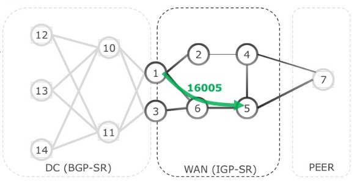
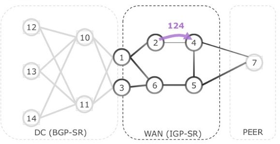
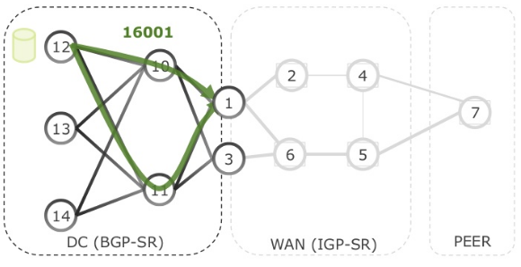
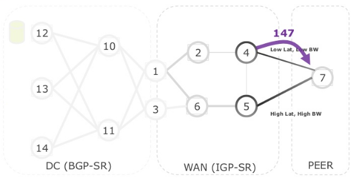

# Segment Routing Introduction

## SR Overview

Segment Routing simplifies MPLS. It provides source-based routing, allowing the source to choose a path, which is then added to the packet header as an ordered list of segments. The rest of the network executes the encoded instructions. All of which is done without keeping any state within the network, because labels are no longer assigned on a per LSP basis, but instead on a per segment basis. Also, label distribution protocols are no longer required as Segment Routing control plane leverages link state Interior Gateway Protocols (IGPs) IS-IS and OSPF, and the Border Gateway Protocol (BGP) for the distribution.

## Concept of Segments

Segments are instructions that nodes execute on the incoming packets, which carries the instructions in its header. Instructions include commands like `forward packet to the shortest path`, `forward packet through a specific interface`, `deliver packet to a specific application/service instance`, etc.

Each segment is identified by the Segment ID (SID). The format of the SID depends on the implementation. Example of SID formats are: an MPLS label, an index value in an MPLS label space, an IPv6 address. 
In addition, as we previously mentioned, state is removed from the network. This is because labels are no longer assigned on a per LSP basis, but instead on a per segment basis.

### Global vs Local Segments

Segments can be Global within the SR domain, i.e the set of nodes participating in the SR model. Each node installs the instruction of a Global Segment in its forwarding table. Segment can also be Local to the node and only the node that originated the Local Segment installs the associated instruction in its forwarding table. The local semantic of a Local Segment doesn't mean that nodes in the network do not know about the other node's Local Segments as in order to be able to use Local Segments, other nodes  need to know about their existence and meaning.

### Combining Segment

Segement are basic building blocs to build paths through a network. A single segment can steer a packet through the network such as a segment with the instruction `forward packet according to the shortest path to destination Nodex`. By combining segments in an ordered list packet can be steered on any path through the network or on a chain of services, regardless of shortest path, domain boundaries, routing protocol, etc. Such an ordered list of segments is called a Segment List or SID List. Each entry in the SID list is an instruction to complete one section or segment of the whole path, hence the term `segment` in Segment Routing.

### Segment List Operations

Beside executing the instruction encoded in the SID List, the nodes also manage the Segment List itself. The instruction that is currently being executed on the packet is the instruction of the `Active Segment`. Three basic operations are defined on the SID List:
|Operation|Behaviour|
|-|-|
|PUSH|insert segment(s) at the head of the SID List and set the first segment as the Active Segment. If the packet did not have a SID List in its header it is inserted first|
|CONTINUE|the Active Segment is not completed and therefore remains Active|
|NEXT|the Active Segment is completed; the next segment in the SID List becomes the Active Segment|
|||

These SID List operations are mapped to the actual data plane operations done on the packet header.

## Segment Routing Control Plane

Although static configuration of segment instruction on the nodes in the network would be possible in theory, a routing protocol is generally used to distribute the segment information in the network. The SR control plane is currently specified for the link state Interior Gateway Protocols (IGPs) IS-IS and OSPF, and for the Border Gateway Protocol (BGP).

Segment Routing is based upon 4 key segments:

- IGP Prefix Segment
- IGP Adjacency Segment
- BGP Prefix Segment
- BGP Peering Segment

### IGP Prefix Segment

A pool of global labels are defined (the SRGB aka SR Global Block), each label is then assigned to each node. The IGP (ISIS/OSPF) then signals each of these assigned labels within the SR domain, so that each node has the shortest path within its MPLS table to the given prefix.

For example, based on the diagram, if node 5 is assigned the SRGB label of 16005. If node 1 pushes the label 16005 to the top of its label stack, the packet will be switched via the shortest path (via node 6) to node 5.

### IGP Adjacency Segment

Unlike the IGP prefix segments, the IGP adjacency segments are dynamically generated/assigned. When a node discovers a neighbour, the node will automatically assign a label for the adjacent link. The label format is 1XY – X is the "from" – Y is the "to", as shown below.

### BGP Prefix Segment

The BGP prefix segment is similar to the IGP prefix in that a global block (SRGB) of labels are defined and assigned to each node, which is then advertised throughout the fabric via an extension to BGP.

Below shows an example, node 1 is assigned label 16001. Any packet with a top label of 16001 will be switched (forwarded) to 16001 aka node 1.

### BGP Peering Segment

The final segment is the BGP peering segment, which as the name suggests 'addresses' the peering links. When the routers within the WAN discover a peer then automatically assign a label, which is assigned to its MPLS data plane. In essence, this is the same as the IGP adjacency segment but applied to BGP.

## Segment Routing Data Plane

The Segment Routing architecture does not assume a specific data plane implementation. The SR architecture can be implemented on the MPLS data plane and on the IPv6 data plane.

### SR MPLS

SR on the MPLS data plane leverages the existing MPLS architecture (IETF RFC 3031). A Segment Identifier (SID) is represented as a MPLS label or an index value in a MPLS label space. The SID List is represented in the packet header as a stack of MPLS labels. The SR MPLS data plane implementation can be used with both IPv4 and IPv6 address families. Both IPv4 and IPv6 control planes can program the MPLS forwarding entries.

### SRv6

SR can also be applied to the IPv6 data plane using a new type of IPv6 Extension Header: the Segment Routing Header (SRH). Extensions headers are defined in the base IPv6 standard specification (IETF RFC 2460) as an expansion mechanism to carry additional routing information. The IPv6 data plane implementation of Segment Routing is commonly known as `SRv6`. A segment is represented as an IPv6 address. And a SID List is encoded as an ordered list of IPv6 addresses in the SRH. SRv6 offers the SR functionality without requiring MPLS on the network.

## Summary

- A segmennt is a topological or service instruction.
- A Segment List is an ordered list of instructions.
- Source routing: the source encodes a list of segments in the header of a packet to steer the packet along the desired multi-area, multi-domain topological and service path.
- The nodes in a network process a packet based on the instructions in its header.
- Per-flow state is only maintained at the source, not in the network.
- Prefic Segment: steers a packet along ECMP-aware shortest path to the segment's prefix Global segment.
- Node Segment: Prefix Segment of a prefix that represents a node (i.e. router-id)
- Anycast Segment: steers a packet along ECMP-aware shortest path to the segment's anycast prefix
- Adjacency Segment: steers a packet on the link of the segment's adjacency. Typically a local segment.
- BGP Peer Segment: steers a packet towards a specific BGP peer (over a specific link) overruling BGP decision process. Typically a local segment.
- Segment Routing can be implemented on different data planes (MPLS and IPv6) adn control plane protocols (ISIS, OSPF, BGP).
