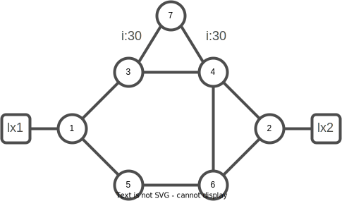
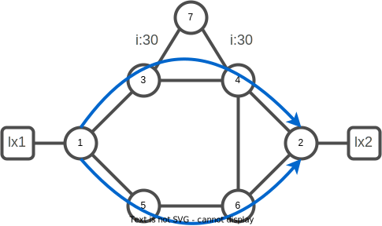

# 02. Segment Routing Introduction

Segment Routing simplifies MPLS. It provides source-based routing, allowing the source to choose a path, which is then added to the packet header as an ordered list of segments. The rest of the network executes the encoded instructions. All of which is done without keeping any state within the network, because labels are no longer assigned on a per LSP basis, but instead on a per segment basis. Also, label distribution protocols are no longer required as Segment Routing control plane leverages link state Interior Gateway Protocols (IGPs) IS-IS and OSPF, and the Border Gateway Protocol (BGP) for the distribution.

In summary Segment Routing can be characterized by:

- A segment is a topological or service instruction.
- A Segment List is an ordered list of instructions.
- Source routing: the source encodes a list of segments in the header of a packet to steer the packet along the desired multi-area, multi-domain topological and service path.
- The nodes in a network process a packet based on the instructions in its header.
- Per-flow state is only maintained at the source, not in the network.
- Prefic Segment: steers a packet along ECMP-aware shortest path to the segment's prefix Global segment.
- Node Segment: Prefix Segment of a prefix that represents a node (i.e. router-id)
- Anycast Segment: steers a packet along ECMP-aware shortest path to the segment's anycast prefix
- Adjacency Segment: steers a packet on the link of the segment's adjacency. Typically a local segment.
- BGP Peer Segment: steers a packet towards a specific BGP peer (over a specific link) overruling BGP decision process. Typically a local segment.
- Segment Routing can be implemented on different data planes (MPLS and IPv6) adn control plane protocols (ISIS, OSPF, BGP).

The tasks related to Segment Routing lab introduction include:

- understand the ISIS lab topology (task 1. to 4.)
- configure Segment Routing leveraging ISIS control plane (task 5. to 9.)
- understand SR IGP ECMP-aware capability (tasks 10. and 11.)

The topology of the lab is highlighted below:



Segments are instructions that nodes execute on the incoming packets, which carries the instructions in its header. Instructions include commands like `forward packet to the shortest path`, `forward packet through a specific interface`, `deliver packet to a specific application/service instance`, etc.

Each segment is identified by the Segment ID (SID). The format of the SID depends on the implementation. Example of SID formats are: an MPLS label, an index value in an MPLS label space, an IPv6 address.
In addition, as we previously mentioned, state is removed from the network. This is because labels are no longer assigned on a per LSP basis, but instead on a per segment basis.

## Get familiar with lab topology

### Task 1. Check the IS-IS interfaces

Visualise the router interfaces announced in IS-IS process `core`:

```bash
xrd 1
```

:keyboard: xrd-1

```bash
show isis interface brief
```

You should have an output similar to:

```console
IS-IS core Interfaces
    Interface      All     Adjs    Adj Topos  Adv Topos  CLNS   MTU    Prio  
                   OK    L1   L2    Run/Cfg    Run/Cfg                L1   L2
-----------------  ---  ---------  ---------  ---------  ----  ----  --------
Lo0                Yes    -    -      0/0        1/1     No       -    -    - 
Gi0/0/0/0          Yes    -    1      1/1        1/1     Up    1497    -    - 
Gi0/0/0/1          Yes    -    1      1/1        1/1     Up    1497    -    - 
Gi0/0/0/2          Yes    -    0      1/1        1/1     Up    1497    -    - 
```

### Task 2. Check the IS-IS neighbors

You can verify the number of neighbors known via IS-IS with the following command:

:keyboard: xrd-1

```bash
show isis neighbors
```

You should have an output similar to:

```console
IS-IS core neighbors:
System Id      Interface        SNPA           State Holdtime Type IETF-NSF
xrd-3          Gi0/0/0/0        *PtoP*         Up    23       L2   Capable 
xrd-5          Gi0/0/0/1        *PtoP*         Up    29       L2   Capable 
```

### Task 3. Check the IS-IS topology

Verify the IS-IS topology. Take a time to verify that you know every other nodes with the expected metric.

:keyboard: xrd-1

```bash
show isis topology
```

You should have an output similar to:

```console
IS-IS core paths to IPv4 Unicast (Level-2) routers
System Id          Metric    Next-Hop           Interface       SNPA          
xrd-1              --      
xrd-2              30        xrd-5              Gi0/0/0/1       *PtoP*        
xrd-2              30        xrd-3              Gi0/0/0/0       *PtoP*        
xrd-3              10        xrd-3              Gi0/0/0/0       *PtoP*        
xrd-4              20        xrd-3              Gi0/0/0/0       *PtoP*        
xrd-5              10        xrd-5              Gi0/0/0/1       *PtoP*        
xrd-6              20        xrd-5              Gi0/0/0/1       *PtoP*        
xrd-7              40        xrd-3              Gi0/0/0/0       *PtoP*        
```

:question: Questions:

- Why is xrd-2 node appearing twice ?

### Task 4. Verify routing table

You should be learning the Loopbacks and inter-links from the other nodes of the topology.

:keyboard: xrd-1

```bash
show ip route 
```

You should have an output similar to:

```console
L    1.1.1.1/32 is directly connected, 00:26:03, Loopback0
i L2 2.2.2.2/32 [115/30] via 100.1.3.3, 00:00:46, GigabitEthernet0/0/0/0
                [115/30] via 100.1.5.5, 00:00:46, GigabitEthernet0/0/0/1
i L2 3.3.3.3/32 [115/10] via 100.1.3.3, 00:25:56, GigabitEthernet0/0/0/0
i L2 4.4.4.4/32 [115/20] via 100.1.3.3, 00:25:52, GigabitEthernet0/0/0/0
i L2 5.5.5.5/32 [115/10] via 100.1.5.5, 00:25:56, GigabitEthernet0/0/0/1
i L2 6.6.6.6/32 [115/20] via 100.1.5.5, 00:25:52, GigabitEthernet0/0/0/1
i L2 7.7.7.7/32 [115/40] via 100.1.3.3, 00:04:39, GigabitEthernet0/0/0/0
C    99.1.10.0/24 is directly connected, 00:26:02, GigabitEthernet0/0/0/2
L    99.1.10.1/32 is directly connected, 00:26:02, GigabitEthernet0/0/0/2
i L2 99.2.20.0/24 [115/40] via 100.1.3.3, 00:00:46, GigabitEthernet0/0/0/0
                  [115/40] via 100.1.5.5, 00:00:46, GigabitEthernet0/0/0/1
C    100.1.3.0/24 is directly connected, 00:26:02, GigabitEthernet0/0/0/0
L    100.1.3.1/32 is directly connected, 00:26:02, GigabitEthernet0/0/0/0
C    100.1.5.0/24 is directly connected, 00:26:02, GigabitEthernet0/0/0/1
L    100.1.5.1/32 is directly connected, 00:26:02, GigabitEthernet0/0/0/1
i L2 100.2.4.0/24 [115/30] via 100.1.3.3, 00:00:46, GigabitEthernet0/0/0/0
i L2 100.2.6.0/24 [115/30] via 100.1.5.5, 00:25:52, GigabitEthernet0/0/0/1
i L2 100.3.4.0/24 [115/20] via 100.1.3.3, 00:25:56, GigabitEthernet0/0/0/0
i L2 100.3.7.0/24 [115/40] via 100.1.3.3, 00:04:39, GigabitEthernet0/0/0/0
i L2 100.4.6.0/24 [115/30] via 100.1.3.3, 00:25:52, GigabitEthernet0/0/0/0
                  [115/30] via 100.1.5.5, 00:25:52, GigabitEthernet0/0/0/1
i L2 100.4.7.0/24 [115/50] via 100.1.3.3, 00:00:46, GigabitEthernet0/0/0/0
i L2 100.5.6.0/24 [115/20] via 100.1.5.5, 00:25:56, GigabitEthernet0/0/0/1
L    127.0.0.0/8 [0/0] via 0.0.0.0, 00:26:06
C    172.28.0.0/24 is directly connected, 00:26:02, MgmtEth0/RP0/CPU0/0
L    172.28.0.1/32 is directly connected, 00:26:02, MgmtEth0/RP0/CPU0/0
```

## Configure Segment Routing

Although static configuration of segment instruction on the nodes in the network would be possible in theory, a routing protocol is generally used to distribute the segment information in the network. The SR control plane is currently specified for the link state Interior Gateway Protocols (IGPs) IS-IS and OSPF, and for the Border Gateway Protocol (BGP).

In the current lab we will leverage IS-IS control plane to distribute segment information.

A pool of global labels are defined (the SRGB aka SR Global Block), each label is then assigned to each node. The IGP (IS-IS/OSPF) then signals each of these assigned labels within the SR domain, so that each node has the shortest path within its MPLS table to the given prefix.

For example, we will configure node xrd-1 with the SRGB label of 16001. If node xrd-2 pushes the label 16001 to the top of its label stack, the packet will be switched via the shortest path (via node xrd-3 and xrd-4 or via xrd-5 and xrd-6).

### Task 5. Activate segment-routing on xrd-1

:keyboard: xrd-1

```bash
configure terminal
router isis core
 address-family ipv4 unicast
  segment-routing mpls
 interface Loopback0
  address-family ipv4 unicast
   prefix-sid absolute 16001
   commit
   end
exit
```

### Task 6. Activate segment-routing on all the routers

Adapt the configuration template and configure accordingly the other lab devices xrd-2 to xrd-7.

<details><summary><b>:closed_book: Segment-Routing configurations snippets</b></summary>

```bash
xrd 2
```

:keyboard: xrd-2 configuration:

```bash
configure terminal
router isis core
 address-family ipv4 unicast
  segment-routing mpls
 interface Loopback0
  address-family ipv4 unicast
   prefix-sid absolute 16002
commit
end
exit
```

```bash
xrd 3
```

:keyboard: xrd-3 configuration:

```bash
configure terminal
router isis core
 address-family ipv4 unicast
  segment-routing mpls
 interface Loopback0
  address-family ipv4 unicast
   prefix-sid absolute 16003
commit
end
exit
```

```bash
xrd 4
```

:keyboard: xrd-4 configuration:

```bash
configure terminal
router isis core
 address-family ipv4 unicast
  segment-routing mpls
 interface Loopback0
  address-family ipv4 unicast
   prefix-sid absolute 16004
commit
end
exit
```

```bash
xrd 5
```

:keyboard: xrd-5 configuration:

```bash
configure terminal
router isis core
 address-family ipv4 unicast
  segment-routing mpls
 interface Loopback0
  address-family ipv4 unicast
   prefix-sid absolute 16005
commit
end
exit
```

```bash
xrd 6
```

:keyboard: xrd-6 configuration:

```bash
configure terminal
router isis core
 address-family ipv4 unicast
  segment-routing mpls
 interface Loopback0
  address-family ipv4 unicast
   prefix-sid absolute 16006
commit
end
exit
```

```bash
xrd 7
```

:keyboard: xrd-7 configuration:

```bash
configure terminal
router isis core
 address-family ipv4 unicast
  segment-routing mpls
 interface Loopback0
  address-family ipv4 unicast
   prefix-sid absolute 16007
commit
end
exit
```

</details>
<br/>

### Task 7. Check SR Prefix and Adjacency SIDs

SR on the MPLS data plane leverages the existing MPLS architecture (IETF RFC 3031). A Segment Identifier (SID) is represented as a MPLS label or an index value in a MPLS label space. The SID List is represented in the packet header as a stack of MPLS labels. The SR MPLS data plane implementation can be used with both IPv4 and IPv6 address families. Both IPv4 and IPv6 control planes can program the MPLS forwarding entries.

Verify the allocated and announced SR Prefix and Adjacency sids.

```bash
xrd 1
```

:keyboard: xrd-1

```bash
show mpls forwarding
```

You should have an output similar to:

```console
Local  Outgoing    Prefix             Outgoing     Next Hop        Bytes       
Label  Label       or ID              Interface                    Switched    
------ ----------- ------------------ ------------ --------------- ------------
16002  16002       SR Pfx (idx 2)     Gi0/0/0/0    100.1.3.3       288         
       16002       SR Pfx (idx 2)     Gi0/0/0/1    100.1.5.5       0           
16003  Pop         SR Pfx (idx 3)     Gi0/0/0/0    100.1.3.3       0           
16004  16004       SR Pfx (idx 4)     Gi0/0/0/0    100.1.3.3       0           
16005  Pop         SR Pfx (idx 5)     Gi0/0/0/1    100.1.5.5       0           
16006  16006       SR Pfx (idx 6)     Gi0/0/0/1    100.1.5.5       0           
16007  16007       SR Pfx (idx 7)     Gi0/0/0/0    100.1.3.3       224         
24000  Pop         SR Adj (idx 1)     Gi0/0/0/0    100.1.3.3       0           
24001  Pop         SR Adj (idx 3)     Gi0/0/0/0    100.1.3.3       0           
24002  Pop         SR Adj (idx 1)     Gi0/0/0/1    100.1.5.5       0           
24003  Pop         SR Adj (idx 3)     Gi0/0/0/1    100.1.5.5       0 
```

:question: Question:

- What does `Pop` means ?

Beside executing the instruction encoded in the SID List, the nodes also manage the Segment List itself. The instruction that is currently being executed on the packet is the instruction of the `Active Segment`. Three basic operations are defined on the SID List:
|Operation|Behaviour|
|-|-|
|PUSH|insert segment(s) at the head of the SID List and set the first segment as the Active Segment. If the packet did not have a SID List in its header it is inserted first|
|CONTINUE|the Active Segment is not completed and therefore remains Active|
|NEXT|the Active Segment is completed; the next segment in the SID List becomes the Active Segment|
|||

These SID List operations are mapped to the actual data plane operations done on the packet header.

Unlike the IGP prefix segments, the IGP adjacency segments are dynamically generated/assigned. When a node discovers a neighbor, the node will automatically assign a label for the adjacent link. The label format is 1XY – X is the "from" – Y is the "to", as shown below.

Visualize the adjacency SID allocated to xrd-1 interfaces :

:keyboard: xrd-1

```bash
show mpls label table detail 
```

```console
Table Label   Owner                           State  Rewrite
----- ------- ------------------------------- ------ -------
0     0       LSD(A)                          InUse  Yes
0     1       LSD(A)                          InUse  Yes
0     2       LSD(A)                          InUse  Yes
0     13      LSD(A)                          InUse  Yes
0     16000   ISIS(A):core                    InUse  No
  (Lbl-blk SRGB, vers:0, (start_label=16000, size=8000)
0     24000   ISIS(A):core                    InUse  Yes
  (SR Adj Segment IPv4, vers:0, index=1, type=0, intf=Gi0/0/0/0, nh=100.1.3.3)
0     24001   ISIS(A):core                    InUse  Yes
  (SR Adj Segment IPv4, vers:0, index=3, type=0, intf=Gi0/0/0/0, nh=100.1.3.3)
0     24002   ISIS(A):core                    InUse  Yes
  (SR Adj Segment IPv4, vers:0, index=1, type=0, intf=Gi0/0/0/1, nh=100.1.5.5)
0     24003   ISIS(A):core                    InUse  Yes
  (SR Adj Segment IPv4, vers:0, index=3, type=0, intf=Gi0/0/0/1, nh=100.1.5.5)
```

:information_source: On Cisco IOS-XR implementation ISIS pre-allocates an Adj-SID for protection mechanism (FRR,TI-LFA).

### Task 8. Check IS-IS SR database

Verify the router is propagating information related to Segment Routing via ISIS.

:keyboard: xrd-1

```bash
show isis database verbose
```

```console
IS-IS core (Level-2) Link State Database
LSPID                 LSP Seq Num  LSP Checksum  LSP Holdtime/Rcvd  ATT/P/OL
xrd-1.00-00         * 0x0000000a   0x8ad2        552  /*            0/0/0
  Area Address:   49.0002
  LSP MTU:        1492
  NLPID:          0xcc
  Router ID:      1.1.1.1
  IP Address:     1.1.1.1
  Hostname:       xrd-1
  Router Cap:     1.1.1.1 D:0 S:0
    Segment Routing: I:1 V:0, SRGB Base: 16000 Range: 8000
    Node Maximum SID Depth: 
      Label Imposition: 10
    SR Algorithm: 
      Algorithm: 0
      Algorithm: 1
  Metric: 10         IS-Extended xrd-3.00
    Local Interface ID: 3, Remote Interface ID: 5
    Interface IP Address: 100.1.3.1
    Neighbor IP Address: 100.1.3.3
    Physical BW: 1000000 kbits/sec
    ADJ-SID: F:0 B:0 V:1 L:1 S:0 P:0 weight:0 Adjacency-sid:24001
  Metric: 10         IS-Extended xrd-5.00
    Local Interface ID: 4, Remote Interface ID: 5
    Interface IP Address: 100.1.5.1
    Neighbor IP Address: 100.1.5.5
    Physical BW: 1000000 kbits/sec
    ADJ-SID: F:0 B:0 V:1 L:1 S:0 P:0 weight:0 Adjacency-sid:24003
  Metric: 0          IP-Extended 1.1.1.1/32
    Prefix-SID Index: 1, Algorithm:0, R:0 N:1 P:0 E:0 V:0 L:0
    Prefix Attribute Flags: X:0 R:0 N:1 E:0 A:0
    Source Router ID: 1.1.1.1
  Metric: 10         IP-Extended 99.1.10.0/24
    Prefix Attribute Flags: X:0 R:0 N:0 E:0 A:0
  Metric: 10         IP-Extended 100.1.3.0/24
    Prefix Attribute Flags: X:0 R:0 N:0 E:0 A:0
  Metric: 10         IP-Extended 100.1.5.0/24
    Prefix Attribute Flags: X:0 R:0 N:0 E:0 A:0
    
  [... output truncated ...]
```

:pushpin: Notes:

- Both interfaces Adj-SID are announced in the IGP.
- Node-SID is the sum `Prefix-SID Index: 1` + `SRGB Base: 16000` = 16001

### Task 9. Test the Segment Routing MPLS data plane

:keyboard: xrd-1

```bash
traceroute mpls ipv4 2.2.2.2/32             
```

```console
Tracing the route to 2.2.2.2

 1  100.1.3.3 [MPLS: Label 16002 Exp 0] 2 msec  1 msec  1 msec 
 2  100.3.4.4 [MPLS: Label 16002 Exp 0] 1 msec  1 msec  1 msec 
 3  100.2.4.2 4 msec  *  2 msec 
```

:question: Question:

- What label has been enforced to get to destination ?

## Verify Equal Cost Multi-Path

Segment Routing support and leverage ECMP natively. From previous activity you verified that two equal cost multi-path (ECMP) are available to get to xrd-2.
The picture below highlight the 2x equal cost multi paths between xrd-1 and xrd-2.



### Task 10. Trace multi-paths with MPLS OAM toolkit

You can seek for multi-paths with the following command :

:keyboard: xrd-1

```bash
traceroute sr-mpls multipath 2.2.2.2/32 verbose
```

You should have an output similar to:

```console
Codes: '!' - success, 'Q' - request not sent, '.' - timeout,
  'L' - labeled output interface, 'B' - unlabeled output interface, 
  'D' - DS Map mismatch, 'F' - no FEC mapping, 'f' - FEC mismatch,
  'M' - malformed request, 'm' - unsupported tlvs, 'N' - no rx label, 
  'P' - no rx intf label prot, 'p' - premature termination of LSP, 
  'R' - transit router, 'I' - unknown upstream index,
  'X' - unknown return code, 'x' - return code 0

Type escape sequence to abort.

LL!
Path 0 found, 
 output interface GigabitEthernet0/0/0/0 nexthop 100.1.3.3
 source 100.1.3.1 destination 127.0.0.0
  0 100.1.3.1 100.1.3.3 MRU 1500 [Labels: 16002 Exp: 0] multipaths 0
L 1 100.1.3.3 100.3.4.4 MRU 1500 [Labels: 16002 Exp: 0] ret code 8 multipaths 1
L 2 100.3.4.4 100.2.4.2 MRU 1500 [Labels: implicit-null Exp: 0] ret code 8 multipaths 1
! 3 100.2.4.2, ret code 3 multipaths 0
LL!
Path 1 found, 
 output interface GigabitEthernet0/0/0/1 nexthop 100.1.5.5
 source 100.1.5.1 destination 127.0.0.0
  0 100.1.5.1 100.1.5.5 MRU 1500 [Labels: 16002 Exp: 0] multipaths 0
L 1 100.1.5.5 100.5.6.6 MRU 1500 [Labels: 16002 Exp: 0] ret code 8 multipaths 1
L 2 100.5.6.6 100.2.6.2 MRU 1500 [Labels: implicit-null Exp: 0] ret code 8 multipaths 1
! 3 100.2.6.2, ret code 3 multipaths 0

Paths (found/broken/unexplored) (2/0/0)
 Echo Request (sent/fail) (6/0)
 Echo Reply (received/timeout) (6/0)
 Total Time Elapsed 21 ms
```

### Task 11. Check FIB information

The route to 2.2.2.2/32 is indeed known twice with the same metric cost :

:keyboard: xrd-1

```bash
show route 2.2.2.2/32 detail
```

```console
Routing entry for 2.2.2.2/32
  Known via "isis core", distance 115, metric 30, labeled SR, label redist non FIB, type level-2
  Installed Dec 28 17:13:57.029 for 4d22h
  Routing Descriptor Blocks
    100.1.3.3, from 2.2.2.2, via GigabitEthernet0/0/0/0, Backup (Local-LFA)
      Route metric is 30
      Label: 0x3e82 (16002)
      Tunnel ID: None
      Binding Label: None
      Extended communities count: 0
      Path id:65              Path ref count:1
      NHID:0x1(Ref:11)
    100.1.5.5, from 2.2.2.2, via GigabitEthernet0/0/0/1, Protected
      Route metric is 30
      Label: 0x3e82 (16002)
      Tunnel ID: None
      Binding Label: None
      Extended communities count: 0
      Path id:2       Path ref count:0
      NHID:0x2(Ref:11)
      Backup path id:65
  Route version is 0x28 (40)
  Local Label: 0x3e82 (16002)
  IP Precedence: Not Set
  QoS Group ID: Not Set
  Flow-tag: Not Set
  Fwd-class: Not Set
  Route Priority: RIB_PRIORITY_NON_RECURSIVE_MEDIUM (7) SVD Type RIB_SVD_TYPE_LOCAL
  Download Priority 1, Download Version 312
  No advertising protos.  
```

---