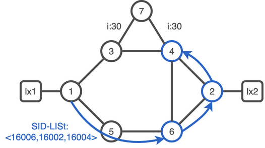

# 03. Segment Routing Traffic Engineering

Segment routing enables you to steer the traffic in any arbitrary manner within the network, just inserting the appropriate set of Node or Adj SID in the packet to express any deterministic paths.
Traffic over SR engineered paths.

## Configure SR-TE

### Task 1. Enable SR-TE on xrd-1

Enable SR-MPLS traffic engineering on xrd-1:

```bash
xrd 1
```

:keyboard: xrd-1

```bash
configure
 router isis core
  address-family ipv4 unicast
   mpls traffic-eng level-2-only
   mpls traffic-eng router-id Loopback0
  !
 !
 segment-routing traffic-eng
 !
!
commit
end
exit
```

### Task 2. Enable SR-TE on all routers

Enable SR-MPLS traffic engineering on all the routers.

<details><summary><b>:closed_book: SR-TE configurations snippets</b></summary>

```bash
xrd 2
```

:keyboard: xrd-2 configuration:

```bash
configure
 router isis core
  address-family ipv4 unicast
   mpls traffic-eng level-2-only
   mpls traffic-eng router-id Loopback0
  !
 !
 segment-routing traffic-eng
 !
!
commit
end
exit
```

```bash
xrd 3
```

:keyboard: xrd-3 configuration:

```bash
configure
 router isis core
  address-family ipv4 unicast
   mpls traffic-eng level-2-only
   mpls traffic-eng router-id Loopback0
  !
 !
 segment-routing traffic-eng
 !
!
commit
end
exit
```

```bash
xrd 4
```

:keyboard: xrd-4 configuration:

```bash
configure
 router isis core
  address-family ipv4 unicast
   mpls traffic-eng level-2-only
   mpls traffic-eng router-id Loopback0
  !
 !
 segment-routing traffic-eng
 !
!
commit
end
exit
```

```bash
xrd 5
```

:keyboard: xrd-5 configuration:

```bash
configure
 router isis core
  address-family ipv4 unicast
   mpls traffic-eng level-2-only
   mpls traffic-eng router-id Loopback0
  !
 !
 segment-routing traffic-eng
 !
!
commit
end
exit
```

```bash
xrd 6
```

:keyboard: xrd-6 configuration:

```bash
configure
 router isis core
  address-family ipv4 unicast
   mpls traffic-eng level-2-only
   mpls traffic-eng router-id Loopback0
  !
 !
 segment-routing traffic-eng
 !
!
commit
end
exit
```

```bash
xrd 7
```

:keyboard: xrd-7 configuration:

```bash
configure
 router isis core
  address-family ipv4 unicast
   mpls traffic-eng level-2-only
   mpls traffic-eng router-id Loopback0
  !
 !
 segment-routing traffic-eng
 !
!
commit
end
exit
```

</details>
<br/>

### Task 3. Check local traffic engineering topology

```bash
xrd 1
```

:keyboard: xrd-1

```bash
show segment-routing traffic-eng ipv4 topology summary
```

You should have a similar output:

```console
XTC Agent's topology database summary:
--------------------------------

Topology nodes:                0
Prefixes:                      0
  Prefix SIDs:                 0
Links:                         0
  Adjacency SIDs:              0

Topology Ready Summary:
  Ready:                     yes
  Last HA case:          startup
  Timer value (sec):         120
  Timer:
    Running: no
```

xrd-1 doesn't seem to know any topology. To be able to locally compute a label stack path for SR-TE policy, a router head-end need to have a SR-TE database (SR-TE DB). The SR-TE process collects that information from IS-IS/OSPF and BGP-LS. In our case we will configure xrd-1 to distribute link-state database to SR-TE.

### Task 4. Configure the link state database distribution

:keyboard: xrd-1

```bash
configure
 router isis core
  distribute link-state
commit
end
```

Once the distribution of the main IGP process into the SR-TE DB you should now be able to visualize the traffic engineering topology.

:keyboard: xrd-1

```bash
show segment-routing traffic-eng ipv4 topology
```

You should have a similar output:

```console
SR-TE topology database
-----------------------

Node 2
  TE router ID: 1.1.1.1
  Host name: xrd-1
  ISIS system ID: 0000.0000.0001 level-2
  Prefix SID:
    Prefix 1.1.1.1, label 16001 (regular), flags: X:0, R:0, N:1, P:0, E:0, V:0, L:0, M:0

  Link[0]: local address 100.1.3.1, remote address 100.1.3.3
    Local node:
      ISIS system ID: 0000.0000.0001 level-2
    Remote node:
      TE router ID: 3.3.3.3
      Host name: xrd-3
      ISIS system ID: 0000.0000.0003 level-2
    Metric: IGP 10, TE 10, Latency 10 microseconds
    Bandwidth: Total link 125000000, Reservable 0
    Admin-groups: 0x00000000
    Admin-groups-detail:
    Adj SID: 24000 (protected) 24001 (unprotected)

  Link[1]: local address 100.1.5.1, remote address 100.1.5.5
    Local node:
      ISIS system ID: 0000.0000.0001 level-2
    Remote node:
      TE router ID: 5.5.5.5
      Host name: xrd-5
      ISIS system ID: 0000.0000.0005 level-2
    Metric: IGP 10, TE 10, Latency 10 microseconds
    Bandwidth: Total link 125000000, Reservable 0
    Admin-groups: 0x00000000
    Admin-groups-detail:
    Adj SID: 24002 (protected) 24003 (unprotected)

Node 6
  TE router ID: 2.2.2.2
  Host name: xrd-2
  ISIS system ID: 0000.0000.0002 level-2
  Prefix SID:
    Prefix 2.2.2.2, label 16002 (regular), flags: X:0, R:0, N:1, P:0, E:0, V:0, L:0, M:0
[...]
```

## SR-TE Policy with Explicit Path

### Task 5. Configure Policy with Explicit Path

In the current IGP configuration, shortest IGP path to node xrd-4 is the path : xrd-3, xrd-4.
Let's create a policy to use the bottom path instead (xrd-5, xrd-6).



An SR policy is defined through the tuple:

- headend : The node where the policy is instantiated,configured
- color : A digit to differentiate, the policy intents.
- endpoint :  It indicates the destination of the policy. The endpoint is specified as an IPv4 or IPv6 address and SHOULD resolve to a unique node in the domain.

An SR Policy is associated with one or more candidate paths.  

A Segment-List represents a specific source-routed path to send traffic from the headend to the endpoint of the corresponding SR policy.

A candidate path is either dynamic or explicit.

An explicit candidate path is expressed as a Segment-List or a set of Segment-Lists.
  
:keyboard: xrd-1

```bash
config
segment-routing
 traffic-eng
  segment-list xrd1-to-xrd4-via-xrd2
   index 10 mpls label 16005
   index 20 mpls label 16006
   index 30 mpls label 16004
  !
  policy xrd1-xrd4
   color 110 end-point ipv4 4.4.4.4
   candidate-paths
    preference 100
     explicit segment-list xrd1-to-xrd4-via-xrd2
     !
    !
   !
  !
 !
!
commit
end
```

### Task 6. Verify Explicit Path Policy

:keyboard: xrd-1

```bash
show segment-routing traffic-eng policy color 110 detail
```

```console
SR-TE policy database
---------------------

Color: 110, End-point: 4.4.4.4
  Name: srte_c_110_ep_4.4.4.4
  Status:
    Admin: up  Operational: up for 00:00:16 (since Dec 28 16:53:38.795)
  Candidate-paths:
    Preference: 100 (configuration) (active)
      Name: xrd1-xrd4
      Requested BSID: dynamic
      PCC info:
        Symbolic name: cfg_xrd1-xrd4_discr_100
        PLSP-ID: 10
      Constraints:
        Protection Type: protected-preferred
        Maximum SID Depth: 10 
      Explicit: segment-list xrd1-to-xrd4-via-xrd2 (valid)
        Weight: 1, Metric Type: TE
          16005 [Prefix-SID, 5.5.5.5]
          16006
          16004
  Attributes:
    Binding SID: 24005
    Forward Class: Not Configured
    Steering labeled-services disabled: no
    Steering BGP disabled: no
    IPv6 caps enable: yes
    Invalidation drop enabled: no
    Max Install Standby Candidate Paths: 0
```

### Task 7. Verify MPLS Forwarding Plane

Notice the Binding SID associated with your policy. It's the BSID of its active candidate path.
If you display the mpls forwarding plane configuration you should be able to find it.

:keyboard: xrd-1

```bash
show mpls forwarding
```

You should have a similar output:

```console
Thu Nov  3 08:35:33.698 UTC
Local  Outgoing    Prefix             Outgoing     Next Hop        Bytes       
Label  Label       or ID              Interface                    Switched    
------ ----------- ------------------ ------------ --------------- ------------
16002  16002       SR Pfx (idx 2)     Gi0/0/0/0    100.1.3.3       0           
       16002       SR Pfx (idx 2)     Gi0/0/0/1    100.1.5.5       0           
16003  Pop         SR Pfx (idx 3)     Gi0/0/0/0    100.1.3.3       0           
       16004       SR Pfx (idx 3)     Gi0/0/0/1    100.1.5.5       0            (!)
16004  16004       SR Pfx (idx 4)     Gi0/0/0/0    100.1.3.3       0           
       16004       SR Pfx (idx 4)     Gi0/0/0/1    100.1.5.5       0            (!)
16005  Pop         SR Pfx (idx 5)     Gi0/0/0/1    100.1.5.5       0           
       16006       SR Pfx (idx 5)     Gi0/0/0/0    100.1.3.3       0            (!)
16006  16006       SR Pfx (idx 6)     Gi0/0/0/1    100.1.5.5       0           
       16006       SR Pfx (idx 6)     Gi0/0/0/0    100.1.3.3       0            (!)
16007  16007       SR Pfx (idx 7)     Gi0/0/0/0    100.1.3.3       108284      
       16004       SR Pfx (idx 7)     Gi0/0/0/1    100.1.5.5       0            (!)
24000  Pop         SR Adj (idx 1)     Gi0/0/0/0    100.1.3.3       0           
       16004       SR Adj (idx 1)     Gi0/0/0/1    100.1.5.5       0            (!)
24001  Pop         SR Adj (idx 3)     Gi0/0/0/0    100.1.3.3       0           
24002  Pop         SR Adj (idx 1)     Gi0/0/0/1    100.1.5.5       0           
       16006       SR Adj (idx 1)     Gi0/0/0/0    100.1.3.3       0            (!)
24003  Pop         SR Adj (idx 3)     Gi0/0/0/1    100.1.5.5       0           
24005  Pop         No ID              srte_c_110_e point2point     0           
24006  Unlabelled  100.5.6.0/24       Gi0/0/0/1    100.1.5.5       0           
       16006       100.5.6.0/24       Gi0/0/0/0    100.1.3.3       0            (!)
24007  Unlabelled  100.3.7.0/24       Gi0/0/0/0    100.1.3.3       0           
       16004       100.3.7.0/24       Gi0/0/0/1    100.1.5.5       0            (!)
24008  Unlabelled  100.3.4.0/24       Gi0/0/0/0    100.1.3.3       0           
       16004       100.3.4.0/24       Gi0/0/0/1    100.1.5.5       0            (!)
24009  16006       SR TE: 1 [TE-INT]  Gi0/0/0/1    100.1.5.5       0           
       16006       SR TE: 1 [TE-INT]  Gi0/0/0/0    100.1.3.3       0            (!)
```

### Task 8. Check SR-TE Fowarding policy

:keyboard: xrd-1

```bash
show segment-routing traffic-eng forwarding policy
```

```console
SR-TE Policy Forwarding database
--------------------------------

Color: 110, End-point: 4.4.4.4
  Name: srte_c_110_ep_4.4.4.4
  Binding SID: 24005
  Active LSP:
    Candidate path:
      Preference: 100 (configuration)
      Name: xrd1-xrd4
    Local label: 24006
    Segment lists:
      SL[0]:
        Name: xrd1-to-xrd4-via-xrd2
        Switched Packets/Bytes: 5/520
          [MPLS -> MPLS]: 5/520
        Paths:
          Path[0]:
            Outgoing Label: 16006
            Outgoing Interfaces: GigabitEthernet0/0/0/1
            Next Hop: 100.1.5.5
            Switched Packets/Bytes: 5/520
              [MPLS -> MPLS]: 5/520
            FRR Pure Backup: No
            ECMP/LFA Backup: No
            Internal Recursive Label: Unlabelled (recursive)
            Label Stack (Top -> Bottom): { 16006, 16004 }

  Policy Packets/Bytes Switched: 73/7656
```

## Traffic Steering

### Task 9. Check FIB information

For now the policy is just signalized in the IGP. There's no routing information set in the RIB/FIB. It's a policy not a tunnel.

:keyboard: xrd-1

```bash
show route 4.4.4.4/32 detail
```

```console
Routing entry for 4.4.4.4/32
  Known via "isis core", distance 115, metric 20, labeled SR, type level-2
  Installed Jan  2 14:57:28.692 for 1d22h
  Routing Descriptor Blocks
    100.1.3.3, from 4.4.4.4, via GigabitEthernet0/0/0/0
      Route metric is 20
      Label: 0x3e84 (16004)
      Tunnel ID: None
      Binding Label: None
      Extended communities count: 0
      Path id:1       Path ref count:0
      NHID:0x2(Ref:11)
  Route version is 0x12 (18)
  Local Label: 0x3e84 (16004)
  IP Precedence: Not Set
  QoS Group ID: Not Set
  Flow-tag: Not Set
  Fwd-class: Not Set
  Route Priority: RIB_PRIORITY_NON_RECURSIVE_MEDIUM (7) SVD Type RIB_SVD_TYPE_LOCAL
  Download Priority 1, Download Version 167
  No advertising protos.
```

### Task 10. Configure Autoroute Steering

A simple way to steer traffic into the configured policy is to add the policy to the router IGP.
You can announce the policy xrd1-xrd4 as a next-hop to 4.4.4.4 with the following configuration

:keyboard: xrd-1

```bash
conf
segment-routing
 traffic-eng
  policy xrd1-xrd4
   autoroute
    include ipv4 all
   !  
  !
 !
!
commit
end
```

Verify the new route path via the SR-TE policy

:keyboard: xrd-1

```bash
show route 4.4.4.4/32 detail
```

You should have a similar output:

```console
Routing entry for 4.4.4.4/32
  Known via "isis core", distance 115, metric 20, labeled SR, label redist non FIB, type level-2
  Installed Dec 28 17:13:56.528 for 4d22h
  Routing Descriptor Blocks
    4.4.4.4, from 4.4.4.4, via srte_c_110_ep_4.4.4.4
      Route metric is 20
      Label: 0x3 (3)
      Tunnel ID: None
      Binding Label: 0x5dcf (24015)
      Extended communities count: 0
      Path id:1       Path ref count:0
      NHID:0x3(Ref:5)
  Route version is 0x18 (24)
  Local Label: 0x3e84 (16004)
  IP Precedence: Not Set
  QoS Group ID: Not Set
  Flow-tag: Not Set
  Fwd-class: Not Set
  Route Priority: RIB_PRIORITY_NON_RECURSIVE_MEDIUM (7) SVD Type RIB_SVD_TYPE_LOCAL
  Download Priority 1, Download Version 298
  No advertising protos.  
```

:keyboard: xrd-1

```bash
traceroute mpls multipath ipv4  4.4.4.4/32 verbose 
```

You should have a similar output:

```console
Starting LSP Path Discovery for 4.4.4.4/32

Codes: '!' - success, 'Q' - request not sent, '.' - timeout,
  'L' - labeled output interface, 'B' - unlabeled output interface, 
  'D' - DS Map mismatch, 'F' - no FEC mapping, 'f' - FEC mismatch,
  'M' - malformed request, 'm' - unsupported tlvs, 'N' - no rx label, 
  'P' - no rx intf label prot, 'p' - premature termination of LSP, 
  'R' - transit router, 'I' - unknown upstream index,
  'X' - unknown return code, 'x' - return code 0

Type escape sequence to abort.

LL!
Path 0 found, 
 output interface srte_c_110_ep_4.4.4.4 nexthop 100.1.5.5
 source 100.1.5.1 destination 127.0.0.0
  0 100.1.5.1 100.1.5.5 MRU 1500 [Labels: 16006/16004/implicit-null Exp: 0/0/0] multipaths 0
L 1 100.1.5.5 100.5.6.6 MRU 1500 [Labels: implicit-null/16004/implicit-null Exp: 0/0/0] ret code 8 multipaths 1
L 2 100.5.6.6 100.4.6.4 MRU 1500 [Labels: implicit-null/implicit-null Exp: 0/0] ret code 8 multipaths 1
! 3 100.4.6.4, ret code 3 multipaths 0

Paths (found/broken/unexplored) (1/0/0)
 Echo Request (sent/fail) (3/0)
 Echo Reply (received/timeout) (3/0)
 Total Time Elapsed 12 ms
```

Verify reachability to node xrd-4.

:keyboard: xrd-1

```bash
ping mpls ipv4 4.4.4.4/32 verbose
```

```console
Thu Nov  3 08:52:12.139 UTC
Type escape sequence to abort.
Sending 5, 100-byte ICMP Echos to 4.4.4.4, timeout is 2 seconds:
!!!!!
Success rate is 100 percent (5/5), round-trip min/avg/max = 1/1/5 ms
```

Visualize the `Switched Packets/Bytes` counters are incremented for the correct policy path.

:keyboard: xrd-1

```bash
show segment-routing traffic-eng forwarding policy 110 details
```

You should have a similar output:

```console
SR-TE Policy Forwarding database
--------------------------------

Color: 110, End-point: 4.4.4.4
  Name: srte_c_110_ep_4.4.4.4
  Binding SID: 24015
  Active LSP:
    Candidate path:
      Preference: 100 (configuration)
      Name: xrd1-xrd4
    Local label: 24007
    Segment lists:
      SL[0]:
        Name: xrd1-to-xrd4-via-xrd2
        Switched Packets/Bytes: 5/520
          [MPLS -> MPLS]: 5/520
        Paths:
          Path[0]:
            Outgoing Label: 16006
            Outgoing Interfaces: GigabitEthernet0/0/0/0
            Next Hop: 100.1.3.3
            Switched Packets/Bytes: 0/0
            FRR Pure Backup: Yes
            ECMP/LFA Backup: Yes
            Internal Recursive Label: Unlabelled (recursive)
            Label Stack (Top -> Bottom): { 16006, 16005, 16006, 16004 }
            Path-id: 1 (Pure-Backup), Weight: 1
          Path[1]:
            Outgoing Label: 16006
            Outgoing Interfaces: GigabitEthernet0/0/0/1
            Next Hop: 100.1.5.5
            Switched Packets/Bytes: 5/520
              [MPLS -> MPLS]: 5/520
            FRR Pure Backup: No
            ECMP/LFA Backup: No
            Internal Recursive Label: Unlabelled (recursive)
            Label Stack (Top -> Bottom): { 16006, 16004 }
            Path-id: 2 (Protected), Backup-path-id: 1, Weight: 1

  Policy Packets/Bytes Switched: 10/1052
```

## SR-TE Policy with Dynamic Policy

A dynamic candidate path expresses an optimization objective and a set of constraints. The headend (potentially with the help of a PCE) computes the solution Segment-List (or set of Segment-Lists) that solves the optimization problem.

If a candidate path is associated with a set of Segment-Lists, each Segment-List is associated with a weight for weighted load balancing. The default weight is 1.

The preference of the candidate path is used to select the best candidate path for an SR Policy.  The default preference is 100.

A candidate path is usable when it valid. A common path validity criterion is the reachability of its constituent SIDs.

The candidate path selection process operates on the candidate path Preference.  A candidate path is selected when it is valid, and it has the highest preference value among all the candidate paths of the SR Policy.

### Task 11. Add a new dynamic candidate path with an higher preference

:keyboard: xrd-1

```bash
config
segment-routing
 traffic-eng
  policy xrd1-xrd4
   color 110 end-point ipv4 4.4.4.4
   candidate-paths
    preference 110
     dynamic
      metric
       type igp
      !
     !
    !
   !
  !
 commit
 end
```

:question: What are the different supported `metric type` ?

### Task 12. Verify Policy status

:keyboard: xrd-1

```bash
show segment-routing traffic-eng policy color 110
```

You should have a similar output:

```console
SR-TE policy database
---------------------

Color: 110, End-point: 4.4.4.4
  Name: srte_c_110_ep_4.4.4.4
  Status:
    Admin: up  Operational: up for 00:36:44 (since Dec 28 16:53:38.795)
  Candidate-paths:
    Preference: 110 (configuration) (active)
      Name: xrd1-xrd4
      Requested BSID: dynamic
      PCC info:
        Symbolic name: cfg_xrd1-xrd4_discr_110
        PLSP-ID: 13
      Constraints:
        Protection Type: protected-preferred
        Maximum SID Depth: 10 
      Dynamic (valid)
        Metric Type: IGP,   Path Accumulated Metric: 20 
          16004 [Prefix-SID, 4.4.4.4]
    Preference: 100 (configuration) (inactive)
      Name: xrd1-xrd4
      Requested BSID: dynamic
      PCC info:
        Symbolic name: cfg_xrd1-xrd4_discr_100
        PLSP-ID: 10
      Constraints:
        Protection Type: protected-preferred
        Maximum SID Depth: 10 
      Explicit: segment-list xrd1-to-xrd4-via-xrd2 (inactive)
        Weight: 1, Metric Type: TE
          16005
          16006
          16004
  Attributes:
    Binding SID: 24015
    Forward Class: Not Configured
    Steering labeled-services disabled: no
    Steering BGP disabled: no
    IPv6 caps enable: yes
    Invalidation drop enabled: no
    Max Install Standby Candidate Paths: 0
```

:question: Which path is active ? What's the label stack ?
