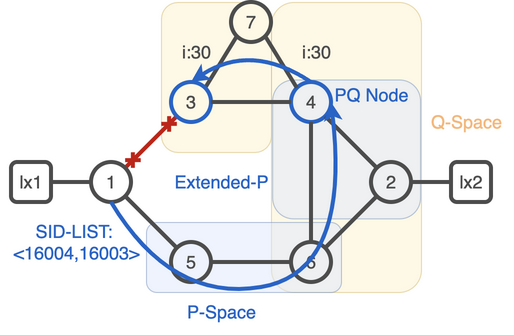
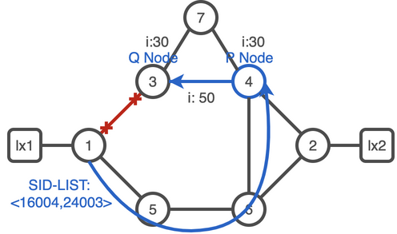

# SR TI-LFA Protection

This lab explores the Segment Routing (SR) Topology Independent Loop-Free Alternative (TI-LFA) functionality. The lab illustrates that TI-LFA can protect traffic flows against link failure. This scenario demonstrates how to configure TI-LFA link protection and verify the TI-LFA backup path. During the lab, the protection of a traffic flow is examined hop by hop. Using this method, multiple types of TI-LFA repair paths are encountered.

TI-LFA computes backup paths for all destinations. TI-LFA not only protects SR carried traffic, but also plain IP traffic can be protected, only imposing a SR label stack when a failure occurs. 

## Task 1. Enable TI-LFA

Let's start by verifying the state of the adjacencies

:keyboard: xrd-1
```bash
show isis adjacency detail
```
``` 
IS-IS core Level-2 adjacencies:
System Id      Interface                SNPA           State Hold Changed  NSF IPv4 IPv6
                                                                               BFD  BFD 
xrd-3          Gi0/0/0/0                *PtoP*         Up    29   00:33:18 Yes None None
  Area Address:           49.0002
  Neighbor IPv4 Address:  100.1.3.3*
  Adjacency SID:          24000
  Non-FRR Adjacency SID:  24001
  Topology:               IPv4 Unicast
  BFD Status:             BFD Not Required, Neighbor Useable
xrd-5          Gi0/0/0/1                *PtoP*         Up    29   00:33:21 Yes None None
  Area Address:           49.0002
  Neighbor IPv4 Address:  100.1.5.5*
  Adjacency SID:          24002
  Non-FRR Adjacency SID:  24003
  Topology:               IPv4 Unicast
  BFD Status:             BFD Not Required, Neighbor Useable

Total adjacency count: 2
```

:pushpin:
On both interfaces you have a `Adjacency SID` and a `Non-FRR Adjacency SID`

Enable TI-LFA on xrd 1.
TI-LFA is activated on the routing protocol per interface.

:keyboard: xrd-1
```bash
configure
router isis core
 interface GigabitEthernet0/0/0/0
  address-family ipv4 unicast
   fast-reroute per-prefix
   fast-reroute per-prefix ti-lfa
  !
 !
 interface GigabitEthernet0/0/0/1
  address-family ipv4 unicast
   fast-reroute per-prefix
   fast-reroute per-prefix ti-lfa
  !
 !
 interface GigabitEthernet0/0/0/2
  address-family ipv4 unicast
   fast-reroute per-prefix
   fast-reroute per-prefix ti-lfa
  !
 !
 commit
```

Verify that adjacencies are protected, and visualize the backup label stack computed.

:keyboard: xrd-1
```bash
show isis adjacency detail
```
```
IS-IS core Level-2 adjacencies:
System Id      Interface                SNPA           State Hold Changed  NSF IPv4 IPv6
                                                                               BFD  BFD 
xrd-3          Gi0/0/0/0                *PtoP*         Up    25   00:42:14 Yes None None
  Area Address:           49.0002
  Neighbor IPv4 Address:  100.1.3.3*
  Adjacency SID:          24000 (protected)
   Backup label stack:    [16004, 16003]
   Backup stack size:     2
   Backup interface:      Gi0/0/0/1
   Backup nexthop:        100.1.5.5
   Backup node address:   3.3.3.3
  Non-FRR Adjacency SID:  24001
  Topology:               IPv4 Unicast
  BFD Status:             BFD Not Required, Neighbor Useable
xrd-5          Gi0/0/0/1                *PtoP*         Up    24   00:42:17 Yes None None
  Area Address:           49.0002
  Neighbor IPv4 Address:  100.1.5.5*
  Adjacency SID:          24002 (protected)
   Backup label stack:    [16006, 16005]
   Backup stack size:     2
   Backup interface:      Gi0/0/0/0
   Backup nexthop:        100.1.3.3
   Backup node address:   5.5.5.5
  Non-FRR Adjacency SID:  24003
  Topology:               IPv4 Unicast
  BFD Status:             BFD Not Required, Neighbor Useable

Total adjacency count: 2
```

:keyboard: xrd-1
```bash
show isis fast-reroute 3.3.3.3/32 detail
```
```
L2 3.3.3.3/32 [10/115] Label: 16003, medium priority
   Installed Nov 02 15:43:52.501 for 00:01:22
     via 100.1.3.3, GigabitEthernet0/0/0/0, Label: ImpNull, xrd-3, SRGB Base: 16000, Weight: 0
       Backup path: TI-LFA (link), via 100.1.5.5, GigabitEthernet0/0/0/1 xrd-5, SRGB Base: 16000, Weight: 0, Metric: 40
         P node: xrd-4.00 [4.4.4.4], Label: 16004
         Prefix label: 16003
         Backup-src: xrd-3.00
       P: No, TM: 40, LC: No, NP: No, D: No, SRLG: Yes
     src xrd-3.00-00, 3.3.3.3, prefix-SID index 3, R:0 N:1 P:0 E:0 V:0 L:0, Alg:0
```

Enable TI-LFA on all the remaining Nodes

<details><summary><b>TI-LFA configurations snippets</b></summary>

```bash
xrd 1
```

:keyboard: xrd-1 configuration:
```bash
configure
router isis core
 interface GigabitEthernet0/0/0/0
  address-family ipv4 unicast
   fast-reroute per-prefix
   fast-reroute per-prefix ti-lfa
  !
 !
 interface GigabitEthernet0/0/0/1
  address-family ipv4 unicast
   fast-reroute per-prefix
   fast-reroute per-prefix ti-lfa
  !
 !
 interface GigabitEthernet0/0/0/2
  address-family ipv4 unicast
   fast-reroute per-prefix
   fast-reroute per-prefix ti-lfa
  !
 !
 commit
end
exit
```

```bash
xrd 2
```

:keyboard: xrd-2 configuration:
```bash
configure
router isis core
 interface GigabitEthernet0/0/0/0
  address-family ipv4 unicast
   fast-reroute per-prefix
   fast-reroute per-prefix ti-lfa
  !
 !
 interface GigabitEthernet0/0/0/1
  address-family ipv4 unicast
   fast-reroute per-prefix
   fast-reroute per-prefix ti-lfa
  !
 !
 interface GigabitEthernet0/0/0/2
  address-family ipv4 unicast
   fast-reroute per-prefix
   fast-reroute per-prefix ti-lfa
  !
 !
 commit
end
exit
```

```bash
xrd 3
```

:keyboard: xrd-3 configuration:
```bash
configure
router isis core
 interface GigabitEthernet0/0/0/0
  address-family ipv4 unicast
   fast-reroute per-prefix
   fast-reroute per-prefix ti-lfa
  !
 !
 interface GigabitEthernet0/0/0/2
  address-family ipv4 unicast
   fast-reroute per-prefix
   fast-reroute per-prefix ti-lfa
  !
 !
 interface GigabitEthernet0/0/0/3
  address-family ipv4 unicast
   fast-reroute per-prefix
   fast-reroute per-prefix ti-lfa
  !
 !
 commit
end
exit
```

```bash
xrd 4
```

:keyboard: xrd-4 configuration:
```bash
configure terminal
router isis core
 interface GigabitEthernet0/0/0/0
  address-family ipv4 unicast
   fast-reroute per-prefix
   fast-reroute per-prefix ti-lfa
  !
 !
 interface GigabitEthernet0/0/0/1
  address-family ipv4 unicast
   fast-reroute per-prefix
   fast-reroute per-prefix ti-lfa
  !
 !
 interface GigabitEthernet0/0/0/2
  address-family ipv4 unicast
   fast-reroute per-prefix
   fast-reroute per-prefix ti-lfa
  !
 !
  interface GigabitEthernet0/0/0/3
  address-family ipv4 unicast
   fast-reroute per-prefix
   fast-reroute per-prefix ti-lfa
  !
 !
 commit
end
exit
```

```bash
xrd 5
```

:keyboard: xrd-5 configuration:
```bash
configure terminal
router isis core
 interface GigabitEthernet0/0/0/0
  address-family ipv4 unicast
   fast-reroute per-prefix
   fast-reroute per-prefix ti-lfa
  !
 !
 interface GigabitEthernet0/0/0/2
  address-family ipv4 unicast
   fast-reroute per-prefix
   fast-reroute per-prefix ti-lfa
  !
 !
 commit
end
exit
```

```bash
xrd 6
```

:keyboard: xrd-6 configuration:
```bash
configure terminal
router isis core
  interface GigabitEthernet0/0/0/0
  address-family ipv4 unicast
   fast-reroute per-prefix
   fast-reroute per-prefix ti-lfa
  !
 !
 interface GigabitEthernet0/0/0/1
  address-family ipv4 unicast
   fast-reroute per-prefix
   fast-reroute per-prefix ti-lfa
  !
 !
 interface GigabitEthernet0/0/0/2
  address-family ipv4 unicast
   fast-reroute per-prefix
   fast-reroute per-prefix ti-lfa
  !
 !
commit
end
exit
```

```bash
xrd 7
```

:keyboard: xrd-7 configuration:
```bash
configure terminal
router isis core
 interface GigabitEthernet0/0/0/0
  address-family ipv4 unicast
   fast-reroute per-prefix
   fast-reroute per-prefix ti-lfa
  !
 !
 interface GigabitEthernet0/0/0/1
  address-family ipv4 unicast
   fast-reroute per-prefix
   fast-reroute per-prefix ti-lfa
  !
 !
commit
end
exit
```

</details>

Verify backup path in RIB. ISIS installs the backup path in RIB to reach each destination marked as. RIB contains the primary path (Protected) and backup path (Backup) marked as (!)

:keyboard: xrd-1
```bash
show ip route
```
```
Codes: C - connected, S - static, R - RIP, B - BGP, (>) - Diversion path
       D - EIGRP, EX - EIGRP external, O - OSPF, IA - OSPF inter area
       N1 - OSPF NSSA external type 1, N2 - OSPF NSSA external type 2
       E1 - OSPF external type 1, E2 - OSPF external type 2, E - EGP
       i - ISIS, L1 - IS-IS level-1, L2 - IS-IS level-2
       ia - IS-IS inter area, su - IS-IS summary null, * - candidate default
       U - per-user static route, o - ODR, L - local, G  - DAGR, l - LISP
       A - access/subscriber, a - Application route
       M - mobile route, r - RPL, t - Traffic Engineering, (!) - FRR Backup path

Gateway of last resort is not set

L    1.1.1.1/32 is directly connected, 00:46:54, Loopback0
i L2 2.2.2.2/32 [115/30] via 100.1.3.3, 00:04:41, GigabitEthernet0/0/0/0
                [115/30] via 100.1.5.5, 00:04:41, GigabitEthernet0/0/0/1
i L2 3.3.3.3/32 [115/10] via 100.1.3.3, 00:04:41, GigabitEthernet0/0/0/0
                [115/40] via 100.1.5.5, 00:04:41, GigabitEthernet0/0/0/1 (!)
i L2 4.4.4.4/32 [115/20] via 100.1.3.3, 00:09:33, GigabitEthernet0/0/0/0
                [115/30] via 100.1.5.5, 00:09:33, GigabitEthernet0/0/0/1 (!)
i L2 5.5.5.5/32 [115/40] via 100.1.3.3, 00:04:41, GigabitEthernet0/0/0/0 (!)
                [115/10] via 100.1.5.5, 00:04:41, GigabitEthernet0/0/0/1
i L2 6.6.6.6/32 [115/30] via 100.1.3.3, 00:04:41, GigabitEthernet0/0/0/0 (!)
                [115/20] via 100.1.5.5, 00:04:41, GigabitEthernet0/0/0/1
i L2 7.7.7.7/32 [115/40] via 100.1.3.3, 00:04:41, GigabitEthernet0/0/0/0
                [115/60] via 100.1.5.5, 00:04:41, GigabitEthernet0/0/0/1 (!)
C    99.1.10.0/24 is directly connected, 00:46:52, GigabitEthernet0/0/0/2
L    99.1.10.1/32 is directly connected, 00:46:52, GigabitEthernet0/0/0/2
i L2 99.2.20.0/24 [115/40] via 100.1.3.3, 00:04:41, GigabitEthernet0/0/0/0
                  [115/40] via 100.1.5.5, 00:04:41, GigabitEthernet0/0/0/1
C    100.1.3.0/24 is directly connected, 00:46:52, GigabitEthernet0/0/0/0
L    100.1.3.1/32 is directly connected, 00:46:52, GigabitEthernet0/0/0/0
C    100.1.5.0/24 is directly connected, 00:46:52, GigabitEthernet0/0/0/1
L    100.1.5.1/32 is directly connected, 00:46:52, GigabitEthernet0/0/0/1
i L2 100.2.4.0/24 [115/30] via 100.1.3.3, 00:09:33, GigabitEthernet0/0/0/0
                  [115/40] via 100.1.5.5, 00:09:33, GigabitEthernet0/0/0/1 (!)
i L2 100.2.6.0/24 [115/40] via 100.1.3.3, 00:04:41, GigabitEthernet0/0/0/0 (!)
                  [115/30] via 100.1.5.5, 00:04:41, GigabitEthernet0/0/0/1
i L2 100.3.4.0/24 [115/20] via 100.1.3.3, 00:04:41, GigabitEthernet0/0/0/0
                  [115/40] via 100.1.5.5, 00:04:41, GigabitEthernet0/0/0/1 (!)
i L2 100.3.7.0/24 [115/40] via 100.1.3.3, 00:04:41, GigabitEthernet0/0/0/0
                  [115/70] via 100.1.5.5, 00:04:41, GigabitEthernet0/0/0/1 (!)
i L2 100.4.6.0/24 [115/30] via 100.1.3.3, 00:04:41, GigabitEthernet0/0/0/0
                  [115/30] via 100.1.5.5, 00:04:41, GigabitEthernet0/0/0/1
i L2 100.4.7.0/24 [115/50] via 100.1.3.3, 00:09:33, GigabitEthernet0/0/0/0
                  [115/60] via 100.1.5.5, 00:09:33, GigabitEthernet0/0/0/1 (!)
i L2 100.5.6.0/24 [115/40] via 100.1.3.3, 00:04:41, GigabitEthernet0/0/0/0 (!)
                  [115/20] via 100.1.5.5, 00:04:41, GigabitEthernet0/0/0/1
L    127.0.0.0/8 [0/0] via 0.0.0.0, 00:46:57
C    172.28.0.0/24 is directly connected, 00:46:52, MgmtEth0/RP0/CPU0/0
L    172.28.0.1/32 is directly connected, 00:46:52, MgmtEth0/RP0/CPU0/0
```

Notice that the output of the show command displays the backup path for route 3.3.3.3/32 via 100.1.5.5 as FRR backup. Traffic will be steered towards XRd-5 (GigE0/0/0/1) in case of failure of interface GigE0/0/0/0.
```bash
show route 3.3.3.3
```
```
Routing entry for 3.3.3.3/32
  Known via "isis core", distance 115, metric 10, labeled SR, type level-2
  Installed Nov  2 15:43:52.501 for 00:05:54
  Routing Descriptor Blocks
    100.1.3.3, from 3.3.3.3, via GigabitEthernet0/0/0/0, Protected
      Route metric is 10
    100.1.5.5, from 3.3.3.3, via GigabitEthernet0/0/0/1, Backup (TI-LFA)
      Repair Node(s): 4.4.4.4
      Route metric is 40
  No advertising protos. 
```

:keyboard: xrd-1
```bash
show mpls forwarding
```
```
Local  Outgoing    Prefix             Outgoing     Next Hop        Bytes       
Label  Label       or ID              Interface                    Switched    
------ ----------- ------------------ ------------ --------------- ------------
16002  16002       SR Pfx (idx 2)     Gi0/0/0/0    100.1.3.3       0           
       16002       SR Pfx (idx 2)     Gi0/0/0/1    100.1.5.5       0           
16003  Pop         SR Pfx (idx 3)     Gi0/0/0/0    100.1.3.3       0           
       16004       SR Pfx (idx 3)     Gi0/0/0/1    100.1.5.5       0            (!)
16004  16004       SR Pfx (idx 4)     Gi0/0/0/0    100.1.3.3       0           
       16004       SR Pfx (idx 4)     Gi0/0/0/1    100.1.5.5       0            (!)
16005  Pop         SR Pfx (idx 5)     Gi0/0/0/1    100.1.5.5       0           
       16006       SR Pfx (idx 5)     Gi0/0/0/0    100.1.3.3       0            (!)
16006  16006       SR Pfx (idx 6)     Gi0/0/0/1    100.1.5.5       0           
       16006       SR Pfx (idx 6)     Gi0/0/0/0    100.1.3.3       0            (!)
16007  16007       SR Pfx (idx 7)     Gi0/0/0/0    100.1.3.3       0         
       16004       SR Pfx (idx 7)     Gi0/0/0/1    100.1.5.5       0            (!)
24000  Pop         SR Adj (idx 1)     Gi0/0/0/0    100.1.3.3       0           
       16004       SR Adj (idx 1)     Gi0/0/0/1    100.1.5.5       0            (!)
24001  Pop         SR Adj (idx 3)     Gi0/0/0/0    100.1.3.3       0           
24002  Pop         SR Adj (idx 1)     Gi0/0/0/1    100.1.5.5       0           
       16006       SR Adj (idx 1)     Gi0/0/0/0    100.1.3.3       0            (!)
24003  Pop         SR Adj (idx 3)     Gi0/0/0/1    100.1.5.5       0          
```

:keyboard: xrd-1
```bash
show isis fast-reroute 3.3.3.3/32 detail 
```
```
L2 3.3.3.3/32 [10/115] Label: 16003, medium priority
   Installed Nov 02 16:33:33.911 for 00:00:03
     via 100.1.3.3, GigabitEthernet0/0/0/0, Label: ImpNull, xrd-3, SRGB Base: 16000, Weight: 0
       Backup path: TI-LFA (link), via 100.1.5.5, GigabitEthernet0/0/0/1 xrd-5, SRGB Base: 16000, Weight: 0, Metric: 40
         P node: xrd-4.00 [4.4.4.4], Label: 16004
         Prefix label: 16003
         Backup-src: xrd-3.00
       P: No, TM: 40, LC: No, NP: No, D: No, SRLG: Yes
     src xrd-3.00-00, 3.3.3.3, prefix-SID index 3, R:0 N:1 P:0 E:0 V:0 L:0, Alg:0
```
:question: Is xrd-4 only a 'P node' ?

## Task 2. Remote-LFA

To compute a back-up next hop, TI-LFA requires the computation of different node sets calleds `spaces`.  

| Concept          | Description                                                                                                                                                                                 |
|------------------|---------------------------------------------------------------------------------------------------------------------------------------------------------------------------------------------|
| P space          | The set of nodes reachable by the source node of a protected link, using the Constrained Shortest Path First (CSPF) topology without crossing the protected link.                           |
| Extended-P space | The set of nodes reachable by the `direct neighbors` of the source node of a protected link, using the Constrained Shortest Path First (CSPF) topology without crossing the protected link. |                                                                                                |                                                                                                                                                                  |
| Q Space          | The set of nodes reachable by the destination node of a protected link, using the CSPF topology without crossing the protected link.                                                        |
| PQ Node          | A node in both P and Q space. The further node on the natural post-convergence path is elected.                                                                                             |                                                                         |                                                                                                                                     |                                                                                                                                                           |





Let's compute the different space when we consider a link failure between xrd-1 and xrd-3.
* Routers xrd-5 and xrd-6 are part of xrd-1 `P space`, they are reachable to xrd-1 without crossing the link xrd-1/xrd-3.
* Router xrd-2 is not part of xrd-1 P space as one of it's ECMP path is crossing link xrd-1/xrd-3.
* Router xrd-2 and xrd-4 are part of xrd-1 `extended P space`. Router xrd-5 - direct neighbor of xrd-1 - can reach xrd-2 and xrd-4 without crossing the link xrd-1/xrd-3
* Router xrd-3 can reach : xrd-2,xrd-4,xrd-6,xrd-7 without crossing link xrd-1/xrd-3, they are part of the `Q space`
* Router xrd-4 is the furthest node on the natural post-convergence IGP path it's selected as PQ Node.

TI-LFA computes the post-convergence path on xrd-1 for destination xrd-3 by computing the IGP the shortest path to xrd-3 on the topology with the link xrd-1 to xrd-3 removed. 
TI-LFA then computes the segment-list required to steer the packets on that backup path and finds that one intermediate nodes is needed: xrd-4 (the PQ-node). When traffic gets to xrd-4 the shortest path to xrd-2 is unambiguous. The TI-LFA computation on xrd-1 for destination xrd-3 (post-convergence path) results in two additional labels to be imposed on protected packets steered on the backup path:
* Label to node 4 : 16004
* Labe to destination : 16003


:keyboard: xrd-1
```bash
show cef 3.3.3.3/32 detail 
```

```
3.3.3.3/32, version 90, labeled SR, internal 0x1000001 0x8110 (ptr 0x87166fa0) [1], 0x600 (0x877c9c78), 0xa28 (0x897830a8)
 Updated Oct 28 09:09:26.709 
 local adjacency to GigabitEthernet0/0/0/0

 Prefix Len 32, traffic index 0, precedence n/a, priority 1
  gateway array (0x876324e8) reference count 3, flags 0x500068, source rib (7), 0 backups
                [3 type 4 flags 0x8401 (0x8912f5e8) ext 0x0 (0x0)]
  LW-LDI[type=1, refc=1, ptr=0x877c9c78, sh-ldi=0x8912f5e8]
  gateway array update type-time 1 Oct 28 09:09:26.709
 LDI Update time Oct 28 09:09:26.711
 LW-LDI-TS Oct 28 09:09:26.711
   via 100.1.3.3/32, GigabitEthernet0/0/0/0, 4 dependencies, weight 0, class 0, protected [flags 0x400]
    path-idx 0 bkup-idx 1 NHID 0x1 [0x899332a0 0x899330b0]
    next hop 100.1.3.3/32
     local label 16003      labels imposed {ImplNull}
   via 100.1.5.5/32, GigabitEthernet0/0/0/1, 11 dependencies, weight 0, class 0, backup (TI-LFA) [flags 0xb00]
    path-idx 1 NHID 0x2 [0x894ec8d0 0x0]
    next hop 100.1.5.5/32, Repair Node(s): 4.4.4.4
    local adjacency
     local label 16003      labels imposed {16004 16003}

    Load distribution: 0 (refcount 3)

    Hash  OK  Interface                 Address
    0     Y   GigabitEthernet0/0/0/0    100.1.3.3    
```

Notice that not only incoming unlabeled IP traffic is protected (as shown in the CEF entry) but also incoming labeled traffic. 
The output of show mpls forwarding displays the primary path and backup path for packets with the prefix-SID label of xrd-3, 16003

:keyboard: xrd-1
```bash
show mpls forwarding labels 16003 detail 
```
```
Local  Outgoing    Prefix             Outgoing     Next Hop        Bytes       
Label  Label       or ID              Interface                    Switched    
------ ----------- ------------------ ------------ --------------- ------------
16003  Pop         SR Pfx (idx 3)     Gi0/0/0/0    100.1.3.3       0           
     Updated: Oct 28 09:09:26.711
     Path Flags: 0x400 [  BKUP-IDX:1 (0x899332a0) ]
     Version: 90, Priority: 1
     Label Stack (Top -> Bottom): { Imp-Null }
     NHID: 0x1, Encap-ID: N/A, Path idx: 0, Backup path idx: 1, Weight: 0
     MAC/Encaps: 14/14, MTU: 1500
     Outgoing Interface: GigabitEthernet0/0/0/0 (ifhandle 0x00000010)
     Packets Switched: 0

       16004       SR Pfx (idx 3)     Gi0/0/0/1    100.1.5.5       0            (!)
     Updated: Oct 28 09:09:26.711
     Path Flags: 0xb00 [  IDX:1 BKUP, NoFwd ]
     Version: 90, Priority: 1
     Label Stack (Top -> Bottom): { 16004 16003 }
     NHID: 0x2, Encap-ID: N/A, Path idx: 1, Backup path idx: 0, Weight: 0
     MAC/Encaps: 14/22, MTU: 1500
     Outgoing Interface: GigabitEthernet0/0/0/1 (ifhandle 0x00000018)
     Packets Switched: 0
     (!): FRR pure backup

  Traffic-Matrix Packets/Bytes Switched: 0/0
```

Note by enabling TI-LFA on a link, the protected adjacency-SIDs of that link are also protected.
The protected adjacency-SID for Xrv-1 to XRv-3 (24000) is protected via the link to XRv-5. Verify the backup path in the MPLS forwarding table. The backup path goes via PQ-node XRv-4. Verify adjacency protection in the MPLS forwarding table.

:pushpin: Adj-SID may differ in your lab
:keyboard: xrd-1
```bash
show mpls forwarding labels 24000 detail 
```
```
Local  Outgoing    Prefix             Outgoing     Next Hop        Bytes       
Label  Label       or ID              Interface                    Switched    
------ ----------- ------------------ ------------ --------------- ------------
24000  Pop         SR Adj (idx 0)     Gi0/0/0/0    100.1.3.3       0           
     Updated: Oct 28 09:09:26.811
     Path Flags: 0x400 [  BKUP-IDX:1 (0x899332a0) ]
     Version: 19, Priority: 1
     Label Stack (Top -> Bottom): { Imp-Null }
     NHID: 0x1, Encap-ID: N/A, Path idx: 0, Backup path idx: 1, Weight: 0
     MAC/Encaps: 14/14, MTU: 1500
     Outgoing Interface: GigabitEthernet0/0/0/0 (ifhandle 0x00000010)
     Packets Switched: 0

       16004       SR Adj (idx 0)     Gi0/0/0/1    100.1.5.5       0            (!)
     Updated: Oct 28 09:09:26.811
     Path Flags: 0x100 [  BKUP, NoFwd ]
     Version: 19, Priority: 1
     Label Stack (Top -> Bottom): { 16004 16003 }
     NHID: 0x2, Encap-ID: N/A, Path idx: 1, Backup path idx: 0, Weight: 0
     MAC/Encaps: 14/22, MTU: 1500
     Outgoing Interface: GigabitEthernet0/0/0/1 (ifhandle 0x00000018)
     Packets Switched: 0
     (!): FRR pure backup
```

The IPv4 protected adjacency-SID for the adjacency to XRv-3 is 24000 in the output. Notice that the MPLS forwarding entry of the adjacency-SID shows the primary path and the backup path. The backup path for an adjacency-SID steers the traffic to the remote end of the link. 

:keyboard: xrd-1
```bash
show mpls forwarding labels 24000
```
```
Local  Outgoing    Prefix             Outgoing     Next Hop        Bytes       
Label  Label       or ID              Interface                    Switched    
------ ----------- ------------------ ------------ --------------- ------------
24000  Pop         SR Adj (idx 0)     Gi0/0/0/0    100.1.3.3       0           
       16004       SR Adj (idx 0)     Gi0/0/0/1    100.1.5.5       0            (!)
```

## Task 3. Topology Independent-LFA

For now a PQ node was clearly elected and Remote-LFA was possible. 
On the current IGP weight configuration, xrd-4 is part of the P and Q space it's a PQ Node. To illustrate the strength of TI-LFA, let's increase the IGP metric between xrd-5 and xrd-6. xrd-6 is no longer part of the P space and is now part of the Q space, leaving the topology without a PQ node let's check what TI-LFA will compute as backup label.




Connect to router xrd-5

```bash
xrd 5
```

Configure IGP metric to 50.

:keyboard: xrd-5
```bash
router isis core
 address-family ipv4 unicast
 !
 interface GigabitEthernet0/0/0/0
  address-family ipv4 unicast
   metric 50
  !
 !
!
end
```

:keyboard: xrd-1
```bash
show isis fast-reroute 3.3.3.3/32 detail 
```
```
L2 3.3.3.3/32 [10/115] Label: 16003, medium priority
   Installed Dec 05 17:28:55.611 for 00:00:25
     via 100.1.3.3, GigabitEthernet0/0/0/0, Label: ImpNull, xrd-3, SRGB Base: 16000, Weight: 0
       Backup path: TI-LFA (link), via 100.1.5.5, GigabitEthernet0/0/0/1 xrd-5, SRGB Base: 16000, Weight: 0, Metric: 80
         P node: xrd-5.00 [5.5.5.5], Label: ImpNull
         Q node: xrd-6.00 [6.6.6.6], Label: 24003
         Prefix label: 16003
         Backup-src: xrd-3.00
       P: No, TM: 80, LC: No, NP: No, D: No, SRLG: Yes
     src xrd-3.00-00, 3.3.3.3, prefix-SID index 3, R:0 N:1 P:0 E:0 V:0 L:0, Alg:0
```

:pushpin: Notice the utilisation of adjacency SID `24003` to force traffic through the high IGP cost link xrd-5/xrd-6, once the traffic is in the `Q space` it's safe to reach `xrd-3` with a single label `16003`.