# 04. Segment Routing Traffic Engineering

Segment routing enables you to steer the traffic in any arbitrary manner within the network, just inserting the appropriate set of Node or Adj SID in the packet to express any deterministic paths.
Traffic over SR engineered paths.

## Configure SR-TE

### Task 1. Enable SR-TE on xrd-1

Enable SR-MPLS traffic engineering on xrd-1:

```bash
xrd 1
```

:keyboard: xrd-1

```bash
configure
 router isis core
  address-family ipv4 unicast
   mpls traffic-eng level-2-only
   mpls traffic-eng router-id Loopback0
  !
 !
 segment-routing traffic-eng
 !
!
commit
end
exit
```

### Task 2. Enable SR-TE on all routers

Enable SR-MPLS traffic engineering on all the routers.

<details><summary><b>:closed_book: SR-TE configurations snippets</b></summary>

```bash
xrd 2
```

:keyboard: xrd-2 configuration:

```bash
configure
 router isis core
  address-family ipv4 unicast
   mpls traffic-eng level-2-only
   mpls traffic-eng router-id Loopback0
  !
 !
 segment-routing traffic-eng
 !
!
commit
end
exit
```

```bash
xrd 3
```

:keyboard: xrd-3 configuration:

```bash
configure
 router isis core
  address-family ipv4 unicast
   mpls traffic-eng level-2-only
   mpls traffic-eng router-id Loopback0
  !
 !
 segment-routing traffic-eng
 !
!
commit
end
exit
```

```bash
xrd 4
```

:keyboard: xrd-4 configuration:

```bash
configure
 router isis core
  address-family ipv4 unicast
   mpls traffic-eng level-2-only
   mpls traffic-eng router-id Loopback0
  !
 !
 segment-routing traffic-eng
 !
!
commit
end
exit
```

```bash
xrd 5
```

:keyboard: xrd-5 configuration:

```bash
configure
 router isis core
  address-family ipv4 unicast
   mpls traffic-eng level-2-only
   mpls traffic-eng router-id Loopback0
  !
 !
 segment-routing traffic-eng
 !
!
commit
end
exit
```

```bash
xrd 6
```

:keyboard: xrd-6 configuration:

```bash
configure
 router isis core
  address-family ipv4 unicast
   mpls traffic-eng level-2-only
   mpls traffic-eng router-id Loopback0
  !
 !
 segment-routing traffic-eng
 !
!
commit
end
exit
```

```bash
xrd 7
```

:keyboard: xrd-7 configuration:

```bash
configure
 router isis core
  address-family ipv4 unicast
   mpls traffic-eng level-2-only
   mpls traffic-eng router-id Loopback0
  !
 !
 segment-routing traffic-eng
 !
!
commit
end
exit
```

</details>
<br/>

### Task 3. Check local traffic engineering topology

Connect to xrd 1

```bash
xrd 1
```

:keyboard: xrd-1

```bash
show segment-routing traffic-eng ipv4 topology summary
```

You should have a similar output:

```console
XTC Agent's topology database summary:
--------------------------------

Topology nodes:                0
Prefixes:                      0
  Prefix SIDs:                 0
Links:                         0
  Adjacency SIDs:              0

Topology Ready Summary:
  Ready:                     yes
  Last HA case:          startup
  Timer value (sec):         120
  Timer:
    Running: no
```

xrd-1 doesn't seem to know any topology. To be able to locally compute a label stack path for SR-TE policy, a router head-end need to have a SR-TE database (SR-TE DB). The SR-TE process collects that information from IS-IS/OSPF and BGP-LS. In our case we will configure xrd-1 to distribute ISIS link-state database to SR-TE.

### Task 4. Configure the link state database distribution

:keyboard: xrd-1

```bash
configure
 router isis core
  distribute link-state
commit
end
```

Once the distribution of the main IGP process into the SR-TE DB you should now be able to visualize the traffic engineering topology.

:keyboard: xrd-1

```bash
show segment-routing traffic-eng ipv4 topology
```

You should have a similar output:

```console
SR-TE topology database
-----------------------

Node 2
  TE router ID: 1.1.1.1
  Host name: xrd-1
  ISIS system ID: 0000.0000.0001 level-2
  Prefix SID:
    Prefix 1.1.1.1, label 16001 (regular), flags: X:0, R:0, N:1, P:0, E:0, V:0, L:0, M:0

  Link[0]: local address 100.1.3.1, remote address 100.1.3.3
    Local node:
      ISIS system ID: 0000.0000.0001 level-2
    Remote node:
      TE router ID: 3.3.3.3
      Host name: xrd-3
      ISIS system ID: 0000.0000.0003 level-2
    Metric: IGP 10, TE 10, Latency 10 microseconds
    Bandwidth: Total link 125000000, Reservable 0
    Admin-groups: 0x00000000
    Admin-groups-detail:
    Adj SID: 24000 (protected) 24001 (unprotected)

  Link[1]: local address 100.1.5.1, remote address 100.1.5.5
    Local node:
      ISIS system ID: 0000.0000.0001 level-2
    Remote node:
      TE router ID: 5.5.5.5
      Host name: xrd-5
      ISIS system ID: 0000.0000.0005 level-2
    Metric: IGP 10, TE 10, Latency 10 microseconds
    Bandwidth: Total link 125000000, Reservable 0
    Admin-groups: 0x00000000
    Admin-groups-detail:
    Adj SID: 24002 (protected) 24003 (unprotected)

Node 6
  TE router ID: 2.2.2.2
  Host name: xrd-2
  ISIS system ID: 0000.0000.0002 level-2
  Prefix SID:
    Prefix 2.2.2.2, label 16002 (regular), flags: X:0, R:0, N:1, P:0, E:0, V:0, L:0, M:0
[...]
```

## SR-TE Policy with Explicit Path

### Task 5. Configure Policy with Explicit Path

In the current IGP configuration, shortest IGP path to node xrd-4 is the path : xrd-3, xrd-4.
Let's create a policy to use the bottom path instead (xrd-5, xrd-6).



An SR policy is defined through the tuple:

- headend : The node where the policy is instantiated,configured
- color : A digit to differentiate, the policy intents.
- endpoint :  It indicates the destination of the policy. The endpoint is specified as an IPv4 or IPv6 address and SHOULD resolve to a unique node in the domain.

An SR Policy is associated with one or more candidate paths.  

A Segment-List represents a specific source-routed path to send traffic from the headend to the endpoint of the corresponding SR policy.

A candidate path is either dynamic or explicit.

An explicit candidate path is expressed as a Segment-List or a set of Segment-Lists.
  
:keyboard: xrd-1

```bash
config
segment-routing
 traffic-eng
  segment-list xrd1-to-xrd2-via-xrd6
   index 10 mpls label 16004
   index 20 mpls label 16006
   index 30 mpls label 16002
  !
  policy xrd1-xrd2
   color 110 end-point ipv4 2.2.2.2
   candidate-paths
    preference 100
     explicit segment-list xrd1-to-xrd2-via-xrd6
     !
    !
   !
  !
 !
!
commit
end
```

### Task 6. Verify Explicit Path Policy

:keyboard: xrd-1

```bash
show segment-routing traffic-eng policy color 110 detail
```

You should have a similar output:

```console
SR-TE policy database
---------------------

Color: 110, End-point: 2.2.2.2
  Name: srte_c_110_ep_2.2.2.2
  Status:
    Admin: up  Operational: up for 00:01:21 
  Candidate-paths:
    Preference: 100 (configuration) (active)
      Name: xrd1-xrd2
      Requested BSID: dynamic
      Constraints:
        Protection Type: protected-preferred
        Maximum SID Depth: 10 
      Explicit: segment-list xrd1-to-xrd2-via-xrd6 (valid)
        Weight: 1, Metric Type: TE
          16004 [Prefix-SID, 4.4.4.4]
          16006
          16002
  LSPs:
    LSP[0]:
      LSP-ID: 2 policy ID: 1 (active)
      Local label: 24012
      State: Programmed
      Binding SID: 24013
  Attributes:
    Binding SID: 24013
    Forward Class: Not Configured
    Steering labeled-services disabled: no
    Steering BGP disabled: no
    IPv6 caps enable: yes
    Invalidation drop enabled: no
    Max Install Standby Candidate Paths: 0
```

### Task 7. Verify MPLS Forwarding Plane

Notice the Binding SID associated with your policy. It's the BSID of its active candidate path.
If you display the mpls forwarding plane configuration you should be able to find it.

:keyboard: xrd-1

```bash
show mpls forwarding
```

> labels may differ in your lab

```console
Local  Outgoing    Prefix             Outgoing     Next Hop        Bytes       
Label  Label       or ID              Interface                    Switched    
------ ----------- ------------------ ------------ --------------- ------------
16002  16002       SR Pfx (idx 2)     Gi0/0/0/0    100.1.3.3       0           
       Pop         SR Pfx (idx 2)     Gi0/0/0/1    100.1.5.5       0            (!)
16003  Pop         SR Pfx (idx 3)     Gi0/0/0/0    100.1.3.3       0           
       Pop         SR Pfx (idx 3)     Gi0/0/0/1    100.1.5.5       0            (!)
16004  16004       SR Pfx (idx 4)     Gi0/0/0/0    100.1.3.3       0           
       Pop         SR Pfx (idx 4)     Gi0/0/0/1    100.1.5.5       0            (!)
16005  Pop         SR Pfx (idx 5)     Gi0/0/0/1    100.1.5.5       0           
       16006       SR Pfx (idx 5)     Gi0/0/0/0    100.1.3.3       0            (!)
16006  16006       SR Pfx (idx 6)     Gi0/0/0/0    100.1.3.3       0           
       Pop         SR Pfx (idx 6)     Gi0/0/0/1    100.1.5.5       0            (!)
16007  16007       SR Pfx (idx 7)     Gi0/0/0/0    100.1.3.3       535         
       Pop         SR Pfx (idx 7)     Gi0/0/0/1    100.1.5.5       0            (!)
24000  Pop         SR Adj (idx 1)     Gi0/0/0/0    100.1.3.3       0           
       Pop         SR Adj (idx 1)     Gi0/0/0/1    100.1.5.5       0            (!)
24001  Pop         SR Adj (idx 3)     Gi0/0/0/0    100.1.3.3       0           
24002  Pop         SR Adj (idx 1)     Gi0/0/0/1    100.1.5.5       0           
       16006       SR Adj (idx 1)     Gi0/0/0/0    100.1.3.3       0            (!)
24003  Pop         SR Adj (idx 3)     Gi0/0/0/1    100.1.5.5       0           
24004  Unlabelled  100.4.6.0/24       Gi0/0/0/0    100.1.3.3       0           
       Pop         100.4.6.0/24       Gi0/0/0/1    100.1.5.5       0            (!)
24005  Unlabelled  100.2.6.0/24       Gi0/0/0/0    100.1.3.3       0           
       Pop         100.2.6.0/24       Gi0/0/0/1    100.1.5.5       0            (!)
24006  Unlabelled  99.2.20.0/24       Gi0/0/0/0    100.1.3.3       0           
       Pop         99.2.20.0/24       Gi0/0/0/1    100.1.5.5       0            (!)
24007  Unlabelled  100.4.7.0/24       Gi0/0/0/0    100.1.3.3       0           
       Pop         100.4.7.0/24       Gi0/0/0/1    100.1.5.5       0            (!)
24008  Unlabelled  100.3.7.0/24       Gi0/0/0/0    100.1.3.3       0           
       Pop         100.3.7.0/24       Gi0/0/0/1    100.1.5.5       0            (!)
24009  Unlabelled  100.3.4.0/24       Gi0/0/0/0    100.1.3.3       0           
       Pop         100.3.4.0/24       Gi0/0/0/1    100.1.5.5       0            (!)
24010  Unlabelled  100.2.4.0/24       Gi0/0/0/0    100.1.3.3       0           
       Pop         100.2.4.0/24       Gi0/0/0/1    100.1.5.5       0            (!)
24011  Unlabelled  100.5.6.0/24       Gi0/0/0/1    100.1.5.5       0           
       16006       100.5.6.0/24       Gi0/0/0/0    100.1.3.3       0            (!)
24012  16004       SR TE: 1 [TE-INT]  Gi0/0/0/0    100.1.3.3       0           
       24003       SR TE: 1 [TE-INT]  Gi0/0/0/1    100.1.5.5       0            (!)
24013  Pop         No ID              srte_c_110_e point2point     0                    
```

### Task 8. Check SR-TE Forwarding policy

:keyboard: xrd-1

```bash
show segment-routing traffic-eng forwarding policy
```

```console
SR-TE Policy Forwarding database
--------------------------------

Color: 110, End-point: 2.2.2.2
  Name: srte_c_110_ep_2.2.2.2
  Binding SID: 24013
  Active LSP:
    Candidate path:
      Preference: 100 (configuration)
      Name: xrd1-xrd2
    Local label: 24012
    Segment lists:
      SL[0]:
        Name: xrd1-to-xrd2-via-xrd6
        Switched Packets/Bytes: 0/0
        Paths:
          Path[0]:
            Outgoing Label: 16004
            Outgoing Interfaces: GigabitEthernet0/0/0/0
            Next Hop: 100.1.3.3
            Switched Packets/Bytes: 0/0
            FRR Pure Backup: No
            ECMP/LFA Backup: No
            Internal Recursive Label: Unlabelled (recursive)
            Label Stack (Top -> Bottom): { 16004, 16006, 16002 }
          Path[1]:
            Outgoing Label: 24003
            Outgoing Interfaces: GigabitEthernet0/0/0/1
            Next Hop: 100.1.5.5
            Switched Packets/Bytes: 0/0
            FRR Pure Backup: Yes
            ECMP/LFA Backup: Yes
            Internal Recursive Label: Unlabelled (recursive)
            Label Stack (Top -> Bottom): { 24003, 16004, 16006, 16002 }

  Policy Packets/Bytes Switched: 2/136
```

:pushpin:

`Path[0]` is the policy backup path (`FRR Pure Backup: Yes`) although the Label Stack may seem strange at first it's there to match as good as possible the explicit label stack intent we specified.
We wanted go to xrd-4 then xrd-6 then xrd-2 in that order.

## Traffic Steering

### Task 9. Check FIB information

For now the policy is just signalized in the IGP. There's no routing information set in the RIB/FIB regarding the policy you created with label `24013`. **It's a policy not a tunnel**.


:keyboard: xrd-1

```bash
show route 2.2.2.2/32 detail
```

```console
Routing entry for 2.2.2.2/32
  Known via "isis core", distance 115, metric 30, labeled SR, type level-2
  Installed Jan  7 21:24:54.069 for 00:06:12
  Routing Descriptor Blocks
    100.1.3.3, from 2.2.2.2, via GigabitEthernet0/0/0/0, Protected
      Route metric is 30
      Label: 0x3e82 (16002)
      Tunnel ID: None
      Binding Label: None
      Extended communities count: 0
      Path id:1       Path ref count:0
      NHID:0x2(Ref:15)
      Backup path id:65
    100.1.5.5, from 2.2.2.2, via GigabitEthernet0/0/0/1, Backup (TI-LFA)
      Repair Node(s): 5.5.5.5, 6.6.6.6
      Route metric is 70
      Labels: 0x3 0x5dc3 0x3e82 (3 24003 16002)
      Tunnel ID: None
      Binding Label: None
      Extended communities count: 0
      Path id:65              Path ref count:1
      NHID:0x1(Ref:15)
  Route version is 0x16 (22)
  Local Label: 0x3e82 (16002)
  IP Precedence: Not Set
  QoS Group ID: Not Set
  Flow-tag: Not Set
  Fwd-class: Not Set
  Route Priority: RIB_PRIORITY_NON_RECURSIVE_MEDIUM (7) SVD Type RIB_SVD_TYPE_LOCAL
  Download Priority 1, Download Version 181
  No advertising protos. . 
```

### Task 10. Configure Autoroute Steering

A simple way to steer traffic into the configured policy is to add the policy to the router IGP.
You can announce the policy xrd1-xrd4 as a next-hop to 4.4.4.4 with the following configuration

:keyboard: xrd-1

```bash
conf
segment-routing
 traffic-eng
  policy xrd1-xrd2
   autoroute
    include ipv4 all
   !  
  !
 !
!
commit
end
```

### Task 11. Verify new route forwarding

Verify the new route path via the SR-TE policy

:keyboard: xrd-1

```bash
show route 2.2.2.2/32 detail
```

You should have a similar output:

```console
Routing entry for 2.2.2.2/32
  Known via "isis core", distance 115, metric 30, labeled SR, label redist non FIB, type level-2
  Installed Jan  7 21:31:35.212 for 00:00:02
  Routing Descriptor Blocks
    2.2.2.2, from 2.2.2.2, via srte_c_110_ep_2.2.2.2
      Route metric is 30
      Label: 0x3 (3)
      Tunnel ID: None
      Binding Label: 0x5dcd (24013)
      Extended communities count: 0
      Path id:1       Path ref count:0
      NHID:0x3(Ref:3)
  Route version is 0x19 (25)
  Local Label: 0x3e82 (16002)
  IP Precedence: Not Set
  QoS Group ID: Not Set
  Flow-tag: Not Set
  Fwd-class: Not Set
  Route Priority: RIB_PRIORITY_NON_RECURSIVE_MEDIUM (7) SVD Type RIB_SVD_TYPE_LOCAL
  Download Priority 1, Download Version 203
  No advertising protos. 
```

### Task 12. Test reachability

:keyboard: xrd-1

```bash
traceroute mpls ipv4  2.2.2.2/32 verbose 
```

You should have a similar output:

```console
Tracing MPLS Label Switched Path to 2.2.2.2/32, timeout is 2 seconds

Codes: '!' - success, 'Q' - request not sent, '.' - timeout,
  'L' - labeled output interface, 'B' - unlabeled output interface, 
  'D' - DS Map mismatch, 'F' - no FEC mapping, 'f' - FEC mismatch,
  'M' - malformed request, 'm' - unsupported tlvs, 'N' - no rx label, 
  'P' - no rx intf label prot, 'p' - premature termination of LSP, 
  'R' - transit router, 'I' - unknown upstream index,
  'X' - unknown return code, 'x' - return code 0

Type escape sequence to abort.

  0 100.1.3.1 100.1.3.3 MRU 1500 [Labels: 16004/16006/16002/implicit-null Exp: 0/0/0/0]
L 1 100.1.3.3 100.3.4.4 MRU 1500 [Labels: implicit-null/16006/16002/implicit-null Exp: 0/0/0/0] 2 ms, ret code 8
L 2 100.3.4.4 100.4.6.6 MRU 1500 [Labels: implicit-null/16002/implicit-null Exp: 0/0/0] 2 ms, ret code 8
L 3 100.4.6.6 100.2.6.2 MRU 1500 [Labels: implicit-null/implicit-null Exp: 0/0] 3 ms, ret code 8
! 4 100.2.6.2 3 ms, ret code 3
```

Verify reachability to node xrd-2.

:keyboard: xrd-1

```bash
ping 2.2.2.2
```

```console
Type escape sequence to abort.
Sending 5, 100-byte ICMP Echos to 2.2.2.2, timeout is 2 seconds:
!!!!!
Success rate is 100 percent (5/5), round-trip min/avg/max = 1/1/5 ms
```

### Task 13. Show policy counters

Visualize the `Switched Packets/Bytes` counters are incremented for the correct policy path.

:keyboard: xrd-1

```bash
show segment-routing traffic-eng forwarding policy color 110 detail
```

You should have a similar output:

```console
Color: 110, End-point: 2.2.2.2
  Name: srte_c_110_ep_2.2.2.2
  Binding SID: 24013
  Active LSP:
    Candidate path:
      Preference: 100 (configuration)
      Name: xrd1-xrd2
    Local label: 24012
    Segment lists:
      SL[0]:
        Name: xrd1-to-xrd2-via-xrd6
        Switched Packets/Bytes: 10/1040
          [MPLS -> MPLS]: 10/1040
        Paths:
          Path[0]:
            Outgoing Label: 16004
            Outgoing Interfaces: GigabitEthernet0/0/0/0
            Next Hop: 100.1.3.3
            Switched Packets/Bytes: 10/1040
              [MPLS -> MPLS]: 10/1040
            FRR Pure Backup: No
            ECMP/LFA Backup: No
            Internal Recursive Label: Unlabelled (recursive)
            Label Stack (Top -> Bottom): { 16004, 16006, 16002 }
            Path-id: 1 (Protected), Backup-path-id: 2, Weight: 1
          Path[1]:
            Outgoing Label: 24003
            Outgoing Interfaces: GigabitEthernet0/0/0/1
            Next Hop: 100.1.5.5
            Switched Packets/Bytes: 0/0
            FRR Pure Backup: Yes
            ECMP/LFA Backup: Yes
            Internal Recursive Label: Unlabelled (recursive)
            Label Stack (Top -> Bottom): { 24003, 16004, 16006, 16002 }
            Path-id: 2 (Pure-Backup), Weight: 1

  Policy Packets/Bytes Switched: 45/4864
```

### Task 14. Remove policy autoroute 

:keyboard: xrd-1

```bash
conf
segment-routing
 traffic-eng
  policy xrd1-xrd2
    no autoroute
  !
 !
!
commit
end
exit
```

## SR-TE Policy with Dynamic Policy

A dynamic candidate path expresses an optimization objective and a set of constraints. The headend (potentially with the help of a PCE) computes the solution Segment-List (or set of Segment-Lists) that solves the optimization problem.

If a candidate path is associated with a set of Segment-Lists, each Segment-List is associated with a weight for weighted load balancing. The default weight is 1.

The preference of the candidate path is used to select the best candidate path for an SR Policy.  The default preference is 100.

A candidate path is usable when it valid. A common path validity criterion is the reachability of its constituent SIDs.

The candidate path selection process operates on the candidate path Preference.  A candidate path is selected when it is valid, and it has the highest preference value among all the candidate paths of the SR Policy.

### Task 15. Add a new dynamic candidate path with a higher preference

Connect to xrd 1
```bash
xrd 1
```

:keyboard: xrd-1

```bash
config
segment-routing
 traffic-eng
  policy xrd1-xrd2
   color 110 end-point ipv4 2.2.2.2
   candidate-paths
    preference 110
     dynamic
      metric
       type igp
      !
     !
    !
   !
  !
 commit
 end
```

:question: What are the different supported `metric type` ?

### Task 16. Verify Policy status

:keyboard: xrd-1

```bash
show segment-routing traffic-eng policy color 110
```

You should have a similar output:

```console
Color: 110, End-point: 2.2.2.2
  Name: srte_c_110_ep_2.2.2.2
  Status:
    Admin: up  Operational: up for 00:08:52 (since Jan  7 21:27:27.407)
  Candidate-paths:
    Preference: 110 (configuration) (inactive) (reoptimizing)
      Name: xrd1-xrd2
      Requested BSID: dynamic
      Constraints:
        Protection Type: protected-preferred
        Maximum SID Depth: 10 
      Dynamic (inactive)
        Metric Type: IGP,   Path Accumulated Metric: 30 
          16002 [Prefix-SID, 2.2.2.2]
    Preference: 100 (configuration) (active)
      Name: xrd1-xrd2
      Requested BSID: dynamic
      Constraints:
        Protection Type: protected-preferred
        Maximum SID Depth: 10 
      Explicit: segment-list xrd1-to-xrd2-via-xrd6 (valid)
        Weight: 1, Metric Type: TE
          16004 [Prefix-SID, 4.4.4.4]
          16006
          16002
  Attributes:
    Binding SID: 24013
    Forward Class: Not Configured
    Steering labeled-services disabled: no
    Steering BGP disabled: no
    IPv6 caps enable: yes
    Invalidation drop enabled: no
    Max Install Standby Candidate Paths: 0
```

:question: Which path is active ? What's the label stack ?

:keyboard: xrd-1

```bash
exit
```
---