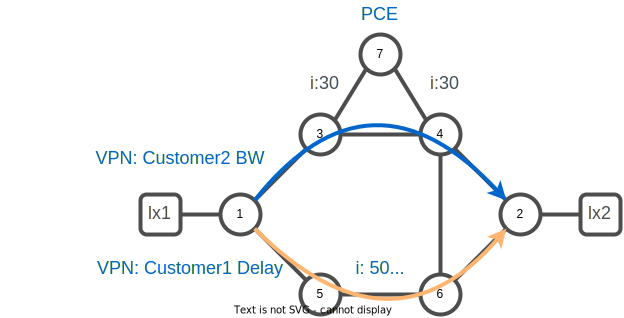

# 05. On Demand Next Hop (ODN)

## On Demand Next Hop (ODN)

For a given head-end node, a SR-Policy is defined by a tuple color,destination. In a scenario where you have several destinations with the same policy intent it would be more efficient and simple to use a policy template.

If a service head-end needs to send traffic to a prefix matching a color, it automatically instantiates an SR Policy to a BGP next-hop when required (on-demand).
The `color` BGP community is used as SLA indicator to match the policy color definition on the head-end node.

A mechanism called Automated Steering (AS) automatically steers the BGP traffic into this SR Policy, also based on nexthop and color.



Configure an SR Policy template for each color for which on-demand SR Policy instantiation is desired
An example with two color templates configured:

* color 301 for low-delay (optimize link-delay metric)
* color 302 for high bandwidth (optimize IGP metric)

### Task. 1 Simulate delay measurement with TE metric

We are going to simulate delay measurement with the TE metric. 
Let's configure the best TE path on the link between xrd-5 and xrd-6.

Connect to xrd-5

```bash
xrd 5
```

Configure TE metric to 5 on link xrd-5/xrd-6.

```bash
config
segment-routing
 traffic-eng
  interface GigabitEthernet0/0/0/0
   metric 5
  !
 !
!
commit
end
exit
```

Connect to xrd-6

```bash
xrd 6
```

Configure TE metric to 5 on link xrd-5/xrd-6.

:keyboard: xrd-6
```bash
config
segment-routing
 traffic-eng
  interface GigabitEthernet0/0/0/0
   metric 5
  !
 !
!
commit
end
exit
```


### Task. 2 Create a second customer VPN with ODN policies

Create a VRF named `customer2` on xrd-1 and xrd-2.

:keyboard: xrd-1
```bash
config
vrf customer2
 address-family ipv4 unicast
  import route-target
   20:20
  !
  export route-target
   20:20
  !
 !
!
interface loopback 20
 vrf customer2
 ipv4 address 20.20.20.1/32
!
router bgp 65000
 vrf customer2
  rd 65000:2
  address-family ipv4 unicast
   redistribute connected
  !
 !
!
commit
end
```

Declare as well two ODN policy color `301` for constraint low-delay and `302` for constraint bandwidth.

:keyboard: xrd-1
```bash
config
segment-routing
 traffic-eng
  on-demand color 301
   dynamic
    pcep
   !
    metric
     type te
    !
   !
  on-demand color 302
   dynamic
    metric
     type igp
    !
   !
  !
 !
!
commit
end
exit
```

```bash
xrd 2
```

:keyboard: xrd-2
```bash
config
vrf customer2
 address-family ipv4 unicast
  import route-target
   20:20
  !
  export route-target
   20:20
  !
 !
!
interface loopback 20
 vrf customer2
 ipv4 address 20.20.20.2/32
!
router bgp 65000
 vrf customer2
  rd 65000:2
  address-family ipv4 unicast
   redistribute connected
  !
 !
!
commit 
end
```

:keyboard: xrd-2
```bash
config
segment-routing
 traffic-eng
  on-demand color 301
   dynamic
    pcep
   !
    metric
     type te
    !
   !
  on-demand color 302
   dynamic
    metric
     type igp
    !
   !
  !
 !
!
commit
end
exit
```

:push_pin:
* Note that an ODN policy differs from a standard policy as they don't have an endpoint associated.

### Task. 3 Verify state of policy `301` and `302` 

:keyboard: xrd-1
```bash
show segment-routing traffic-eng policy
```
:question: Why is policy 301 and 302 not present ?

For now, we don't receive any color information from the newly created VPN `customer2` nor `customer1` matching the two created policy `301` and `302`.

### Task. 4 Verify prefix learned via vrf `customer2`

:keyboard: xrd-1
```bash
show bgp vpnv4 uni vrf customer2
```
```
BGP router identifier 1.1.1.1, local AS number 65000
BGP generic scan interval 60 secs
Non-stop routing is enabled
BGP table state: Active
Table ID: 0x0
BGP main routing table version 57
BGP NSR Initial initsync version 1 (Reached)
BGP NSR/ISSU Sync-Group versions 0/0
BGP scan interval 60 secs

Status codes: s suppressed, d damped, h history, * valid, > best
              i - internal, r RIB-failure, S stale, N Nexthop-discard
Origin codes: i - IGP, e - EGP, ? - incomplete
   Network            Next Hop            Metric LocPrf Weight Path
Route Distinguisher: 65000:2 (default for vrf customer2)
Route Distinguisher Version: 57
*> 20.20.20.1/32      0.0.0.0                  0         32768 ?
*>i20.20.20.2/32      2.2.2.2                  0    100      0 ?

Processed 2 prefixes, 2 paths
```

### Task. 5 Edit VPN prefix coloring

:keyboard: xrd-1
```bash
config
!
extcommunity-set opaque LOW_DELAY
 301
end-set
!
extcommunity-set opaque BANDWIDTH
 302
end-set
!
route-policy LOW_DELAY
 set extcommunity color LOW_DELAY
end
!
route-policy BANDWIDTH
 set extcommunity color BANDWIDTH
end
!
vrf customer1
 address-family ipv4 unicast
  export route-policy LOW_DELAY
 !
!
vrf customer2
 address-family ipv4 unicast
  export route-policy BANDWIDTH
 !
!
commit
end
exit
```

:keyboard: xrd-2
```bash
config
!
extcommunity-set opaque LOW_DELAY
 301
end-set
!
extcommunity-set opaque BANDWIDTH
 302
end-set
!
route-policy LOW_DELAY
 set extcommunity color LOW_DELAY
end
!
route-policy BANDWIDTH
 set extcommunity color BANDWIDTH
end
!
vrf customer1
 address-family ipv4 unicast
  export route-policy LOW_DELAY
 !
!
vrf customer2
 address-family ipv4 unicast
  export route-policy BANDWIDTH
 !
!
commit
end
exit
```

### Task. 6 Verify state of policy `301` and `302` :

Connect to xrd-1

```bash
xrd 1
```

Visualize `BANDWIDTH` optimized policy color `302` 

:keyboard: xrd-1
```bash
show segment-routing traffic-eng policy color 302   
```
```
SR-TE policy database
---------------------

Color: 302, End-point: 2.2.2.2
  Name: srte_c_302_ep_2.2.2.2
  Status:
    Admin: up  Operational: up for 00:29:09 (since Jan  2 17:54:28.269)
  Candidate-paths:
    Preference: 200 (BGP ODN) (active)
      Requested BSID: dynamic
      PCC info:
        Symbolic name: bgp_c_302_ep_2.2.2.2_discr_200
        PLSP-ID: 17
      Constraints:
        Protection Type: protected-preferred
        Maximum SID Depth: 10 
      Dynamic (valid)
        Metric Type: IGP,   Path Accumulated Metric: 30 
          16002 [Prefix-SID, 2.2.2.2]
    Preference: 100 (BGP ODN) (inactive)
      Requested BSID: dynamic
      PCC info:
        Symbolic name: bgp_c_302_ep_2.2.2.2_discr_100
        PLSP-ID: 16
      Constraints:
        Protection Type: protected-preferred
        Maximum SID Depth: 10 
      Dynamic (pce 7.7.7.7) (inactive)
        Metric Type: IGP,   Path Accumulated Metric: 30 
          16002 [Prefix-SID, 2.2.2.2]
  Attributes:
    Binding SID: 24022
    Forward Class: Not Configured
    Steering labeled-services disabled: no
    Steering BGP disabled: no
    IPv6 caps enable: yes
    Invalidation drop enabled: no
    Max Install Standby Candidate Paths: 0
```
:pushpin: 
* By default, IOSXR instantiate two path, the one configured ( preference `200` ) plus a PCEP one ( preference `100`). 


Visualize `LOW_DELAY` optimized policy color `301` 
:keyboard: xrd-1
```bash
show segment-routing traffic-eng policy color 301   
```
```
Color: 301, End-point: 2.2.2.2
  Name: srte_c_301_ep_2.2.2.2
  Status:
    Admin: up  Operational: up for 00:14:38 (since Jan  2 18:08:55.561)
  Candidate-paths:
    Preference: 200 (BGP ODN) (inactive) (shutdown)
      Requested BSID: dynamic
      Constraints:
        Protection Type: protected-preferred
        Maximum SID Depth: 10 
      Dynamic (inactive)
        Metric Type: TE,   Path Accumulated Metric: 25 
    Preference: 100 (BGP ODN) (active)
      Requested BSID: dynamic
      PCC info:
        Symbolic name: bgp_c_301_ep_2.2.2.2_discr_100
        PLSP-ID: 18
      Constraints:
        Protection Type: protected-preferred
        Maximum SID Depth: 10 
      Dynamic (pce 7.7.7.7) (valid)
        Metric Type: TE,   Path Accumulated Metric: 25 
          16005 [Prefix-SID, 5.5.5.5]
          24002 [Adjacency-SID, 100.5.6.5 - 100.5.6.6]
          16002 [Prefix-SID, 2.2.2.2]
  Attributes:
    Binding SID: 24030
    Forward Class: Not Configured
    Steering labeled-services disabled: no
    Steering BGP disabled: no
    IPv6 caps enable: yes
    Invalidation drop enabled: no
    Max Install Standby Candidate Paths: 0
```

:pushpin: 
* Candidate-path preference `200` is inactive because policy `301` only specify a PCEP path. 
* Note that the computed path force traffic to go through suboptimal IGP path, but better TE path.


## TODO:
:keyboard: xrd-1
```bash
show bgp vpnv4 uni vrf customer2
```
```
BGP router identifier 1.1.1.1, local AS number 65000
BGP generic scan interval 60 secs
Non-stop routing is enabled
BGP table state: Active
Table ID: 0x0
BGP main routing table version 57
BGP NSR Initial initsync version 1 (Reached)
BGP NSR/ISSU Sync-Group versions 0/0
BGP scan interval 60 secs

Status codes: s suppressed, d damped, h history, * valid, > best
              i - internal, r RIB-failure, S stale, N Nexthop-discard
Origin codes: i - IGP, e - EGP, ? - incomplete
   Network            Next Hop            Metric LocPrf Weight Path
Route Distinguisher: 65000:2 (default for vrf customer2)
Route Distinguisher Version: 57
*> 20.20.20.1/32      0.0.0.0                  0         32768 ?
*>i20.20.20.2/32      2.2.2.2                  0    100      0 ?

Processed 2 prefixes, 2 paths
```