# 05. Path Computation Element

In the following lab we will introduce a new concept and utilisation of a dynamic centralized control of a SR-TE network with the usage of a Path Computation Element (PCE). A Path Computation Element is an entity (component, application, or network node) that is capable of computing a network path or
route based on a network graph and applying computational constraints.

For now the computation, and instantiation of the policy were done directly on the Path Computation Client (PCC) element. A Path Computation Client is any client application requesting a
path computation to be performed by a Path Computation Element (PCE).

The communication between a PCE and a PCC is enabled via a Path Computation Element Communication Protocol (PCEP) session.

By design, the PCE doesn't have to be part of the same AS of its different PCC. 
Border Gateway Protocol Link-State (BGP-LS) is an Address Family Identifier (AFI) and Sub-address Family Identifier (SAFI) defined to carry interior gateway protocol (IGP) link-state database through BGP routing protocol.
It's a common recommended design to maintain a BGP-LS session between the PCE and the autonomous system boundary router (ASBR) to exange different AS IGP topologies.



### Task 1. Configure the PCE

Connect to xrd-7
```bash
xrd 7
```

:keyboard: xrd-7
```bash
configure
pce
 address ipv4 7.7.7.7
!
commit 
end
```

## BGP-Link State

BGP-LS (Border Gateway Protocol - Link State) is a extension to the Border Gateway Protocol (BGP) that allows BGP to carry link-state information. In the context of Segment Routing, BGP-LS can be used as a control plane to distribute routing information and construct a network topology map. This information can then be used by Segment Routing to calculate the optimal path for a packet through the network.

BGP-LS allows Segment Routing to leverage the scalability and stability of BGP, while also providing the ability to encode detailed path information in the packet header. This allows for more fine-grained control over the path that packets take through the network, enabling a wide range of advanced routing features and traffic engineering capabilities.


### Task 2. Configure BGP-LS PCE

:keyboard: xrd-7
```bash
configure
!
router bgp 65000
 address-family link-state link-state
 !
 neighbor-group client
  address-family link-state link-state
  !
 !
commit
end
exit
```

### Task 3. Configure BGP-LS PCC

Connect to xrd-2
```bash
xrd 2
```

:keyboard: xrd-2
```bash
configure
router bgp 65000
 address-family link-state link-state
 !
 neighbor-group RR-PCE
  address-family link-state link-state
  !
 !
commit
end
exit
```

Connect to xrd-1
```bash
xrd 1
```

:keyboard: xrd-1
```bash
configure
router bgp 65000
 address-family link-state link-state
 !
 neighbor-group RR-PCE
  address-family link-state link-state
  !
 !
commit
end
```

### Task 4. Verify BGP-LS state

:keyboard: xrd-1

```bash
show bgp link-state link-state neighbors brief
exit
```
```
Neighbor        Spk    AS Description                          Up/Down  NBRState
7.7.7.7           0 65000                                      00:05:13 Established 
```

### Task. 5 Verify PCE Topology

Connect to xrd-7
```bash
xrd 7
```

:keyboard: xrd-7
```bash
show pce ipv4 topology
```
```
PCE's topology database - detail:
---------------------------------
Node 2
  TE router ID: 1.1.1.1
  Host name: xrd-1
  ISIS system ID: 0000.0000.0001 level-2 Area-id: 49.0002 ASN: 0
  Prefix SID:
    ISIS system ID: 0000.0000.0001 level-2 Area-id: 49.0002 ASN: 0 domain ID: 0
      Prefix 1.1.1.1, label 16001 (regular), Algorithm: 0, flags: X:0, R:0, N:1, P:0, E:0, V:0, L:0, M:0
  SRGB INFO:
    ISIS system ID: 0000.0000.0001 level-2 Area-id: 49.0002 ASN: 0
      SRGB Start: 16000 Size: 8000
  SRLB INFO:
    ISIS system ID: 0000.0000.0001 level-2 Area-id: 49.0002 ASN: 0
      SRLB Start: 15000 Size: 1000
  SR Algo INFO:
    ISIS system ID: 0000.0000.0001 level-2 Area-id: 49.0002 ASN: 0
      SR Algo Participation:
         0, 1

  Link[0]: local address 100.1.3.1, remote address 100.1.3.3
    Local node:
      ISIS system ID: 0000.0000.0001 level-2 Area-id: 49.0002 ASN: 0
    Remote node:
      TE router ID: 3.3.3.3
      Host name: xrd-3
      ISIS system ID: 0000.0000.0003 level-2 Area-id: 49.0002 ASN: 0
    Metric: IGP 10, TE 10, Latency 10 microseconds
    Bandwidth: Total 125000000 Bps, Reservable 0 Bps
    Admin-groups: 0x00000000
    Adj SID: 24000 (protected) 24001 (unprotected)
    Flex-algo Metric: TE 4294967295
[...]
```
:keyboard: xrd-7
```bash
exit
```

### Task 6. Configure PCC with PCE 

Connect to xrd-1
```bash
xrd 1
```

:keyboard: xrd-1
```bash
config
segment-routing
 traffic-eng
  pcc
   source-address ipv4 1.1.1.1
   pce address ipv4 7.7.7.7
   !
   report-all
  !
 !
!
commit
end
```

:pushpin: 
* The `report-all` keyword enable the `stateful` capability. The PCC will report all policy created to the PCE.
* Several PCE can be declared, in that case a `precedence` must be defined to select the preferred PCE.

Verify peer association between PCC and PCE.

:keyboard: xrd-1
```bash
show segment-routing traffic-eng pcc ipv4 peer 
exit
```
```
PCC's peer database:
--------------------

Peer address: 7.7.7.7, 
  Precedence: 255, (best PCE)
  State up
  Capabilities: Stateful, Update, Segment-Routing, Instantiation, SRv6
```

Connect to xrd-2
```bash
xrd 2
```

:keyboard: xrd-2
```bash
config
segment-routing
 traffic-eng
  pcc
   source-address ipv4 2.2.2.2
   pce address ipv4 7.7.7.7
   !
   report-all
  !
 !
!
commit
end
exit
```

### Task 7. Instantiate a PCE-Delegated policy 

Several policy instanciation are possible

| Concept                         | Description                                                           |
|---------------------------------|-----------------------------------------------------------------------|
| PCE initiated                   | A policy created by a PCE                                             |
| PCC initiated                   | A policy created by a PCC                                             |
| PCC initiated PCE delegated     | A policy created by a PCC with a path computation delegation to a PCE |


Let's create a PCC initiated a TE optimized policy with a PCE delegated path.

Connect to xrd-1
```bash
xrd 1
```

:keyboard: xrd-1
```bash
config
segment-routing
 traffic-eng
  policy to-xrd2
   color 200 end-point ipv4 2.2.2.2
   candidate-paths
    preference 100
     dynamic
      pcep
      !
      metric
       type te
      !
     !
    !
   !
  !
 !
!
commit
end
```

### Task 8. Verify policy on PCC

Visualize the policy state on xrd-1

:keyboard: xrd-1
```bash
show segment-routing traffic-eng policy color 200
exit
```
```console
SR-TE policy database
---------------------

Color: 200, End-point: 2.2.2.2
  Name: srte_c_200_ep_2.2.2.2
  Status:
    Admin: up  Operational: up for 01:01:44 (since Jan  7 21:54:06.977)
  Candidate-paths:
    Preference: 100 (configuration) (active)
      Name: to-xrd2
      Requested BSID: dynamic
      PCC info:
        Symbolic name: cfg_to-xrd2_discr_100
        PLSP-ID: 3
      Constraints:
        Protection Type: protected-preferred
        Maximum SID Depth: 10 
      Dynamic (pce 7.7.7.7) (valid)
        Metric Type: TE,   Path Accumulated Metric: 25 
          16005 [Prefix-SID, 5.5.5.5]
          24002 [Adjacency-SID, 100.5.6.5 - 100.5.6.6]
          16002 [Prefix-SID, 2.2.2.2]
  Attributes:
    Binding SID: 24018
    Forward Class: Not Configured
    Steering labeled-services disabled: no
    Steering BGP disabled: no
    IPv6 caps enable: yes
    Invalidation drop enabled: no
    Max Install Standby Candidate Paths: 0
```

Connect to xrd-7
```bash
xrd 7
```

### Task 9. Verify policy on PCE

Visualize the policy database on the PCE, xrd-7.

:keyboard: xrd-7
```bash
show pce segment-routing traffic-eng policy
exit
```
```
PCE's policy database: 
----------------------

PCC Address: 1.1.1.1
  Color: 110, Endpoint: 2.2.2.2
    Name: srte_c_110_ep_2.2.2.2
    Candidate-paths:
      Symbolic-name: cfg_xrd1-xrd2_discr_100
        PLSP-ID: 2
      Symbolic-name: cfg_xrd1-xrd2_discr_110 (Active)
        PLSP-ID: 1
      
PCC Address: 1.1.1.1
  Color: 200, Endpoint: 2.2.2.2
    Name: srte_c_200_ep_2.2.2.2
    Candidate-paths:
      Symbolic-name: cfg_to-xrd2_discr_100 (Active)
        PLSP-ID: 3
```

---