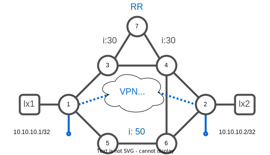

# 06. SR-MPLS VPN

## SR-MPLS L3VPN

SR-MPLS (Segment Routing - Multiprotocol Label Switching) L3VPN (Layer 3 Virtual Private Network) is a type of virtual private network (VPN) that uses Segment Routing and MPLS (Multiprotocol Label Switching) technology to route traffic between different sites or locations.

SR-MPLS L3VPNs allow multiple sites to be connected over a shared network infrastructure, allowing for the creation of a logical, private network that is isolated from the public internet. This can be used to securely connect branch offices, remote workers, and other sites, enabling them to communicate as if they were on the same local network.

SR-MPLS L3VPNs use MPLS labels to forward traffic between sites, and Segment Routing to calculate the optimal path through the network. This allows for advanced traffic engineering capabilities and the ability to optimize the performance of the VPN.



### Task 1. Verify BGP configuration

Visualize the BGP configuration. Router xrd-7 is configured to act as a route reflector server for the two PE : router xrd-1 and xrd-2

Connect to xrd-1
```bash
xrd 1
```

:keyboard: xrd-1
```bash
show run router bgp
```
```
router bgp 65000
 bgp router-id 1.1.1.1
 address-family vpnv4 unicast
 !
 address-family link-state link-state
 !
 neighbor-group RR-PCE
  remote-as 65000
  update-source Loopback0
  address-family vpnv4 unicast
  !
  address-family link-state link-state
  !
 !
 neighbor 7.7.7.7
  use neighbor-group RR-PCE
 !
!
```

:information_source: The configuration is similar on xrd-2

Verify BGP neighbor connection status.

:keyboard: xrd-1
```bash
show bgp neighbor brief
```
```
Neighbor        Spk    AS Description                          Up/Down  NBRState
7.7.7.7           0   65000                                    20:25:16 Established 
```

### Task 2. Create a VRF 

Create a VRF named `customer1` on xrd-1 and xrd-2:

:keyboard: xrd-1
```bash
config
vrf customer1
 address-family ipv4 unicast
  import route-target
   10:10
  !
  export route-target
   10:10
  !
 !
!
interface loopback 10
 vrf customer1
 ipv4 address 10.10.10.1/32
!
router bgp 65000
 vrf customer1
  rd 65000:1
  address-family ipv4 unicast
   redistribute connected
  !
 !
!
commit
end
exit
```

```bash
xrd 2
```

:keyboard: xrd-2
```bash
config
vrf customer1
 address-family ipv4 unicast
  import route-target
   10:10
  !
  export route-target
   10:10
  !
 !
!
interface loopback 10
 vrf customer1
 ipv4 address 10.10.10.2/32
!
router bgp 65000
 vrf customer1
  rd 65000:1
  address-family ipv4 unicast
   redistribute connected
  !
 !
!
commit
end
exit
```

### Task 3. Verify VPN state

Connect to xrd-1

```bash
xrd 1
```

:keyboard: xrd-1
```bash
show ip route vrf customer1 
```
```
Codes: C - connected, S - static, R - RIP, B - BGP, (>) - Diversion path
       D - EIGRP, EX - EIGRP external, O - OSPF, IA - OSPF inter area
       N1 - OSPF NSSA external type 1, N2 - OSPF NSSA external type 2
       E1 - OSPF external type 1, E2 - OSPF external type 2, E - EGP
       i - ISIS, L1 - IS-IS level-1, L2 - IS-IS level-2
       ia - IS-IS inter area, su - IS-IS summary null, * - candidate default
       U - per-user static route, o - ODR, L - local, G  - DAGR, l - LISP
       A - access/subscriber, a - Application route
       M - mobile route, r - RPL, t - Traffic Engineering, (!) - FRR Backup path

Gateway of last resort is not set

L    10.10.10.1/32 is directly connected, 00:00:40, Loopback10
B    10.10.10.2/32 [200/0] via 2.2.2.2 (nexthop in vrf default), 00:00:27
```

Notice that xrd-1 learned via `BGP`, xrd-2 loopback address `10.10.10.2/32` via `2.2.2.2`.

:keyboard: xrd-1
```bash
show bgp vpnv4 uni
```
```
BGP router identifier 1.1.1.1, local AS number 65000
BGP generic scan interval 60 secs
Non-stop routing is enabled
BGP table state: Active
Table ID: 0x0
BGP main routing table version 9
BGP NSR Initial initsync version 1 (Reached)
BGP NSR/ISSU Sync-Group versions 0/0
BGP scan interval 60 secs

Status codes: s suppressed, d damped, h history, * valid, > best
              i - internal, r RIB-failure, S stale, N Nexthop-discard
Origin codes: i - IGP, e - EGP, ? - incomplete
   Network            Next Hop            Metric LocPrf Weight Path
Route Distinguisher: 65000:1 (default for vrf customer1)
Route Distinguisher Version: 9
*> 10.10.10.1/32      0.0.0.0                  0         32768 ?
*>i10.10.10.2/32      2.2.2.2                  0    100      0 ?
```

:keyboard: xrd-1
```bash
ping vrf customer1 10.10.10.2
```
```
Thu Nov  3 11:48:48.869 UTC
Type escape sequence to abort.
Sending 5, 100-byte ICMP Echos to 10.10.10.2, timeout is 2 seconds:
!!!!!
Success rate is 100 percent (5/5), round-trip min/avg/max = 1/1/2 ms
```

## SR-TE automatic steering 

SR (Segment Routing) prefix coloring is a technique used in traffic engineering to differentiate between different types of traffic or traffic classes in a network. It allows different policies or treatment to be applied to different traffic classes based on the color of the traffic.

In SR prefix coloring, a color is assigned to each prefix, or destination address, in the network. This color is then encoded in the packet header as the packet is forwarded through the network. Routers and other network devices can then use the color to apply different policies or treatment to the packet based on its color.

For example, a network might use SR prefix coloring to give higher priority to certain types of traffic, such as real-time video or voice traffic, by assigning a higher-priority color to those prefixes. This can help to ensure that the important traffic is given preferential treatment and is not delayed by other traffic.

### Task 4. Configure a SR-TE policy

The policy will have a PCE constraint. A policy with path disjointness constraint is a type of traffic engineering policy that requires the path of the policy's traffic to be distinct from certain other paths in the network, in order to improve resilience and reliability.



:keyboard: xrd-1
```bash
config
segment-routing
 traffic-eng
  policy to-xrd2-diversity
   color 300 end-point ipv4 2.2.2.2
   candidate-paths
    preference 100
     dynamic
      pcep
      !
      metric
       type igp
      !
     !
     constraints
      disjoint-path group-id 10 type link
     !
    !
   !
  !
 !
!
commit
end
exit
```

```bash
xrd 2
```

:keyboard: xrd-2
```bash
config
segment-routing
 traffic-eng  
  policy to-xrd1-diversity
   color 300 end-point ipv4 1.1.1.1
   candidate-paths
    preference 100
     dynamic
      pcep
      !
      metric
       type igp
      !
     !
     constraints
      disjoint-path group-id 10 type link
     !
    !
   !
  !
 !
!
commit
end
```

### Task 5. Configure the prefix coloring

A BGP (Border Gateway Protocol) extended community is a type of attribute that can be associated with a BGP route. It is used to carry additional information about the route, such as the route's origin, its intended use, or its intended destination.

BGP extended communities are defined as a pair of values, with each value being an unsigned 32-bit integer. The first value is called the "type" and the second value is called the "value". The type and value are combined to form a unique extended community attribute.

BGP extended communities can be used for a variety of purposes, such as controlling the route's behavior, influencing its selection, or providing additional information about the route.


Configure the prefix coloring. We want to advert routes learned in the VRF `customer1` with the color `300`.

:keyboard: xrd-2

```bash
config
!
extcommunity-set opaque BEST_EFFORT_DIVERSITY
 300
end-set
!
route-policy BEST_EFFORT_DIVERSITY
 set extcommunity color BEST_EFFORT_DIVERSITY
end
!
vrf customer1
 address-family ipv4 unicast
  export route-policy BEST_EFFORT_DIVERSITY
 !
!
commit
end
exit
```

Connect to xrd 1
```bash
xrd 1
```

:keyboard: xrd-1

```bash
config
!
extcommunity-set opaque BEST_EFFORT_DIVERSITY
 300
end-set
!
route-policy BEST_EFFORT_DIVERSITY
 set extcommunity color BEST_EFFORT_DIVERSITY
end
!
vrf customer1
 address-family ipv4 unicast
  export route-policy BEST_EFFORT_DIVERSITY
 !
!
commit
end
```

### Task 6. Verify the BGP updates 

:keyboard: xrd-1
```bash
show bgp vpnv4 uni vrf customer1
```
```
BGP router identifier 1.1.1.1, local AS number 65000
BGP generic scan interval 60 secs
Non-stop routing is enabled
BGP table state: Active
Table ID: 0x0
BGP main routing table version 88
BGP NSR Initial initsync version 1 (Reached)
BGP NSR/ISSU Sync-Group versions 0/0
BGP scan interval 60 secs

Status codes: s suppressed, d damped, h history, * valid, > best
              i - internal, r RIB-failure, S stale, N Nexthop-discard
Origin codes: i - IGP, e - EGP, ? - incomplete
   Network            Next Hop            Metric LocPrf Weight Path
Route Distinguisher: 65000:1 (default for vrf customer1)
Route Distinguisher Version: 88
*> 10.10.10.1/32      0.0.0.0                  0         32768 ?
*>i10.10.10.2/32      2.2.2.2 C:300            0    100      0 ?
```

:keyboard: xrd-1
```bash
show bgp vpnv4 uni rd 65000:1 10.10.10.2/32 detail
```
```
BGP routing table entry for 10.10.10.2/32, Route Distinguisher: 65000:1
Versions:
  Process           bRIB/RIB  SendTblVer
  Speaker                  87           87
    Flags: 0x000c3001+0x00000000; 
Last Modified: Jan  2 18:46:08.385 for 00:05:36
Paths: (1 available, best #1)
  Not advertised to any peer
  Path #1: Received by speaker 0
  Flags: 0xa000000085060005+0x00, import: 0x39f
  Not advertised to any peer
  Local
    2.2.2.2 C:300 (bsid:24013) (metric 30) from 7.7.7.7 (2.2.2.2), if-handle 0x00000000
      Received Label 24004 
      Origin incomplete, metric 0, localpref 100, valid, internal, best, group-best, import-candidate, imported
      Received Path ID 0, Local Path ID 1, version 84
      Extended community: Color:300 RT:10:10 
      Originator: 2.2.2.2, Cluster list: 7.7.7.7
      SR policy color 300, up, registered, bsid 24013, if-handle 0x0000007c

      Source AFI: VPNv4 Unicast, Source VRF: customer1, Source Route Distinguisher: 65000:1
```

### Task 7. Verify the RIB information for destination prefix 

:keyboard: xrd-1
```bash
show route vrf customer1 10.10.10.2/32 detail 
```
```
Routing entry for 10.10.10.2/32
  Known via "bgp 65000", distance 200, metric 0, type internal
  Installed Jan  2 18:46:08.231 for 00:06:59
  Routing Descriptor Blocks
    2.2.2.2, from 7.7.7.7
      Nexthop in Vrf: "default", Table: "default", IPv4 Unicast, Table Id: 0xe0000000
      Route metric is 0
      Label: 0x5dc4 (24004)
      Tunnel ID: None
      Binding Label: 0x5dcd (24013)
      Extended communities count: 0
      Source RD attributes: 0x0000:65000:1
      NHID:0x0(Ref:0)
  Route version is 0x1d (29)
  No local label
  IP Precedence: Not Set
  QoS Group ID: Not Set
  Flow-tag: Not Set
  Fwd-class: Not Set
  Route Priority: RIB_PRIORITY_RECURSIVE (12) SVD Type RIB_SVD_TYPE_REMOTE
  Download Priority 3, Download Version 98
  No advertising protos. 
```

### Task 8. Verify the FIB information for destination prefix 

:keyboard: xrd-1
```bash
show cef vrf customer1 10.10.10.2/32 detail   
```
```
10.10.10.2/32, version 98, internal 0x5000001 0x30 (ptr 0x8719bc48) [1], 0x0 (0x0), 0x208 (0x890f0be8)
 Updated Jan  2 18:46:08.233
 Prefix Len 32, traffic index 0, precedence n/a, priority 3
  gateway array (0x876343b8) reference count 2, flags 0x2038, source rib (7), 0 backups
                [1 type 1 flags 0x48441 (0x8912fa08) ext 0x0 (0x0)]
  LW-LDI[type=0, refc=0, ptr=0x0, sh-ldi=0x0]
  gateway array update type-time 1 Jan  2 18:46:08.233
 LDI Update time Jan  2 18:46:08.233
   via local-label 24013, 3 dependencies, recursive [flags 0x6000]
    path-idx 0 NHID 0x0 [0x871de930 0x0]
    recursion-via-label
    next hop VRF - 'default', table - 0xe0000000
    next hop via 24013/0/21
     next hop srte_c_300_e labels imposed {ImplNull 24004}

    Load distribution: 0 (refcount 1)

    Hash  OK  Interface                 Address
    0     Y   recursive                 24013/0  
```

### Task 9. Verify policies state and path

:keyboard: xrd-1
```bash
show segment-routing traffic-eng policy color 300
```
```
SR-TE policy database
---------------------

Color: 300, End-point: 2.2.2.2
  Name: srte_c_300_ep_2.2.2.2
  Status:
    Admin: up  Operational: up for 00:00:13 
  Candidate-paths:
    Preference: 100 (configuration) (active)
      Name: to-xrd2-diversity
      Requested BSID: dynamic
      PCC info:
        Symbolic name: cfg_to-xrd2-diversity_discr_100
        PLSP-ID: 26
      Constraints:
        Protection Type: protected-preferred
        Maximum SID Depth: 10 
      Dynamic (pce 7.7.7.7) (valid)
        Metric Type: IGP,   Path Accumulated Metric: 30 
          16002 [Prefix-SID, 2.2.2.2]
  Attributes:
    Binding SID: 24013
    Forward Class: Not Configured
    Steering labeled-services disabled: no
    Steering BGP disabled: no
    IPv6 caps enable: yes
    Invalidation drop enabled: no
    Max Install Standby Candidate Paths: 0
```

:keyboard: xrd-1

```bash
traceroute vrf customer1 10.10.10.2
exit
```
```
Type escape sequence to abort.
Tracing the route to 10.10.10.2

 1  100.1.3.3 [MPLS: Labels 16002/24004 Exp 0] 2 msec  2 msec  2 msec 
 2  100.3.4.4 [MPLS: Labels 16002/24004 Exp 0] 2 msec  2 msec  1 msec 
 3  100.2.4.2 2 msec  *  2 msec 
```

Connect to xrd-2
```bash
xrd 2
```

:keyboard: xrd-2
```bash
show segment-routing traffic-eng policy color 300
```
```
SR-TE policy database
---------------------

Color: 300, End-point: 1.1.1.1
  Name: srte_c_300_ep_1.1.1.1
  Status:
    Admin: up  Operational: up for 00:11:40
  Candidate-paths:
    Preference: 200 (BGP ODN) (inactive) (shutdown)
      Requested BSID: dynamic
      Constraints:
        Protection Type: protected-preferred
        Maximum SID Depth: 10 
      Dynamic (inactive)
        Metric Type: TE,   Path Accumulated Metric: 0 
    Preference: 100 (BGP ODN) (active)
      Requested BSID: dynamic
      PCC info:
        Symbolic name: bgp_c_300_ep_1.1.1.1_discr_100
        PLSP-ID: 7
      Constraints:
        Protection Type: protected-preferred
        Maximum SID Depth: 10 
      Dynamic (pce 7.7.7.7) (valid)
        Metric Type: TE,   Path Accumulated Metric: 25 
          16006 [Prefix-SID, 6.6.6.6]
          24004 [Adjacency-SID, 100.5.6.6 - 100.5.6.5]
          16001 [Prefix-SID, 1.1.1.1]
  Attributes:
    Binding SID: 24007
    Forward Class: Not Configured
    Steering labeled-services disabled: no
    Steering BGP disabled: no
    IPv6 caps enable: yes
    Invalidation drop enabled: no
    Max Install Standby Candidate Paths: 0
```

:keyboard: xrd-2

```bash
traceroute vrf customer1 10.10.10.1
exit
```
```
Type escape sequence to abort.
Tracing the route to 10.10.10.1

 1  100.2.6.6 [MPLS: Labels 24004/16001/24018 Exp 0] 2 msec  2 msec  1 msec 
 2  100.5.6.5 [MPLS: Labels 16001/24018 Exp 0] 2 msec  1 msec  1 msec 
 3  100.1.5.1 1 msec  *  2 msec 
```

note that one of the policy is using a suboptimal IGP path to match both constraints : IGP metric + link diversity.
