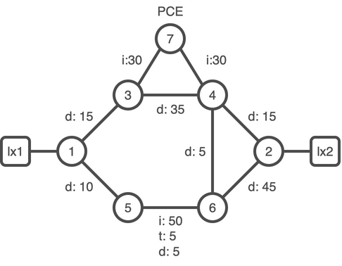
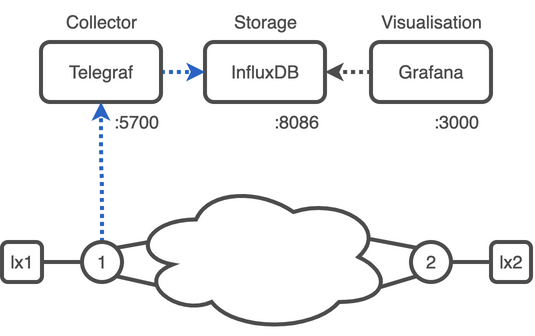

# 06. SR Telemetry and Performance Measurement 

## Performance Measurement



### Task. Configure performance measurement

```bash
config
performance-measurement
 interface GigabitEthernet0/0/0/0
  delay-measurement
   advertise-delay 15
  !
 !
 interface GigabitEthernet0/0/0/1
  delay-measurement
   advertise-delay 10
  !
 !
!
commit
end
exit
```

<details><summary><b>:closed_book: Performance Measurements snippets</b></summary>

```bash
xrd 1
```

:keyboard: xrd-1 configuration:
```bash
config
performance-measurement
 interface GigabitEthernet0/0/0/0
  delay-measurement
   advertise-delay 15
  !
 !
 interface GigabitEthernet0/0/0/1
  delay-measurement
   advertise-delay 10
  !
 !
!
commit
end
exit
```

```bash
xrd 2
```

:keyboard: xrd-2 configuration:
```bash
config
performance-measurement
 interface GigabitEthernet0/0/0/0
  delay-measurement
   advertise-delay 15
  !
 !
 interface GigabitEthernet0/0/0/1
  delay-measurement
   advertise-delay 45
  !
 !
!
commit
end
exit
```

```bash
xrd 3
```

:keyboard: xrd-3 configuration:
```bash
config
performance-measurement
 interface GigabitEthernet0/0/0/0
  delay-measurement
   advertise-delay 35
  !
 !
 interface GigabitEthernet0/0/0/2
  delay-measurement
   advertise-delay 15
  !
 !
!
commit
end
exit
```

```bash
xrd 4
```

:keyboard: xrd-4 configuration:
```bash
config
performance-measurement
 interface GigabitEthernet0/0/0/0
  delay-measurement
   advertise-delay 35
  !
 !
 interface GigabitEthernet0/0/0/1
  delay-measurement
   advertise-delay 6
  !
 !
 interface GigabitEthernet0/0/0/2
  delay-measurement
   advertise-delay 15
  !
 !
!
commit
end
exit
```

```bash
xrd 5
```

:keyboard: xrd-5 configuration:
```bash
config
performance-measurement
 interface GigabitEthernet0/0/0/0
  delay-measurement
   advertise-delay 5
  !
 !
 interface GigabitEthernet0/0/0/2
  delay-measurement
   advertise-delay 10
  !
 !
!
commit
end
exit
```

```bash
xrd 6
```

:keyboard: xrd-6 configuration:
```bash
config
performance-measurement
 interface GigabitEthernet0/0/0/0
  delay-measurement
   advertise-delay 5
  !
 !
 interface GigabitEthernet0/0/0/1
  delay-measurement
   advertise-delay 5
  !
 !
 interface GigabitEthernet0/0/0/2
  delay-measurement
   advertise-delay 45
  !
 !
!
commit
end
exit
```

</details>
<br/>

Connect to xrd-1
```bash
xrd 1
```

:keyboard: xrd-1:
```bash
show segment-routing traffic-eng topology 
```
```
Topology database:
------------------
Node 2
  Router ID: 1.1.1.1

  ISIS-L2 0000.0000.0001
    Hostname: xrd-1
    TE router ID: 1.1.1.1
    ISIS area ID: 49.0002
    SRGBs: 16000 - 24000
    SRLBs: 15000 - 16000

    Prefixes:
      1.1.1.1/32
        Regular SID index: 1
      100.1.3.0/24
      100.1.5.0/24

    Links:
      Local: 100.1.3.1 Remote: 100.1.3.3
        Remote node: ISIS-L2 0000.0000.0003
          Hostname: xrd-3
          TE router ID: 3.3.3.3
          ISIS area ID: 49.0002
        Metrics: IGP 10, TE 10, Latency 18 microseconds
        Bandwidth: Total 125000000 Bps, Reservable 0 Bps
        Flex-Algo ASLA:
          Metric: TE 4294967295
        Adj-SIDs: 24000 (protected), 24001 (unprotected)

      Local: 100.1.5.1 Remote: 100.1.5.5
        Remote node: ISIS-L2 0000.0000.0005
          Hostname: xrd-5
          TE router ID: 5.5.5.5
          ISIS area ID: 49.0002
        Metrics: IGP 10, TE 10, Latency 16 microseconds
        Bandwidth: Total 125000000 Bps, Reservable 0 Bps
        Flex-Algo ASLA:
          Metric: TE 4294967295
        Adj-SIDs: 24002 (protected), 24003 (unprotected)

  ISIS-L2 0000.0000.0001
    ASN: 65000
    Hostname: xrd-1
    TE router ID: 1.1.1.1
    ISIS area ID: 49.0002
    SRGBs: 16000 - 24000
    SRLBs: 15000 - 16000

    Prefixes:
      100.1.3.0/24
      100.1.5.0/24
 --More--
```

## Task. Configure a SR policy with delay metric



:keyboard: xrd-1:
```bash
config
segment-routing
 traffic-eng
  policy to-xrd2-latency
   color 400 end-point ipv4 2.2.2.2
   candidate-paths
    preference 100
     dynamic
      pcep
      !
      metric
       type delay
      !
     !
    !
   !
  !
 !
!
commit
end
```

:keyboard: xrd-1:
```bash
show segment-routing traffic-eng policy color 400
```
```
SR-TE policy database
---------------------

Color: 400, End-point: 2.2.2.2
  Name: srte_c_400_ep_2.2.2.2
  Status:
    Admin: up  Operational: up for 00:00:03 (since Jan  3 11:50:28.148)
  Candidate-paths:
    Preference: 100 (configuration) (active)
      Name: to-xrd2-latency
      Requested BSID: dynamic
      PCC info:
        Symbolic name: cfg_to-xrd2-latency_discr_100
        PLSP-ID: 27
      Constraints:
        Protection Type: protected-preferred
        Maximum SID Depth: 10 
      Dynamic (pce 7.7.7.7) (valid)
        Metric Type: TE,   Path Accumulated Metric: 25 
          16005 [Prefix-SID, 5.5.5.5]
          24002 [Adjacency-SID, 100.5.6.5 - 100.5.6.6]
          16002 [Prefix-SID, 2.2.2.2]
  Attributes:
    Binding SID: 24016
    Forward Class: Not Configured
    Steering labeled-services disabled: no
    Steering BGP disabled: no
    IPv6 caps enable: yes
    Invalidation drop enabled: no
    Max Install Standby Candidate Paths: 0
```

### not supported

```
policy donz
 color 543 end-point ipv4 50.50.50.50
 shutdown
 candidate-paths
  preference 100
   dynamic
   !
   constraints
    segments
     sid-algorithm 128
    !
    affinity
     exclude-any
      name TOP
     !
    !
   !
  !
 !
 performance-measurement
  delay-measurement
  !
 !
!
```


```bash
cd $HOME/lab/sr-lab-telemetry
```

Instantiate the lab
```bash
docker-compose up -d
```


```yaml
version: '3.6'
services:

  telegraf:
    #image: telegraf:1.20.2-alpine
    build:
      context: ./telegraf
      args:
        HTTPS_PROXY: $HTTPS_PROXY
    container_name: telegraf
    ports:
      - 57500:57500
    hostname: telegraf
    command: telegraf --watch-config poll --config-directory /etc/telegraf/telegraf.d
    volumes:
      - "./telegraf/telegraf-sample.conf:/etc/telegraf/telegraf.conf:ro"
      - "./telegraf/telegraf.d:/etc/telegraf/telegraf.d:ro"
    env_file:
      - .env
    logging:
      driver: "json-file"
      options:
        max-size: "20m"
        max-file: "10"
    depends_on:
      - influxdb
    restart: always

  influxdb:
    image: influxdb:2.0.4-alpine
    container_name: influxdb
    ports:
      - 8086:8086
    env_file:
      - .env
    restart: always

  grafana:
    image: grafana/grafana:8.3.0
    container_name: grafana
    ports:
      - 3000:3000
    volumes:
      - grafana-data:/var/lib/grafana
      - ./grafana/provisioning:/etc/grafana/provisioning:ro
      - ./grafana/provisioning/dashboards:/var/lib/grafana/dashboards:ro
    env_file:
      - .env
    environment:
      # Grafana has to use Proxy mode for a successful connection;
      # Therefore, one accesses InfluxDB through the host network.
      INFLUX_HOST_v2: $HOST
    depends_on:
      - influxdb
    restart: always
```


```bash
config
telemetry model-driven
 destination-group lab-sr-collector
  address-family ipv4 172.28.0.254 port 57000
   encoding self-describing-gpb
   protocol grpc no-tls
  !
 !
 sensor-group sr-policy-monitoring-extended
  sensor-path Cisco-IOS-XR-infra-xtc-agent-oper:xtc/policy-forwardings/policy-forwarding
  sensor-path Cisco-IOS-XR-perf-meas-oper:performance-measurement/nodes/node/sr-policies/sr-policy-delay
 !
 subscription lab-sr
  sensor-group-id sr-policy-monitoring-extended sample-interval 10000
  destination-id lab-sr-collector
 !
!
commit
end
```

```
RP/0/RP0/CPU0:xrd-1#show telemetry model-driven sensor-group 
Tue Jan  3 09:34:52.160 UTC
  Sensor Group Id:sr-policy-monitoring-extended
    Sensor Path:        Cisco-IOS-XR-infra-xtc-agent-oper:xtc/policy-forwardings/policy-forwarding
    Sensor Path State:  Resolved
    Sensor Path:        Cisco-IOS-XR-perf-meas-oper:performance-measurement/nodes/node/sr-policies/sr-policy-delay
    Sensor Path State:  Resolved
```

```
RP/0/RP0/CPU0:xrd-1#show telemetry model-driven subscription 
Tue Jan  3 09:35:27.840 UTC
Subscription:  lab-sr                   State: ACTIVE
-------------
  Sensor groups:
  Id                               Interval(ms)               State     
  sr-policy-monitoring-extended    10000                      Resolved  

  Destination Groups:
  Id                 Encoding            Transport   State   Port    Vrf                               IP                                            
  lab-sr             self-describing-gpb grpc        Active  57000                                     172.28.0.254                                  
    TLS :             False

```


