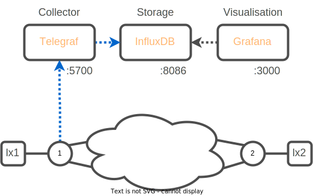

# Model Driven Telemetry

## Monitoring model-driven telemetry data stream

A monitoring stack is a collection of components for ingesting, storing and visualizing telemetry data. 
In the current lab we propose usage of opensource solution tools running as Docker containers:

- Telegraf - a collection container that runs the cisco_telemetry_mdt plugin for ingestion of model-driven telemetry data
- InfluxDB - a storage container that runs a database which stores the data
- Grafana - a visualization container that runs a web application which allows the exploration of data



### Task. 1 Get familiar with a TIG stack

Move to the lab folder.

```bash
cd $HOME/lab/sr-lab-telemetry
```

Dokcer-compose is a tool for defining and running multi-container Docker applications. 
With docker-compose, you use a YAML file to configure your application's services.

Let's visualize those services:

```bash
cat docker-compose.yaml
```
```yaml
version: '3.6'
services:

  telegraf:
    image: telegraf:1.20.2-alpine
    container_name: telegraf
    ports:
      - 57000:57000
    hostname: telegraf
    command: telegraf --config-directory /etc/telegraf/telegraf.d
    volumes:
      - "./telegraf/telegraf-sample.conf:/etc/telegraf/telegraf.conf:ro"
      - "./telegraf/telegraf.d:/etc/telegraf/telegraf.d:ro"
    env_file:
      - .env
    logging:
      driver: "json-file"
      options:
        max-size: "20m"
        max-file: "10"
    depends_on:
      - influxdb
    restart: always

  influxdb:
    image: influxdb:2.0.4-alpine
    container_name: influxdb
    ports:
      - 8086:8086
    env_file:
      - .env
    restart: always

  grafana:
    image: grafana/grafana:8.3.0
    container_name: grafana
    ports:
      - 3000:3000
    volumes:
      - grafana-data:/var/lib/grafana
      - ./grafana/provisioning:/etc/grafana/provisioning:ro
      - ./grafana/provisioning/dashboards:/var/lib/grafana/dashboards:ro
    env_file:
      - .env
    environment:
      # Grafana has to use Proxy mode for a successful connection;
      # Therefore, one accesses InfluxDB through the host network.
      INFLUX_HOST_v2: $HOST
    depends_on:
      - influxdb
    restart: always
```

:push_pin:

- The docker-compose file is composed of three named services `telegraf`, `influxdb`, `grafana` 
- Each service mention the docker `image` to be pulled and used, and other configuration parameters for the container such as the `ports` it's listening on.
- For the service `telegraf` and `grafana`, `volumes` are attached to the container. They link a local machine folder/file to an element in the running container.

### Task 2. Visualize Telegraf configuration

```bash
cat telegraf/telegraf.d/telegraf-sr.conf
```

```ini
[[inputs.cisco_telemetry_mdt]]
  # Telemetry transport
  transport = "grpc"

  # Address and port to host telemetry listener on - dialout:
  # IOS XR dials out to the collector
  service_address = ":57000"

[[outputs.influxdb_v2]]
  urls = ["http://influxdb:8086"]

  token = "$DOCKER_INFLUXDB_INIT_ADMIN_TOKEN"
  organization = "$DOCKER_INFLUXDB_INIT_ORG"
  bucket = "$DOCKER_INFLUXDB_INIT_BUCKET"

  precision = "s"
  timeout = "5s"
```

The configuration file define an `input` and `output` specifications.

Instantiate the lab
```bash
docker-compose up -d
```

The collector has been configured to listen on port 57000 for incoming connections. 
The device will initiate the connection, dialling out to the collector. 
After the connection establishment, the device will begin to stream data to the collector which will send it to a database named telemetry.


## Retrieval of the configuration for model-driven telemetry streaming (dial-out)

The IOS XR device has been preconfigured for model-driven telemetry (MDT) streaming using the gRPC dial-out mechanism.

In this case, the device initiates a gRPC session (dial-out) with the MDT receiver (i.e., the host that runs the Jupyter notebook - 198.18.134.50) and exchanges SYN -- SYN-ACK -- ACK with it while establishing the connection.

If the connection is successfully created, the device will start streaming telemetry data towards the collection point.

The configuration consists of:

A sensor-group that is composed of sensor-path(s):
A sensor-path is a specification of the YANG component about which information should be streamed. It is specified in XPath format
A destination-group that is composed of destination(s):
A destination contains the receiver's specifications:
IP address
port
encoding format
protocol
A subscription that brings together a sensor-group, a destination-group and a time interval [ms]
In this case, we subscribe to real-time updates of the operational state of all interfaces (Cisco-IOS-XR-ifmgr-oper). We expect to receive data regularly, every 10 seconds.

```bash
config
telemetry model-driven
 destination-group lab-sr-collector
  address-family ipv4 172.28.0.254 port 57000
   encoding self-describing-gpb
   protocol grpc no-tls
  !
 !
 sensor-group sr-policy-monitoring-extended
  sensor-path Cisco-IOS-XR-infra-xtc-agent-oper:xtc/policy-forwardings/policy-forwarding
  sensor-path Cisco-IOS-XR-perf-meas-oper:performance-measurement/nodes/node/sr-policies/sr-policy-delay
 !
 subscription lab-sr
  sensor-group-id sr-policy-monitoring-extended sample-interval 10000
  destination-id lab-sr-collector
 !
!
commit
end
```

```
RP/0/RP0/CPU0:xrd-1#show telemetry model-driven sensor-group 
Tue Jan  3 09:34:52.160 UTC
  Sensor Group Id:sr-policy-monitoring-extended
    Sensor Path:        Cisco-IOS-XR-infra-xtc-agent-oper:xtc/policy-forwardings/policy-forwarding
    Sensor Path State:  Resolved
    Sensor Path:        Cisco-IOS-XR-perf-meas-oper:performance-measurement/nodes/node/sr-policies/sr-policy-delay
    Sensor Path State:  Resolved
```

```
RP/0/RP0/CPU0:xrd-1#show telemetry model-driven subscription 
Tue Jan  3 09:35:27.840 UTC
Subscription:  lab-sr                   State: ACTIVE
-------------
  Sensor groups:
  Id                               Interval(ms)               State     
  sr-policy-monitoring-extended    10000                      Resolved  

  Destination Groups:
  Id                 Encoding            Transport   State   Port    Vrf                               IP                                            
  lab-sr             self-describing-gpb grpc        Active  57000                                     172.28.0.254                                  
    TLS :             False

```


