# 07. SR-MPLS VPN

## SR-MPLS VPN




### Task 1. Verify BGP configuration

Visualize the BGP configuration. Router xrd-7 is configured to act as a route reflector server for the two PE : router xrd-1 and xrd-2

:keyboard: xrd-1
```bash
show run router bgp
```
```
router bgp 65000
 bgp router-id 1.1.1.1
 address-family vpnv4 unicast
 !
 neighbor-group RR-PCE
  remote-as 65000
  update-source Loopback0
  address-family vpnv4 unicast
  !
 !
 neighbor 7.7.7.7
  use neighbor-group RR-PCE
 !
!
```

:information_source: The configuration is similar on xrd-2

Verify BGP neighbor connection status.

:keyboard: xrd-1
```bash
show bgp neighbor brief
```
```
Neighbor        Spk    AS Description                          Up/Down  NBRState
7.7.7.7           0   100                                      20:25:16 Established 
```

### Task 2. Create a VRF 

Create a VRF named `customer1` on xrd-1 and xrd-2:

:keyboard: xrd-1
```bash
vrf customer1
 address-family ipv4 unicast
  import route-target
   10:10
  !
  export route-target
   10:10
  !
 !
!
interface loopback 10
 vrf customer1
 ipv4 address 10.10.10.1/32
!
router bgp 65000
 vrf customer1
  rd 65000:1
  address-family ipv4 unicast
   redistribute connected
  !
 !
!
commit
end
exit
```

```bash
xrd 2
```

:keyboard: xrd-2
```bash
config
vrf customer1
 address-family ipv4 unicast
  import route-target
   10:10
  !
  export route-target
   10:10
  !
 !
!
interface loopback 10
 vrf customer1
 ipv4 address 10.10.10.2/32
!
router bgp 65000
 vrf customer1
  rd 65000:1
  address-family ipv4 unicast
   redistribute connected
  !
 !
!
commit
end
exit
```

### Task 3. Verify VPN state

:keyboard: xrd-1
```bash
show ip route vrf customer1 
```
```
Codes: C - connected, S - static, R - RIP, B - BGP, (>) - Diversion path
       D - EIGRP, EX - EIGRP external, O - OSPF, IA - OSPF inter area
       N1 - OSPF NSSA external type 1, N2 - OSPF NSSA external type 2
       E1 - OSPF external type 1, E2 - OSPF external type 2, E - EGP
       i - ISIS, L1 - IS-IS level-1, L2 - IS-IS level-2
       ia - IS-IS inter area, su - IS-IS summary null, * - candidate default
       U - per-user static route, o - ODR, L - local, G  - DAGR, l - LISP
       A - access/subscriber, a - Application route
       M - mobile route, r - RPL, t - Traffic Engineering, (!) - FRR Backup path

Gateway of last resort is not set

C    99.1.10.0/24 is directly connected, 00:04:57, GigabitEthernet0/0/0/2
L    99.1.10.1/32 is directly connected, 00:04:57, GigabitEthernet0/0/0/2
B    99.2.20.0/24 [200/0] via 2.2.2.2 (nexthop in vrf default), 00:00:03
```

:keyboard: xrd-1
```bash
show bgp vpnv4 uni
```
```
BGP router identifier 1.1.1.1, local AS number 100
BGP generic scan interval 60 secs
Non-stop routing is enabled
BGP table state: Active
Table ID: 0x0
BGP main routing table version 5
BGP NSR Initial initsync version 1 (Reached)
BGP NSR/ISSU Sync-Group versions 0/0
BGP scan interval 60 secs

Status codes: s suppressed, d damped, h history, * valid, > best
              i - internal, r RIB-failure, S stale, N Nexthop-discard
Origin codes: i - IGP, e - EGP, ? - incomplete
   Network            Next Hop            Metric LocPrf Weight Path
Route Distinguisher: 1.1.1.1:0 (default for vrf customer1)
Route Distinguisher Version: 5
*> 99.1.10.0/24       0.0.0.0                  0         32768 ?
*>i99.2.20.0/24       2.2.2.2                  0    100      0 ?
Route Distinguisher: 2.2.2.2:0
Route Distinguisher Version: 4
*>i99.2.20.0/24       2.2.2.2                  0    100      0 ?

Processed 3 prefixes, 3 paths
```

:keyboard: xrd-1
```bash
ping vrf customer1 10.10.10.2
```
```
Thu Nov  3 11:48:48.869 UTC
Type escape sequence to abort.
Sending 5, 100-byte ICMP Echos to 10.10.10.2, timeout is 2 seconds:
!!!!!
Success rate is 100 percent (5/5), round-trip min/avg/max = 1/1/2 ms
```

### Task 4. SR-TE steering



:keyboard: xrd-1
```bash
config
segment-routing
 traffic-eng
  policy to-xrd2-diversity
   color 300 end-point ipv4 2.2.2.2
   candidate-paths
    preference 100
     dynamic
      pcep
      !
      disjoint-path group-id 10 type link
      !
      metric
       type igp
      !
     !
    !
   !
  !
 !
!
commit
end
exit
```

```bash
xrd 2
```

:keyboard: xrd-2
```bash
config
segment-routing
 traffic-eng
  policy to-xrd1-diversity
   color 300 end-point ipv4 1.1.1.1
   candidate-paths
    preference 100
     dynamic
      pcep
      !
      disjoint-path group-id 10 type link
      !
      metric
       type igp
      !
     !
    !
   !
  !
 !
!
commit
end
```


Configure the prefix coloring. We want to advert routes learned in the VRF `customer1` with the color `300`.

```bash
config
!
extcommunity-set opaque BEST_EFFORT_DIVERSITY
 300
end-set
!
route-policy BEST_EFFORT_DIVERSITY
 set extcommunity color BEST_EFFORT_DIVERSITY
end
!
vrf customer1
 address-family ipv4 unicast
  export route-policy BEST_EFFORT_DIVERSITY
 !
!
commit
end
```

:keyboard: xrd-1
```bash
show bgp vpnv4 uni vrf customer1
```
```
BGP router identifier 1.1.1.1, local AS number 65000
BGP generic scan interval 60 secs
Non-stop routing is enabled
BGP table state: Active
Table ID: 0x0
BGP main routing table version 88
BGP NSR Initial initsync version 1 (Reached)
BGP NSR/ISSU Sync-Group versions 0/0
BGP scan interval 60 secs

Status codes: s suppressed, d damped, h history, * valid, > best
              i - internal, r RIB-failure, S stale, N Nexthop-discard
Origin codes: i - IGP, e - EGP, ? - incomplete
   Network            Next Hop            Metric LocPrf Weight Path
Route Distinguisher: 65000:1 (default for vrf customer1)
Route Distinguisher Version: 88
*> 10.10.10.1/32      0.0.0.0                  0         32768 ?
*>i10.10.10.2/32      2.2.2.2 C:300            0    100      0 ?
*> 99.1.10.0/24       0.0.0.0                  0         32768 ?
*>i99.2.20.0/24       2.2.2.2 C:300            0    100      0 ?
```

:keyboard: xrd-1
```bash
show bgp vpnv4 uni rd 65000:1 10.10.10.2/32 detail
```
```
BGP routing table entry for 10.10.10.2/32, Route Distinguisher: 65000:1
Versions:
  Process           bRIB/RIB  SendTblVer
  Speaker                  87           87
    Flags: 0x000c3001+0x00000000; 
Last Modified: Jan  2 18:46:08.385 for 00:05:36
Paths: (1 available, best #1)
  Not advertised to any peer
  Path #1: Received by speaker 0
  Flags: 0xa000000085060005+0x00, import: 0x39f
  Not advertised to any peer
  Local
    2.2.2.2 C:300 (bsid:24013) (metric 30) from 7.7.7.7 (2.2.2.2), if-handle 0x00000000
      Received Label 24004 
      Origin incomplete, metric 0, localpref 100, valid, internal, best, group-best, import-candidate, imported
      Received Path ID 0, Local Path ID 1, version 84
      Extended community: Color:300 RT:10:10 
      Originator: 2.2.2.2, Cluster list: 7.7.7.7
      SR policy color 300, up, registered, bsid 24013, if-handle 0x0000007c

      Source AFI: VPNv4 Unicast, Source VRF: customer1, Source Route Distinguisher: 65000:1
```

:keyboard: xrd-1
```bash
show route vrf customer1 10.10.10.2/32 detail 
```
```
Routing entry for 10.10.10.2/32
  Known via "bgp 65000", distance 200, metric 0, type internal
  Installed Jan  2 18:46:08.231 for 00:06:59
  Routing Descriptor Blocks
    2.2.2.2, from 7.7.7.7
      Nexthop in Vrf: "default", Table: "default", IPv4 Unicast, Table Id: 0xe0000000
      Route metric is 0
      Label: 0x5dc4 (24004)
      Tunnel ID: None
      Binding Label: 0x5dcd (24013)
      Extended communities count: 0
      Source RD attributes: 0x0000:65000:1
      NHID:0x0(Ref:0)
  Route version is 0x1d (29)
  No local label
  IP Precedence: Not Set
  QoS Group ID: Not Set
  Flow-tag: Not Set
  Fwd-class: Not Set
  Route Priority: RIB_PRIORITY_RECURSIVE (12) SVD Type RIB_SVD_TYPE_REMOTE
  Download Priority 3, Download Version 98
  No advertising protos. 
```

:keyboard: xrd-1
```bash
show cef vrf customer1 10.10.10.2/32 detail   
```
```
RP/0/RP0/CPU0:xrd-1#
Mon Jan  2 18:54:01.262 UTC
10.10.10.2/32, version 98, internal 0x5000001 0x30 (ptr 0x8719bc48) [1], 0x0 (0x0), 0x208 (0x890f0be8)
 Updated Jan  2 18:46:08.233
 Prefix Len 32, traffic index 0, precedence n/a, priority 3
  gateway array (0x876343b8) reference count 2, flags 0x2038, source rib (7), 0 backups
                [1 type 1 flags 0x48441 (0x8912fa08) ext 0x0 (0x0)]
  LW-LDI[type=0, refc=0, ptr=0x0, sh-ldi=0x0]
  gateway array update type-time 1 Jan  2 18:46:08.233
 LDI Update time Jan  2 18:46:08.233
   via local-label 24013, 3 dependencies, recursive [flags 0x6000]
    path-idx 0 NHID 0x0 [0x871de930 0x0]
    recursion-via-label
    next hop VRF - 'default', table - 0xe0000000
    next hop via 24013/0/21
     next hop srte_c_300_e labels imposed {ImplNull 24004}

    Load distribution: 0 (refcount 1)

    Hash  OK  Interface                 Address
    0     Y   recursive                 24013/0  
```


:keyboard: xrd-1
```bash
show segment-routing traffic-eng policy color 300
```
```
SR-TE policy database
---------------------

Color: 300, End-point: 2.2.2.2
  Name: srte_c_300_ep_2.2.2.2
  Status:
    Admin: up  Operational: up for 00:00:13 (since Jan  2 18:56:46.887)
  Candidate-paths:
    Preference: 100 (configuration) (active)
      Name: to-xrd2-diversity
      Requested BSID: dynamic
      PCC info:
        Symbolic name: cfg_to-xrd2-diversity_discr_100
        PLSP-ID: 26
      Constraints:
        Protection Type: protected-preferred
        Maximum SID Depth: 10 
      Dynamic (pce 7.7.7.7) (valid)
        Metric Type: IGP,   Path Accumulated Metric: 30 
          16002 [Prefix-SID, 2.2.2.2]
  Attributes:
    Binding SID: 24018
    Forward Class: Not Configured
    Steering labeled-services disabled: no
    Steering BGP disabled: no
    IPv6 caps enable: yes
    Invalidation drop enabled: no
    Max Install Standby Candidate Paths: 0
```


:keyboard: xrd-1
```bash
show segment-routing traffic-eng policy color 300
```
```
SR-TE policy database
---------------------

Color: 300, End-point: 1.1.1.1
  Name: srte_c_300_ep_1.1.1.1
  Status:
    Admin: up  Operational: up for 00:11:40 (since Jan  2 18:45:57.622)
  Candidate-paths:
    Preference: 200 (BGP ODN) (inactive) (shutdown)
      Requested BSID: dynamic
      Constraints:
        Protection Type: protected-preferred
        Maximum SID Depth: 10 
      Dynamic (inactive)
        Metric Type: TE,   Path Accumulated Metric: 0 
    Preference: 100 (BGP ODN) (active)
      Requested BSID: dynamic
      PCC info:
        Symbolic name: bgp_c_300_ep_1.1.1.1_discr_100
        PLSP-ID: 7
      Constraints:
        Protection Type: protected-preferred
        Maximum SID Depth: 10 
      Dynamic (pce 7.7.7.7) (valid)
        Metric Type: TE,   Path Accumulated Metric: 25 
          16006 [Prefix-SID, 6.6.6.6]
          24004 [Adjacency-SID, 100.5.6.6 - 100.5.6.5]
          16001 [Prefix-SID, 1.1.1.1]
  Attributes:
    Binding SID: 24007
    Forward Class: Not Configured
    Steering labeled-services disabled: no
    Steering BGP disabled: no
    IPv6 caps enable: yes
    Invalidation drop enabled: no
    Max Install Standby Candidate Paths: 0
```

note that although one of the policy is using a suboptimal IGP path to match both constraints : IGP metric + link diversity.

---