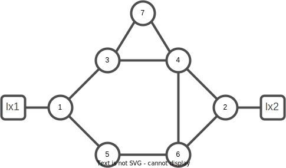
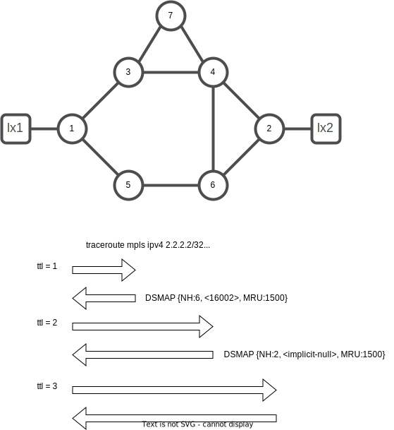
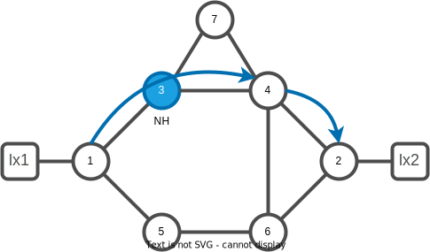
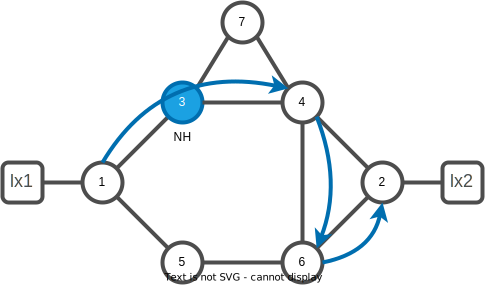
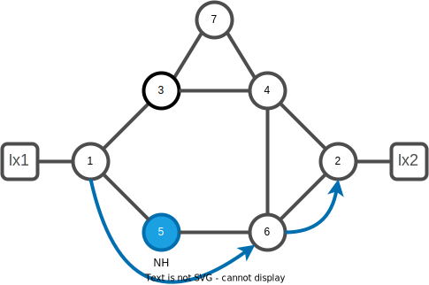
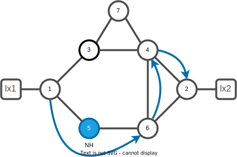
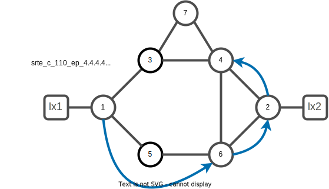

# 09. OAM in Segment Routing Networks

This lab explores the Segment Routing OAM toolkit.

We will use the existing lab with the following topology



Segment Routing Operations, Administration, and Maintenance (OAM) helps service providers to monitor label-switched paths (LSPs) and quickly isolate forwarding problems to assist with fault detection and troubleshooting in the network. The Segment Routing OAM feature provides support for IGP and BGP prefix SID, Nil-FEC (forwarding equivalence classes) LSP and SR Policy Ping and Traceroute functionality.

The tasks related to OAM in Segment Routing Networks includes:

- MPLS Ping and Traceroute for BGP and IGP Prefix-SID (task 1. to 3.)
- MPLS LSP Ping and Traceroute Nil FEC Target (task 4. and 5.)
- Segment Routing Ping and Traceroute (task 6. and 11.)
- Segment Routing Policy Nil-FEC Ping and Traceroute (task 12. and 14.)

## MPLS Ping and Traceroute for BGP and IGP Prefix-SID

## Task 1. Use MPLS Ping from xrd-1 to xrd-2

The MPLS LSP Ping feature is used to check the connectivity between ingress Label Switch Routers (LSRs) and egress LSRs along an LSP. MPLS LSP ping uses MPLS echo request and reply messages, similar to Internet Control Message Protocol (ICMP) echo request and reply messages, to validate an LSP. The destination IP address of the MPLS echo request packet is different from the address used to select the label stack. The destination IP address is defined as a 127.x.y.z/8 address and it prevents the IP packet from being IP switched to its destination, if the LSP is broken.

```bash
xrd 1
```

```bash
ping mpls ipv4 2.2.2.2/32
```

You should have an output similar to:

```console
RP/0/RP0/CPU0:xrd-1#ping mpls ipv4 2.2.2.2/32
Tue Dec 27 18:59:29.101 UTC

Sending 5, 100-byte MPLS Echos to 2.2.2.2/32,
      timeout is 2 seconds, send interval is 0 msec:

Codes: '!' - success, 'Q' - request not sent, '.' - timeout,
  'L' - labeled output interface, 'B' - unlabeled output interface, 
  'D' - DS Map mismatch, 'F' - no FEC mapping, 'f' - FEC mismatch,
  'M' - malformed request, 'm' - unsupported tlvs, 'N' - no rx label, 
  'P' - no rx intf label prot, 'p' - premature termination of LSP, 
  'R' - transit router, 'I' - unknown upstream index,
  'X' - unknown return code, 'x' - return code 0

Type escape sequence to abort.

!!!!!
Success rate is 100 percent (5/5), round-trip min/avg/max = 2/2/4 ms
```

## Task 2. Use MPLS Traceroute from xrd-1 to xrd-2

The MPLS LSP Traceroute feature is used to isolate the failure point of an LSP. It is used for hop-by-hop fault localization and path tracing. The MPLS LSP Traceroute feature relies on the expiration of the Time to Live (TTL) value of the packet that carries the echo request. When the MPLS echo request message hits a transit node, it checks the TTL value and if it is expired, the packet is passed to the control plane, else the message is forwarded. If the echo message is passed to the control plane, a reply message is generated based on the contents of the request message.

The following diagram highlights the traceroute process from xrd-1 to xrd-2:



Let's execute the same traceroute on the lab:

```bash
traceroute mpls ipv4 2.2.2.2/32
```

You should have an output similar to:

```console
RP/0/RP0/CPU0:xrd-1#traceroute mpls ipv4 2.2.2.2/32
Tue Dec 27 19:00:06.482 UTC

Tracing MPLS Label Switched Path to 2.2.2.2/32, timeout is 2 seconds

Codes: '!' - success, 'Q' - request not sent, '.' - timeout,
  'L' - labeled output interface, 'B' - unlabeled output interface, 
  'D' - DS Map mismatch, 'F' - no FEC mapping, 'f' - FEC mismatch,
  'M' - malformed request, 'm' - unsupported tlvs, 'N' - no rx label, 
  'P' - no rx intf label prot, 'p' - premature termination of LSP, 
  'R' - transit router, 'I' - unknown upstream index,
  'X' - unknown return code, 'x' - return code 0

Type escape sequence to abort.

  0 100.1.5.1 MRU 1500 [Labels: 16002 Exp: 0]
L 1 100.1.5.5 MRU 1500 [Labels: 16002 Exp: 0] 9 ms
L 2 100.5.6.6 MRU 1500 [Labels: implicit-null Exp: 0] 6 ms
! 3 100.2.6.2 3 ms
```

The character in the first column is the result code as explained on top of the command (for example `!` means `success` and `L` that the outgoing interface is `labeled`). The second cololumn represents the `TTL` of the Echo Request packet. The third column is the IP address of the node sending the MPLS Echo Reply. The verbose output also shows the IP address of the downstream neighbor. The MPLS MTU of the outgoing interface is indicated in the next column (`MRU`), followed by the label stack that would be found on the outgoing packet. If the node is the penultimate hop and PHP is requested then the outgoing lable to the downstream neighbor is indicated as `implicit-null`. `Exp:` indicates the value of the EXP bits or TC bits for each label in the stack. Finally the latency is displayed and the numeric return code value if the verbose keyword was specified for the command. The downstream neighbor address, MTU, and labels are retrieved from the DSMAP (Downstream Mapping) TLV in the MPLS Echo Reply packet.

## Task 3. Use MPLS Tree Trace from xrd-1 to xrd-2

The MPLS LSP Tree Trace (traceroute multipath) operation is also supported for BGP and IGP Prefix SID. MPLS LSP Tree Trace provides the means to discover all possible equal-cost multipath (ECMP) routing paths of an LSP to reach a destination Prefix SID. It uses multipath data encoded in echo request packets to query for the load-balancing information that may allow the originator to exercise each ECMP. When the packet TTL expires at the responding node, the node returns the list of downstream paths, as well as the multipath information that can lead the operator to exercise each path in the MPLS echo reply. This operation is performed repeatedly for each hop of each path with increasing TTL values until all ECMP are discovered and validated.

```bash
traceroute mpls multipath ipv4 2.2.2.2/32 verbose
```

You should have an output similar to:

```console
RP/0/RP0/CPU0:xrd-1#traceroute mpls multipath ipv4 2.2.2.2/32 verbose 
Tue Dec 27 19:01:44.791 UTC

Starting LSP Path Discovery for 2.2.2.2/32

Codes: '!' - success, 'Q' - request not sent, '.' - timeout,
  'L' - labeled output interface, 'B' - unlabeled output interface, 
  'D' - DS Map mismatch, 'F' - no FEC mapping, 'f' - FEC mismatch,
  'M' - malformed request, 'm' - unsupported tlvs, 'N' - no rx label, 
  'P' - no rx intf label prot, 'p' - premature termination of LSP, 
  'R' - transit router, 'I' - unknown upstream index,
  'X' - unknown return code, 'x' - return code 0

Type escape sequence to abort.

LL!
Path 0 found, 
 output interface GigabitEthernet0/0/0/0 nexthop 100.1.3.3
 source 100.1.3.1 destination 127.0.0.0
  0 100.1.3.1 100.1.3.3 MRU 1500 [Labels: 16002 Exp: 0] multipaths 0
L 1 100.1.3.3 100.3.4.4 MRU 1500 [Labels: 16002 Exp: 0] ret code 8 multipaths 1
L 2 100.3.4.4 100.2.4.2 MRU 1500 [Labels: implicit-null Exp: 0] ret code 8 multipaths 1
! 3 100.2.4.2, ret code 3 multipaths 0
LL!
Path 1 found, 
 output interface GigabitEthernet0/0/0/1 nexthop 100.1.5.5
 source 100.1.5.1 destination 127.0.0.0
  0 100.1.5.1 100.1.5.5 MRU 1500 [Labels: 16002 Exp: 0] multipaths 0
L 1 100.1.5.5 100.5.6.6 MRU 1500 [Labels: 16002 Exp: 0] ret code 8 multipaths 1
L 2 100.5.6.6 100.2.6.2 MRU 1500 [Labels: implicit-null Exp: 0] ret code 8 multipaths 1
! 3 100.2.6.2, ret code 3 multipaths 0

Paths (found/broken/unexplored) (2/0/0)
 Echo Request (sent/fail) (6/0)
 Echo Reply (received/timeout) (6/0)
 Total Time Elapsed 17 ms
```

## MPLS LSP Ping and Traceroute Nil FEC Target

The Nil-FEC LSP ping and traceroute operations are extensions of regular MPLS ping and traceroute.

Nil-FEC LSP Ping/Traceroute functionality supports segment routing and MPLS Static. It also acts as an additional diagnostic tool for all other LSP types. This feature allows operators to provide the ability to freely test any label stack by allowing them to specify the following:

- label stack
- outgoing interface
- nexthop address

In the case of segment routing, each segment nodal label and adjacency label along the routing path is put into the label stack of an echo request message from the initiator Label Switch Router (LSR); MPLS data plane forwards this packet to the label stack target, and the label stack target sends the echo message back.

## Task 4. Use MPLS LSP Ping from xrd-1 to xrd-2

In order to remind you the different Outgoing Interfaces and Next Hops available at xrd-1, execute the following command:

```bash
show mpls forwarding
```

```console
RP/0/RP0/CPU0:xrd-1#show mpls forwarding                                                        
Tue Dec 27 19:03:25.094 UTC
Local  Outgoing    Prefix             Outgoing     Next Hop        Bytes       
Label  Label       or ID              Interface                    Switched    
------ ----------- ------------------ ------------ --------------- ------------
16002  16002       SR Pfx (idx 2)     Gi0/0/0/0    100.1.3.3       0           
       16002       SR Pfx (idx 2)     Gi0/0/0/1    100.1.5.5       0           
16003  Pop         SR Pfx (idx 3)     Gi0/0/0/0    100.1.3.3       0           
16004  16004       SR Pfx (idx 4)     Gi0/0/0/0    100.1.3.3       0           
16005  Pop         SR Pfx (idx 5)     Gi0/0/0/1    100.1.5.5       0           
16006  16006       SR Pfx (idx 6)     Gi0/0/0/1    100.1.5.5       0           
16007  16007       SR Pfx (idx 7)     Gi0/0/0/0    100.1.3.3       428         
24000  Pop         SR Adj (idx 1)     Gi0/0/0/0    100.1.3.3       0           
24001  Pop         SR Adj (idx 3)     Gi0/0/0/0    100.1.3.3       0           
24002  Pop         SR Adj (idx 1)     Gi0/0/0/1    100.1.5.5       0           
24003  Pop         SR Adj (idx 3)     Gi0/0/0/1    100.1.5.5       0  
```

The below diagram higlights the Nil FEC traceroute from xrd-1 to xrd-2 via xrd-3 and xrd-4:



In order to test the LSP to xrd-2 through xrd-3 and xrd-4, execute the following command:

```bash
ping mpls nil-fec labels 16004,16002 output interface Gi0/0/0/0 nexthop 100.1.3.3
```

You should have an output similar to:

```console
RP/0/RP0/CPU0:xrd-1#ping mpls nil-fec labels 16004,16002 output interface Gi0/0/0/0 nexthop 100.1.3.3   
Tue Dec 27 19:06:18.514 UTC

Sending 5, 100-byte MPLS Echos with Nil FEC with labels [16004,16002],
      timeout is 2 seconds, send interval is 0 msec:

Codes: '!' - success, 'Q' - request not sent, '.' - timeout,
  'L' - labeled output interface, 'B' - unlabeled output interface, 
  'D' - DS Map mismatch, 'F' - no FEC mapping, 'f' - FEC mismatch,
  'M' - malformed request, 'm' - unsupported tlvs, 'N' - no rx label, 
  'P' - no rx intf label prot, 'p' - premature termination of LSP, 
  'R' - transit router, 'I' - unknown upstream index,
  'X' - unknown return code, 'x' - return code 0

Type escape sequence to abort.

!!!!!
Success rate is 100 percent (5/5), round-trip min/avg/max = 2/2/3 ms
```

Similarly, the below picture represents a LSP test to xrd-2 through xrd-3, xrd-4 and xrd-6.



To test it on the lab, execute the following command:

```bash
ping mpls nil-fec labels 16004,16006,16002 output interface Gi0/0/0/0 nexthop 100.1.3.3
```

You should have an output similar to:

```console
RP/0/RP0/CPU0:xrd-1#ping mpls nil-fec labels 16004,16006,16002 output interface Gi0/0/0/0 nexthop 100.1.3.3
Tue Dec 27 19:17:36.403 UTC

Sending 5, 100-byte MPLS Echos with Nil FEC with labels [16004,16006,16002],
      timeout is 2 seconds, send interval is 0 msec:

Codes: '!' - success, 'Q' - request not sent, '.' - timeout,
  'L' - labeled output interface, 'B' - unlabeled output interface, 
  'D' - DS Map mismatch, 'F' - no FEC mapping, 'f' - FEC mismatch,
  'M' - malformed request, 'm' - unsupported tlvs, 'N' - no rx label, 
  'P' - no rx intf label prot, 'p' - premature termination of LSP, 
  'R' - transit router, 'I' - unknown upstream index,
  'X' - unknown return code, 'x' - return code 0

Type escape sequence to abort.

!!!!!
Success rate is 100 percent (5/5), round-trip min/avg/max = 2/2/3 ms
```

Let's test the other LSP to xrd-2 through xrd-5 and xrd-6, run the following command:




```bash
ping mpls nil-fec labels 16006,16002 output interface Gi0/0/0/1 nexthop 100.1.5.5 
```

You should have an output similar to:

```console
RP/0/RP0/CPU0:xrd-1#ping mpls nil-fec labels 16006,16002 output interface Gi0/0/0/1 nexthop 100.1.5.5      
Tue Dec 27 19:07:47.015 UTC

Sending 5, 100-byte MPLS Echos with Nil FEC with labels [16006,16002],
      timeout is 2 seconds, send interval is 0 msec:

Codes: '!' - success, 'Q' - request not sent, '.' - timeout,
  'L' - labeled output interface, 'B' - unlabeled output interface, 
  'D' - DS Map mismatch, 'F' - no FEC mapping, 'f' - FEC mismatch,
  'M' - malformed request, 'm' - unsupported tlvs, 'N' - no rx label, 
  'P' - no rx intf label prot, 'p' - premature termination of LSP, 
  'R' - transit router, 'I' - unknown upstream index,
  'X' - unknown return code, 'x' - return code 0

Type escape sequence to abort.

!!!!!
Success rate is 100 percent (5/5), round-trip min/avg/max = 2/2/3 ms
```

Finaly, let's test the LSP to xrd-2 going through xrd-6 and xrd-4:




```bash
ping mpls nil-fec labels 16006,16004,16002 output interface Gi0/0/0/1 nexthop 100.1.5.5
```

You should have an output similar to:

```console
RP/0/RP0/CPU0:xrd-1#ping mpls nil-fec labels 16006,16004,16002 output interface Gi0/0/0/1 nexthop 100.1.5.5
Tue Dec 27 19:08:06.444 UTC

Sending 5, 100-byte MPLS Echos with Nil FEC with labels [16006,16004,16002],
      timeout is 2 seconds, send interval is 0 msec:

Codes: '!' - success, 'Q' - request not sent, '.' - timeout,
  'L' - labeled output interface, 'B' - unlabeled output interface, 
  'D' - DS Map mismatch, 'F' - no FEC mapping, 'f' - FEC mismatch,
  'M' - malformed request, 'm' - unsupported tlvs, 'N' - no rx label, 
  'P' - no rx intf label prot, 'p' - premature termination of LSP, 
  'R' - transit router, 'I' - unknown upstream index,
  'X' - unknown return code, 'x' - return code 0

Type escape sequence to abort.

!!!!!
Success rate is 100 percent (5/5), round-trip min/avg/max = 2/2/3 ms
```

## Task 5. Use MPLS LSP Traceroute from xrd-1 to xrd-2

In order to trace the LSP to xrd-2 through xrd-3 and xrd-4, execute the following command:

```bash
traceroute mpls nil-fec labels 16004,16002 output interface Gi0/0/0/0 nexthop 100.1.3.3
```

You should have an output similar to:

```console
RP/0/RP0/CPU0:xrd-1#traceroute mpls nil-fec labels 16004,16002 output interface Gi0/0/0/0 nexthop 100.1.3.3
Tue Dec 27 19:21:34.542 UTC

Tracing MPLS Label Switched Path with Nil FEC with labels [16004,16002], timeout is 2 seconds

Codes: '!' - success, 'Q' - request not sent, '.' - timeout,
  'L' - labeled output interface, 'B' - unlabeled output interface, 
  'D' - DS Map mismatch, 'F' - no FEC mapping, 'f' - FEC mismatch,
  'M' - malformed request, 'm' - unsupported tlvs, 'N' - no rx label, 
  'P' - no rx intf label prot, 'p' - premature termination of LSP, 
  'R' - transit router, 'I' - unknown upstream index,
  'X' - unknown return code, 'x' - return code 0

Type escape sequence to abort.

  0 100.1.3.1 MRU 1500 [Labels: 16004/16002/explicit-null Exp: 0/0/0]
L 1 100.1.3.3 MRU 1500 [Labels: implicit-null/16002/explicit-null Exp: 0/0/0] 2 ms
L 2 100.3.4.4 MRU 1500 [Labels: implicit-null/explicit-null Exp: 0/0] 2 ms
! 3 100.2.4.2 2 ms
```

Similarly, to test the LSP to xrd-2 through xrd-3, xrd-4 and xrd-6, execute the following command:

```bash
traceroute mpls nil-fec labels 16004,16006,16002 output interface Gi0/0/0/0 nexthop 100.1.3.3
```

You should have an output similar to:

```console
RP/0/RP0/CPU0:xrd-1#traceroute mpls nil-fec labels 16004,16006,16002 output interface Gi0/0/0/0 nexthop 100.1.3.3
Tue Dec 27 19:27:17.207 UTC

Tracing MPLS Label Switched Path with Nil FEC with labels [16004,16006,16002], timeout is 2 seconds

Codes: '!' - success, 'Q' - request not sent, '.' - timeout,
  'L' - labeled output interface, 'B' - unlabeled output interface, 
  'D' - DS Map mismatch, 'F' - no FEC mapping, 'f' - FEC mismatch,
  'M' - malformed request, 'm' - unsupported tlvs, 'N' - no rx label, 
  'P' - no rx intf label prot, 'p' - premature termination of LSP, 
  'R' - transit router, 'I' - unknown upstream index,
  'X' - unknown return code, 'x' - return code 0

Type escape sequence to abort.

  0 100.1.3.1 MRU 1500 [Labels: 16004/16006/16002/explicit-null Exp: 0/0/0/0]
L 1 100.1.3.3 MRU 1500 [Labels: implicit-null/16006/16002/explicit-null Exp: 0/0/0/0] 2 ms
L 2 100.3.4.4 MRU 1500 [Labels: implicit-null/16002/explicit-null Exp: 0/0/0] 2 ms
L 3 100.4.6.6 MRU 1500 [Labels: implicit-null/explicit-null Exp: 0/0] 2 ms
! 4 100.2.6.2 2 ms
```

## Segment Routing Ping and Traceroute

You can initiate the segment routing ping operation only when Segment Routing control plane is available at the originator, even if it is not preferred. This allows you to validate the SR path before directing traffic over the path. Segment Routing ping can use either generic FEC type or SR control-plane FEC type (SR-OSPF, SR-ISIS). In mixed networks, where some devices are running MPLS control plane (for example, LDP) or do not understand SR FEC, generic FEC type allows the device to successfully process and respond to the echo request. By default, generic FEC type is used in the target FEC stack of segment routing ping echo request. Generic FEC is not coupled to a particular control plane; it allows path verification when the advertising protocol is unknown or might change during the path of the echo request. If you need to specify the target FEC, you can select the FEC type as OSPF, IS-IS, or BGP. This ensures that only devices that are running segment routing control plane, and can therefore understand the segment routing IGP FEC, respond to the echo request.

## Task 6. Use SR Ping from xrd-1 to xrd-2

To use SR ping from xrd-1 to xrd-2 execute:

```bash
ping sr-mpls 2.2.2.2/32 fec-type igp isis
```

You should have an output similar to:

```console
RP/0/RP0/CPU0:xrd-1#ping sr-mpls 2.2.2.2/32 fec-type igp isis 
Tue Dec  6 10:48:50.389 UTC

Sending 5, 100-byte MPLS Echos to 2.2.2.2/32,
      timeout is 2 seconds, send interval is 0 msec:

Codes: '!' - success, 'Q' - request not sent, '.' - timeout,
  'L' - labeled output interface, 'B' - unlabeled output interface, 
  'D' - DS Map mismatch, 'F' - no FEC mapping, 'f' - FEC mismatch,
  'M' - malformed request, 'm' - unsupported tlvs, 'N' - no rx label, 
  'P' - no rx intf label prot, 'p' - premature termination of LSP, 
  'R' - transit router, 'I' - unknown upstream index,
  'X' - unknown return code, 'x' - return code 0

Type escape sequence to abort.

!!!!!
Success rate is 100 percent (5/5), round-trip min/avg/max = 2/2/3 ms
```

## Task 7. Use SR Ping verbose from xrd-1 to xrd-2

Check the IP Reply Address with the following verbose command:

```bash
ping sr-mpls 2.2.2.2/32 fec-type igp isis verbose
```

You should have a similar output:

```console
RP/0/RP0/CPU0:xrd-1#ping sr-mpls 2.2.2.2/32 fec-type igp isis verbose
Tue Dec  6 10:55:17.578 UTC

Sending 5, 100-byte MPLS Echos to 2.2.2.2/32,
      timeout is 2 seconds, send interval is 0 msec:

Codes: '!' - success, 'Q' - request not sent, '.' - timeout,
  'L' - labeled output interface, 'B' - unlabeled output interface, 
  'D' - DS Map mismatch, 'F' - no FEC mapping, 'f' - FEC mismatch,
  'M' - malformed request, 'm' - unsupported tlvs, 'N' - no rx label, 
  'P' - no rx intf label prot, 'p' - premature termination of LSP, 
  'R' - transit router, 'I' - unknown upstream index,
  'X' - unknown return code, 'x' - return code 0

Type escape sequence to abort.

!      size 100, reply addr 100.2.6.2, return code 3 
!      size 100, reply addr 100.2.6.2, return code 3 
!      size 100, reply addr 100.2.6.2, return code 3 
!      size 100, reply addr 100.2.6.2, return code 3 
!      size 100, reply addr 100.2.6.2, return code 3 

Success rate is 100 percent (5/5), round-trip min/avg/max = 2/2/3 ms
```

## Task 8. Use SR Ping with ldp fec-type from xrd-1 to xrd-2

To use SR ping from xrd-1 to xrd-2 on ldp labels, execute:

```bash
ping mpls ipv4 2.2.2.2/32 fec-type ldp
```

You should have a similar output:

```console
RP/0/RP0/CPU0:xrd-1#ping mpls ipv4 2.2.2.2/32 fec-type ldp 
Tue Dec  6 10:50:12.508 UTC

Sending 5, 100-byte MPLS Echos to 2.2.2.2/32,
      timeout is 2 seconds, send interval is 0 msec:

Codes: '!' - success, 'Q' - request not sent, '.' - timeout,
  'L' - labeled output interface, 'B' - unlabeled output interface, 
  'D' - DS Map mismatch, 'F' - no FEC mapping, 'f' - FEC mismatch,
  'M' - malformed request, 'm' - unsupported tlvs, 'N' - no rx label, 
  'P' - no rx intf label prot, 'p' - premature termination of LSP, 
  'R' - transit router, 'I' - unknown upstream index,
  'X' - unknown return code, 'x' - return code 0

Type escape sequence to abort.

QQQQQ
Success rate is 0 percent (0/5)
```

Notice the success rate is 0 percent as LDP is not used in the lab. Labels are distributed by ISIS IGP.

## Task 9. Use SR Traceroute from xrd-1 to xrd-2

To use SR Traceroute from xrd-1 to xrd-2 execute:

```bash
traceroute sr-mpls 2.2.2.2/32 fec-type igp isis
```

You should have a similar output:

```console
RP/0/RP0/CPU0:xrd-1#traceroute sr-mpls 2.2.2.2/32 fec-type igp isis 
Tue Dec  6 10:44:47.376 UTC

Tracing MPLS Label Switched Path to 2.2.2.2/32, timeout is 2 seconds

Codes: '!' - success, 'Q' - request not sent, '.' - timeout,
  'L' - labeled output interface, 'B' - unlabeled output interface, 
  'D' - DS Map mismatch, 'F' - no FEC mapping, 'f' - FEC mismatch,
  'M' - malformed request, 'm' - unsupported tlvs, 'N' - no rx label, 
  'P' - no rx intf label prot, 'p' - premature termination of LSP, 
  'R' - transit router, 'I' - unknown upstream index,
  'X' - unknown return code, 'x' - return code 0

Type escape sequence to abort.

  0 100.1.5.1 MRU 1500 [Labels: 16002 Exp: 0]
L 1 100.1.5.5 MRU 1500 [Labels: 16002 Exp: 0] 7 ms
L 2 100.5.6.6 MRU 1500 [Labels: implicit-null Exp: 0] 7 ms
! 3 100.2.6.2 3 ms
```

## Task 10. Use SR Traceroute with ldp fec-type from xrd-1 to xrd-2

To use SR Traceroute from xrd-1 to xrd-2 using ldp fec-type execute:

```bash
traceroute mpls ipv4 2.2.2.2/32 fec-type ldp
```

You should have a similar output:

```console
RP/0/RP0/CPU0:xrd-1#traceroute mpls ipv4 2.2.2.2/32 fec-type ldp 
Tue Dec  6 10:51:10.141 UTC

Tracing MPLS Label Switched Path to 2.2.2.2/32, timeout is 2 seconds

Codes: '!' - success, 'Q' - request not sent, '.' - timeout,
  'L' - labeled output interface, 'B' - unlabeled output interface, 
  'D' - DS Map mismatch, 'F' - no FEC mapping, 'f' - FEC mismatch,
  'M' - malformed request, 'm' - unsupported tlvs, 'N' - no rx label, 
  'P' - no rx intf label prot, 'p' - premature termination of LSP, 
  'R' - transit router, 'I' - unknown upstream index,
  'X' - unknown return code, 'x' - return code 0

Type escape sequence to abort.

Q 1 *
```

Notice the success rate is 0 percent as LDP is not used in the lab.

## Task 11. Use SR Multi path Traceroute from xrd-1 to xrd-2

To use SR Multi Path Traceroute from xrd-1 to xrd-2 execute:

```bash
traceroute sr-mpls multipath 2.2.2.2/32 fec-type igp isis verbose
```

You should have a similar output:

```console
RP/0/RP0/CPU0:xrd-1#traceroute sr-mpls multipath 2.2.2.2/32 fec-type igp isis verbose 
Tue Dec  6 10:52:52.874 UTC

Starting LSP Path Discovery for 2.2.2.2/32

Codes: '!' - success, 'Q' - request not sent, '.' - timeout,
  'L' - labeled output interface, 'B' - unlabeled output interface, 
  'D' - DS Map mismatch, 'F' - no FEC mapping, 'f' - FEC mismatch,
  'M' - malformed request, 'm' - unsupported tlvs, 'N' - no rx label, 
  'P' - no rx intf label prot, 'p' - premature termination of LSP, 
  'R' - transit router, 'I' - unknown upstream index,
  'X' - unknown return code, 'x' - return code 0

Type escape sequence to abort.

LL!
Path 0 found, 
 output interface GigabitEthernet0/0/0/0 nexthop 100.1.3.3
 source 100.1.3.1 destination 127.0.0.0
  0 100.1.3.1 100.1.3.3 MRU 1500 [Labels: 16002 Exp: 0] multipaths 0
L 1 100.1.3.3 100.3.4.4 MRU 1500 [Labels: 16002 Exp: 0] ret code 8 multipaths 1
L 2 100.3.4.4 100.2.4.2 MRU 1500 [Labels: implicit-null Exp: 0] ret code 8 multipaths 1
! 3 100.2.4.2, ret code 3 multipaths 0
LL!
Path 1 found, 
 output interface GigabitEthernet0/0/0/1 nexthop 100.1.5.5
 source 100.1.5.1 destination 127.0.0.0
  0 100.1.5.1 100.1.5.5 MRU 1500 [Labels: 16002 Exp: 0] multipaths 0
L 1 100.1.5.5 100.5.6.6 MRU 1500 [Labels: 16002 Exp: 0] ret code 8 multipaths 1
L 2 100.5.6.6 100.2.6.2 MRU 1500 [Labels: implicit-null Exp: 0] ret code 8 multipaths 1
! 3 100.2.6.2, ret code 3 multipaths 0

Paths (found/broken/unexplored) (2/0/0)
 Echo Request (sent/fail) (6/0)
 Echo Reply (received/timeout) (6/0)
 Total Time Elapsed 17 ms
```

## Segment Routing Policy Nil-FEC Ping and Traceroute

Segment routing OAM supports Nil-FEC LSP ping and traceroute operations to verify the connectivity for segment routing MPLS data plane. For the existing Nil-FEC ping and traceroute commands, you need to specify the entire outgoing label stack, outgoing interface, as well as the next hop. SR policy Nil-FEC ping and SR policy Nil-FEC traceroute enhancements extend the data plane validation functionality of installed SR policies through Nil-FEC ping and traceroute commands while simplifying the operational process. Instead of specifying the entire outgoing label-stack, interface, and next-hop, you can use the policy name or the policy binding-SID label value to initiate Nil-FEC ping and traceroute operations for the SR policies. Specification of outgoing interface and next-hop is also not required for policy Nil-FEC OAM operations.

## Task 12. Check existing SRTE policies



Check you have a policy in place like the one defined previously `srte_c_110_ep_4.4.4.4`:

```bash
show segment-routing traffic-eng policy
```

You should have a similar output:

```console
RP/0/RP0/CPU0:xrd-1#show segment-routing traffic-eng policy 
Wed Dec 28 07:58:17.461 UTC

SR-TE policy database
---------------------

Color: 110, End-point: 4.4.4.4
  Name: srte_c_110_ep_4.4.4.4
  Status:
    Admin: up  Operational: up for 00:07:51 (since Dec 28 07:50:26.192)
  Candidate-paths:
    Preference: 100 (configuration) (active)
      Name: xrd1-xrd4
      Requested BSID: dynamic
      Constraints:
        Protection Type: protected-preferred
        Maximum SID Depth: 10 
      Explicit: segment-list xrd1-to-xrd4-via-xrd2 (valid)
        Weight: 1, Metric Type: TE
          16006 [Prefix-SID, 6.6.6.6]
          16002
          16004
  Attributes:
    Binding SID: 24005
    Forward Class: Not Configured
    Steering labeled-services disabled: no
    Steering BGP disabled: no
    IPv6 caps enable: yes
    Invalidation drop enabled: no
    Max Install Standby Candidate Paths: 0
```

You can notice the policy exists and is `Admin: up` and `Operational: up` as well as the `explicit path` selected with label stack `<16006, 16002, 16004>`. Notice also the binding SID of `24005`.

## Task 13. Use SR Policy Nil-fec Ping

Execute the following command to use SR Policy Nil-fec Ping on `srte_c_110_ep_4.4.4.4` policy:

```bash
ping sr-mpls nil-fec policy name srte_c_110_ep_4.4.4.4
```

You should have a similar output:

```console
RP/0/RP0/CPU0:xrd-1#ping sr-mpls nil-fec policy name srte_c_110_ep_4.4.4.4
Wed Dec 28 07:58:35.547 UTC

Sending 5, 100-byte MPLS Echos with Nil FEC for SR-TE Policy srte_c_110_ep_4.4.4.4,
      timeout is 2 seconds, send interval is 0 msec:

Codes: '!' - success, 'Q' - request not sent, '.' - timeout,
  'L' - labeled output interface, 'B' - unlabeled output interface, 
  'D' - DS Map mismatch, 'F' - no FEC mapping, 'f' - FEC mismatch,
  'M' - malformed request, 'm' - unsupported tlvs, 'N' - no rx label, 
  'P' - no rx intf label prot, 'p' - premature termination of LSP, 
  'R' - transit router, 'I' - unknown upstream index,
  'X' - unknown return code, 'x' - return code 0

Type escape sequence to abort.

!!!!!
Success rate is 100 percent (5/5), round-trip min/avg/max = 2/2/3 ms
```

Alternatively you can use on Binding SID, in our example `24005`:

```bash
ping sr-mpls nil-fec policy binding-sid 24005
```

You should have a similar output:

```console
RP/0/RP0/CPU0:xrd-1#ping sr-mpls nil-fec policy binding-sid 24005
Wed Dec 28 08:10:44.203 UTC

Sending 5, 100-byte MPLS Echos with Nil FEC with Binding SID Label [24005],
      timeout is 2 seconds, send interval is 0 msec:

Codes: '!' - success, 'Q' - request not sent, '.' - timeout,
  'L' - labeled output interface, 'B' - unlabeled output interface, 
  'D' - DS Map mismatch, 'F' - no FEC mapping, 'f' - FEC mismatch,
  'M' - malformed request, 'm' - unsupported tlvs, 'N' - no rx label, 
  'P' - no rx intf label prot, 'p' - premature termination of LSP, 
  'R' - transit router, 'I' - unknown upstream index,
  'X' - unknown return code, 'x' - return code 0

Type escape sequence to abort.

!!!!!
Success rate is 100 percent (5/5), round-trip min/avg/max = 2/2/3 ms
```

## Task 14. Use SR Policy Nil-fec Traceroute

Execute the following command to use SR Policy Nil-fec Traceroute on `srte_c_110_ep_4.4.4.4` policy:

```bash
traceroute sr-mpls nil-fec policy name srte_c_110_ep_4.4.4.4
```

You should have a similar output:

```console
RP/0/RP0/CPU0:xrd-1#traceroute sr-mpls nil-fec policy name srte_c_110_ep_4.4.4.4
Wed Dec 28 07:59:21.139 UTC

Tracing MPLS Label Switched Path with Nil FEC for SR-TE Policy srte_c_110_ep_4.4.4.4, timeout is 2 seconds

Codes: '!' - success, 'Q' - request not sent, '.' - timeout,
  'L' - labeled output interface, 'B' - unlabeled output interface, 
  'D' - DS Map mismatch, 'F' - no FEC mapping, 'f' - FEC mismatch,
  'M' - malformed request, 'm' - unsupported tlvs, 'N' - no rx label, 
  'P' - no rx intf label prot, 'p' - premature termination of LSP, 
  'R' - transit router, 'I' - unknown upstream index,
  'X' - unknown return code, 'x' - return code 0

Type escape sequence to abort.

  0 100.1.5.1 MRU 1500 [Labels: 16006/16002/16004/explicit-null Exp: 0/0/0/0]
L 1 100.1.5.5 MRU 1500 [Labels: implicit-null/16002/16004/explicit-null Exp: 0/0/0/0] 2 ms
L 2 100.5.6.6 MRU 1500 [Labels: implicit-null/16004/explicit-null Exp: 0/0/0] 2 ms
L 3 100.2.6.2 MRU 1500 [Labels: implicit-null/explicit-null Exp: 0/0] 5 ms
! 4 100.2.4.4 3 ms
```

Alternatively you can use on Binding SID, in our example `24005`:

```bash
traceroute sr-mpls nil-fec policy binding-sid 24005
```

You should have a similar output:

```console
RP/0/RP0/CPU0:xrd-1#traceroute sr-mpls nil-fec policy binding-sid 24005
Wed Dec 28 08:10:56.498 UTC

Tracing MPLS Label Switched Path with Nil FEC with Binding SID Label [24005], timeout is 2 seconds

Codes: '!' - success, 'Q' - request not sent, '.' - timeout,
  'L' - labeled output interface, 'B' - unlabeled output interface, 
  'D' - DS Map mismatch, 'F' - no FEC mapping, 'f' - FEC mismatch,
  'M' - malformed request, 'm' - unsupported tlvs, 'N' - no rx label, 
  'P' - no rx intf label prot, 'p' - premature termination of LSP, 
  'R' - transit router, 'I' - unknown upstream index,
  'X' - unknown return code, 'x' - return code 0

Type escape sequence to abort.

  0 100.1.5.1 MRU 1500 [Labels: 16006/16002/16004/explicit-null Exp: 0/0/0/0]
L 1 100.1.5.5 MRU 1500 [Labels: implicit-null/16002/16004/explicit-null Exp: 0/0/0/0] 2 ms
L 2 100.5.6.6 MRU 1500 [Labels: implicit-null/16004/explicit-null Exp: 0/0/0] 2 ms
L 3 100.2.6.2 MRU 1500 [Labels: implicit-null/explicit-null Exp: 0/0] 2 ms
! 4 100.2.4.4 3 ms
```
