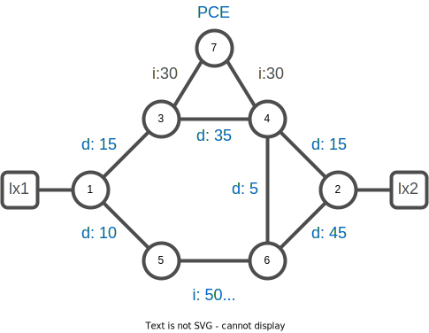
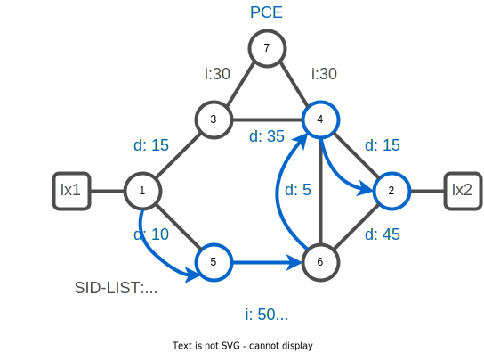

# 09. SR Performance Measurement 

## Performance Measurement (PM)

Network performance metrics is a critical measure for traffic engineering (TE) in service provider networks. Network performance metrics include the following:

* Packet loss
* Delay
* Delay variation

These network performance metrics provide network operators information about the performance characteristics of their networks for performance evaluation and help to ensure compliance with service level agreements. The service-level agreements (SLAs) of service providers depend on the ability to measure and monitor these network performance metrics. Network operators can use performance measurement (PM) feature to monitor the network metrics for links and end-to-end TE label switched paths.

The PM for link delay uses the IP/UDP packet format defined in RFC 5357 (TWAMP-Light) for probes. Two-Way Active Measurement Protocol (TWAMP) adds two-way or round-trip measurement capabilities. TWAMP employs time stamps applied at the echo destination (reflector) to enable greater accuracy. In the case of TWAMP Light, the Session-Reflector doesn’t necessarily know about the session state. The Session-Reflector simply copies the Sequence Number of the received packet to the Sequence Number field of the reflected packet. The controller receives the reflected test packets and collects two-way metrics. This architecture allows for collection of two-way metrics.

The following restrictions and guidelines apply for the PM for link delay feature for different links.

* For broadcast links, only point-to-point (P2P) links are supported. P2P configuration on IGP is required for flooding the value.

* For link bundles, the hashing function may select a member link for forwarding but the reply may come from the remote line card on a different member link of the bundle.

* For one-way delay measurement, clocks should be synchronized on two end-point nodes of the link using PTP.

The delay measurement with probing is not supported on virtualized version of IOS XR. You will activate performance measurement on the lab node and advertise a static delay per interface. 



### Task. 1 Configure performance measurement

Connect to xrd-1
```bash
xrd 1
```

Activate and advertise a static delay per interface.

:keyboard: xrd-1 configuration:
```bash
config
performance-measurement
 interface GigabitEthernet0/0/0/0
  delay-measurement
   advertise-delay 15
  !
 !
 interface GigabitEthernet0/0/0/1
  delay-measurement
   advertise-delay 10
  !
 !
!
commit
end
exit
```

Configure accordingly the remaining routers. 

<details><summary><b>:closed_book: Performance Measurements snippets</b></summary>

```bash
xrd 2
```

:keyboard: xrd-2 configuration:
```bash
config
performance-measurement
 interface GigabitEthernet0/0/0/0
  delay-measurement
   advertise-delay 15
  !
 !
 interface GigabitEthernet0/0/0/1
  delay-measurement
   advertise-delay 45
  !
 !
!
commit
end
exit
```

```bash
xrd 3
```

:keyboard: xrd-3 configuration:
```bash
config
performance-measurement
 interface GigabitEthernet0/0/0/0
  delay-measurement
   advertise-delay 35
  !
 !
 interface GigabitEthernet0/0/0/2
  delay-measurement
   advertise-delay 15
  !
 !
!
commit
end
exit
```

```bash
xrd 4
```

:keyboard: xrd-4 configuration:
```bash
config
performance-measurement
 interface GigabitEthernet0/0/0/0
  delay-measurement
   advertise-delay 35
  !
 !
 interface GigabitEthernet0/0/0/1
  delay-measurement
   advertise-delay 5
  !
 !
 interface GigabitEthernet0/0/0/2
  delay-measurement
   advertise-delay 15
  !
 !
!
commit
end
exit
```

```bash
xrd 5
```

:keyboard: xrd-5 configuration:
```bash
config
performance-measurement
 interface GigabitEthernet0/0/0/0
  delay-measurement
   advertise-delay 5
  !
 !
 interface GigabitEthernet0/0/0/2
  delay-measurement
   advertise-delay 10
  !
 !
!
commit
end
exit
```

```bash
xrd 6
```

:keyboard: xrd-6 configuration:
```bash
config
performance-measurement
 interface GigabitEthernet0/0/0/0
  delay-measurement
   advertise-delay 5
  !
 !
 interface GigabitEthernet0/0/0/1
  delay-measurement
   advertise-delay 5
  !
 !
 interface GigabitEthernet0/0/0/2
  delay-measurement
   advertise-delay 45
  !
 !
!
commit
end
exit
```

</details>
<br/>

### Task. 2 Verify the configuration

You can get a detailed report per interface of the performance measurement configuration.

Connect to xrd-1

```bash
xrd 1
```

:keyboard: xrd-1

```bash
show performance-measurement interfaces detail
```
```
Interface Name: GigabitEthernet0/0/0/0 (ifh: 0x10)
  Delay-Measurement                 : Enabled
  Loss-Measurement                  : Disabled
  Path-Tracing                      : Disabled
  Configured IPv4 Address           : 100.1.3.1
  Configured IPv6 Address           : ::
  Link Local IPv6 Address           : ::
  Configured Next-hop Address       : Unknown
  Local MAC Address                 : 0242.ac12.0003
  Next-hop MAC Address              : 0242.ac12.0002
  In-use Source Address             : 100.1.3.1
  In-use Destination Address        : 100.1.3.3
  Primary VLAN Tag                  : None
  Secondary VLAN Tag                : None
  State                             : Up

  Delay Measurement session:
    Session ID          : 4097
    Profile Keys:
      Profile name      : default
      Profile type      : Interface Delay Measurement
    Last advertisement:
      Advertised at: Jan 03 2023 14:24:35.648 (178650.739 seconds ago)
      Advertised reason: Advertise delay config
      Advertised delays (uSec): avg: 15, min: 15, max: 15, variance: 0
      A flag set: False

    Next advertisement:
      Threshold check scheduled in 1 more probe (roughly every 120 seconds)
      No probes completed

    Current computation:
      Started at: Jan 05 2023 16:01:58.003 (8.384 seconds ago)
      Packets Sent: 3, received: 0
      Measured delays (uSec): avg: 0, min: 0, max: 0, variance: 0
      Next probe scheduled at: Jan 05 2023 16:02:27.999 (in 21.612 seconds)
      Next packet will be sent in 0.612 seconds
      Packet sent every 3.0 seconds 
      Probe samples:
        No History
 --More--
```

Or a summary of the last advertisement per interface

:keyboard: xrd-1

```bash
show performance-measurement history advertisement interfaces
```

```
 FIRST       : First advertisement      
 NEW-SESSION : New child session        
 PER-AVG     : Periodic timer, avg delay threshold crossed
 PER-MIN     : Periodic timer, min delay threshold crossed
 PER-MAX     : Periodic timer, max delay threshold crossed
 ACCEL-AVG   : Accel threshold crossed, avg delay threshold crossed
 ACCEL-MIN   : Accel threshold crossed, min delay threshold crossed
 ACCEL-MAX   : Accel threshold crossed, max delay threshold crossed
 ENABLE      : Advertisement enabled    
 DISABLE     : Advertisement disabled   
 LINK-DOWN   : Link state changed to down
 DELETE      : Session deleted          
 ERROR       : Control code error       
 DYN-DM      : Dynamic delay advertisement is in effect
 ADV-CFG     : Advertise delay config   
 ADV-UNCFG   : Advertise delay unconfig 
 EXEC-CLEAR  : Cleared through exec command
 PM-ERROR    : Performance measurement session error
 ANOM-MIN-DYN: Min delay A flag toggled and dynamic delay is in effect
 ANOM-MIN-STA: Min delay A flag toggled and static delay is in effect

-----------------------------------------------------------------
0/RP0/CPU0
-----------------------------------------------------------------

Interface Name: GigabitEthernet0/0/0/0 (ifh: 0x10)
Delay-Measurement history (uSec):
  Advertisement Timestamp     Average       Min       Max        Reason
  Feb 03 2022 14:24:35.648         15        15        15       ADV-CFG

Interface Name: GigabitEthernet0/0/0/1 (ifh: 0x18)
Delay-Measurement history (uSec):
  Advertisement Timestamp     Average       Min       Max        Reason
  Feb 03 2022 14:24:35.648         10        10        10       ADV-CFG
```

## Task 3. Visualize the traffic engineering topology

Connect to xrd-1
```bash
xrd 1
```

:keyboard: xrd-1:
```bash
show segment-routing traffic-eng topology 
```
```
Topology database:
------------------
Node 2
  Router ID: 1.1.1.1

  ISIS-L2 0000.0000.0001
    Hostname: xrd-1
    TE router ID: 1.1.1.1
    ISIS area ID: 49.0002
    SRGBs: 16000 - 24000
    SRLBs: 15000 - 16000

    Prefixes:
      1.1.1.1/32
        Regular SID index: 1
      100.1.3.0/24
      100.1.5.0/24

    Links:
      Local: 100.1.3.1 Remote: 100.1.3.3
        Remote node: ISIS-L2 0000.0000.0003
          Hostname: xrd-3
          TE router ID: 3.3.3.3
          ISIS area ID: 49.0002
        Metrics: IGP 10, TE 10, Latency 15 microseconds
        Bandwidth: Total 125000000 Bps, Reservable 0 Bps
        Flex-Algo ASLA:
          Metric: TE 4294967295
        Adj-SIDs: 24000 (protected), 24001 (unprotected)

      Local: 100.1.5.1 Remote: 100.1.5.5
        Remote node: ISIS-L2 0000.0000.0005
          Hostname: xrd-5
          TE router ID: 5.5.5.5
          ISIS area ID: 49.0002
        Metrics: IGP 10, TE 10, Latency 10 microseconds
        Bandwidth: Total 125000000 Bps, Reservable 0 Bps
        Flex-Algo ASLA:
          Metric: TE 4294967295
        Adj-SIDs: 24002 (protected), 24003 (unprotected)

  ISIS-L2 0000.0000.0001
    ASN: 65000
    Hostname: xrd-1
    TE router ID: 1.1.1.1
    ISIS area ID: 49.0002
    SRGBs: 16000 - 24000
    SRLBs: 15000 - 16000

    Prefixes:
      100.1.3.0/24
      100.1.5.0/24
 --More-- 
```

:pushpin: 
* A new metric is advertised on the topology : `Metrics: IGP 10, TE 10, Latency 15 microseconds
` 

## Task. 4 Configure a SR policy with latency metric

The extended TE link delay metric (minimum-delay value) can be used to compute paths for SR policies as an optimization metric or as an accumulated delay bound.

:keyboard: xrd-1:
```bash
config
segment-routing
 traffic-eng
  policy to-xrd2-latency
   color 400 end-point ipv4 2.2.2.2
   candidate-paths
    preference 100
     dynamic
      pcep
      !
      metric
       type latency
      !
     !
    !
   !
  !
 !
!
commit
end
```

## Task. 5 Visualize policy state

:keyboard: xrd-1:
```bash
show segment-routing traffic-eng policy color 400
```
```
SR-TE policy database
---------------------

Color: 400, End-point: 2.2.2.2
  Name: srte_c_400_ep_2.2.2.2
  Status:
    Admin: up  Operational: up for 02:38:37 (since Jan  3 11:50:28.148)
  Candidate-paths:
    Preference: 100 (configuration) (active)
      Name: to-xrd2-latency
      Requested BSID: dynamic
      PCC info:
        Symbolic name: cfg_to-xrd2-latency_discr_100
        PLSP-ID: 27
      Constraints:
        Protection Type: protected-preferred
        Maximum SID Depth: 10 
      Dynamic (pce 7.7.7.7) (valid)
        Metric Type: LATENCY,   Path Accumulated Metric: 35 
          16005 [Prefix-SID, 5.5.5.5]
          24002 [Adjacency-SID, 100.5.6.5 - 100.5.6.6]
          16004 [Prefix-SID, 4.4.4.4]
          16002 [Prefix-SID, 2.2.2.2]
  Attributes:
    Binding SID: 24016
    Forward Class: Not Configured
    Steering labeled-services disabled: no
    Steering BGP disabled: no
    IPv6 caps enable: yes
    Invalidation drop enabled: no
    Max Install Standby Candidate Paths: 0
```

The newly created policy is up and operational. The path segment-list is SR optimized for the `LATENCY` metric.



## SR Policy liveness and delay measurement 

The PM for SR Policy uses the IP/UDP packet format defined in RFC 5357 (TWAMP-Light) for probes. Two-Way Active Measurement Protocol (TWAMP) adds two-way or round-trip measurement capabilities. TWAMP employs time stamps applied at the echo destination (reflector) to enable greater accuracy. In the case of TWAMP Light, the Session-Reflector doesn’t necessarily know about the session state. The Session-Reflector simply copies the Sequence Number of the received packet to the Sequence Number field of the reflected packet. The controller receives the reflected test packets and collects two-way metrics. This architecture allows for collection of two-way metrics.

There is a need to monitor the end-to-end delay experienced by the traffic sent over an SR policy to ensure that the delay does not exceed the requested “upper-bound” and violate SLAs. You can verify the end-to-end delay values before activating the candidate-path or the segment lists of the SR policy in forwarding table, or to deactivate the active candidate-path or the segment lists of the SR policy in forwarding table.

:pushpin: 	
* The end-to-end delay value of an SR policy will be different from the path computation result (for example, the sum of TE link delay metrics) due to several factors, such as queuing delay within the routers.


### Liveness detection

> :warning: This feature is not supported on virtualized platform.

SR Policy liveness monitoring allows you to verify end-to-end traffic forwarding over an SR Policy candidate path by periodically sending performance monitoring (PM) packets. The head-end router sends PM packets to the SR policy's endpoint router, which sends them back to the head-end without any control-plane dependency on the endpoint router.

```
segment-routing
 traffic-eng
  policy to-xrd2-latency
   color 400 end-point ipv4 2.2.2.2
   candidate-paths
    performance-measurement
     liveness-detection
   !
  !
 !
!
```

The liveness monitoring allows operators to invalidate a candidate path if it doesn't match the probe SLA.

By default, if an SR Policy becomes invalid, traffic would fall back to the native SR forwarding path.

In some scenarios, a network operator may require that certain traffic be only carried over the path associated with an SR policy and never allow the native SR LSP to be used. The SR-TE Path Invalidation Drop feature is introduced to meet this requirement.

With the Path Invalidation Drop feature enabled, an SR policy that would become invalid (for example, no valid candidate path available) is programmed to drop traffic. At the same time, the SR policy stays up in the control plane to prevent prefixes mapped to the SR policy from falling back to the native SR LSP.

When the SR policy becomes valid again, forwarding over the SR policy resumes.

### Delay measurement

> :warning: This feature is not supported on virtualized platform.

Let you measure end-to-end delay of a given policy. 
It's important to note that end-to-end delay would be different from the sum of individual link of the policy path. The measurement end-to-end take into account the different routers packets processing.

```
segment-routing
 traffic-eng
  policy to-xrd2-latency
   color 400 end-point ipv4 2.2.2.2
   candidate-paths
    performance-measurement
     delay-measurement
   !
  !
 !
!
```
---