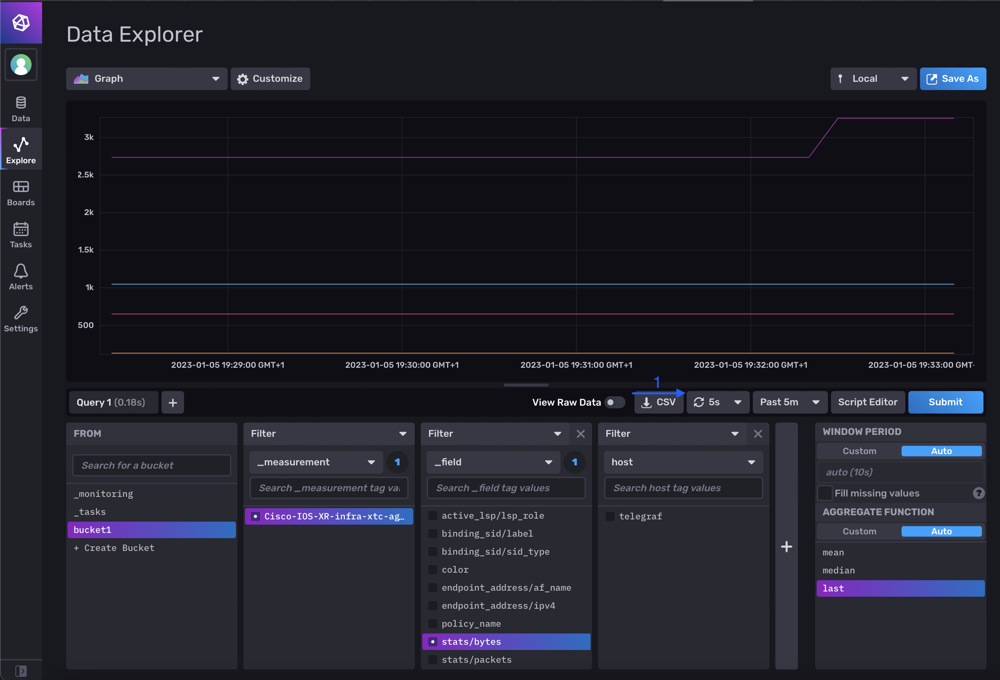
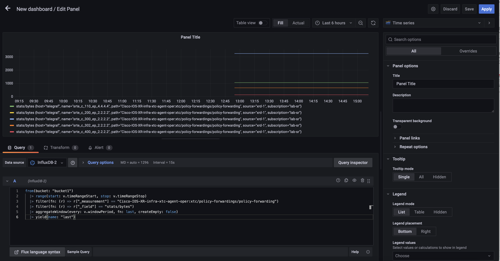

# 10. Model Driven Telemetry

## Monitoring model-driven telemetry data stream

A monitoring stack is a collection of components for ingesting, storing and visualizing telemetry data. 
In the current lab we propose usage of opensource solution tools running as Docker containers:

- Telegraf - a collection container that runs the cisco_telemetry_mdt plugin for ingestion of model-driven telemetry data
- InfluxDB - a storage container that runs a database which stores the time-series data
- Grafana - a visualization container that runs a web application which allows the exploration of data


### Task. 1 Get familiar with a TIG stack

Move to the lab folder.

```bash
cd $HOME/lab/sr-lab-telemetry
```

Dokcer-compose is a tool for defining and running multi-container Docker applications. 
With docker-compose, you use a YAML file to configure your application's services.

Let's visualize those services:

```bash
cat docker-compose.yml
```
```yaml
version: '3.6'
services:

  telegraf:
    image: telegraf:1.20.2-alpine
    container_name: telegraf
    ports:
      - 57000:57000
    hostname: telegraf
    command: telegraf --config-directory /etc/telegraf/telegraf.d
    volumes:
      - "./telegraf/telegraf-sample.conf:/etc/telegraf/telegraf.conf:ro"
      - "./telegraf/telegraf.d:/etc/telegraf/telegraf.d:ro"
    env_file:
      - .env
    logging:
      driver: "json-file"
      options:
        max-size: "20m"
        max-file: "10"
    depends_on:
      - influxdb
    restart: always

  influxdb:
    image: influxdb:2.0.4-alpine
    container_name: influxdb
    ports:
      - 8086:8086
    env_file:
      - .env
    restart: always

  grafana:
    image: grafana/grafana:8.3.0
    container_name: grafana
    ports:
      - 3000:3000
    volumes:
      - grafana-data:/var/lib/grafana
      - ./grafana/provisioning:/etc/grafana/provisioning:ro
      - ./grafana/provisioning/dashboards:/var/lib/grafana/dashboards:ro
    env_file:
      - .env
    environment:
      # Grafana has to use Proxy mode for a successful connection;
      # Therefore, one accesses InfluxDB through the host network.
      INFLUX_HOST_v2: $HOST
    depends_on:
      - influxdb
    restart: always
```

:pushpin: 

- The docker-compose file is composed of three named services `telegraf`, `influxdb`, `grafana` 
- Each service mention the docker `image` to be pulled and used, and other configuration parameters for the container such as the `ports` it's listening on.
- For the service `telegraf` and `grafana`, `volumes` are attached to the container. They link a local machine folder/file to an element in the running container.

### Task 2. Visualize Telegraf configuration

```bash
cat telegraf/telegraf.d/telegraf-sr.conf
```

```ini
[[inputs.cisco_telemetry_mdt]]
  # Telemetry transport
  transport = "grpc"

  # Address and port to host telemetry listener on - dialout:
  # IOS XR dials out to the collector
  service_address = ":57000"

[[outputs.influxdb_v2]]
  urls = ["http://influxdb:8086"]

  token = "$DOCKER_INFLUXDB_INIT_ADMIN_TOKEN"
  organization = "$DOCKER_INFLUXDB_INIT_ORG"
  bucket = "$DOCKER_INFLUXDB_INIT_BUCKET"

  precision = "s"
  timeout = "5s"
```

The configuration file define an `input` and `output` plugins specifications.

The collector has been configured to listen on port 57000 for incoming connections. 

The device will initiate the connection, dialling out to the collector. 
After the connection establishment, the device will begin to stream data to the collector which will send it to a database named telemetry.

### Task 3. Instanciate the lab

```bash
docker-compose up -d
```

## Retrieval of the configuration for model-driven telemetry streaming (dial-out)

We need now to configure a router for model-driven telemetry (MDT) streaming using the gRPC dial-out mechanism.

In this case, the device initiates a gRPC session (dial-out) with the MDT receiver and exchanges SYN -- SYN-ACK -- ACK with it while establishing the connection.

If the connection is successfully created, the device will start streaming telemetry data towards the collection point.

### Task 4. Configure router model-driven telemetry

Connect to xrd 1

```bash
xrd 1
```

:keyboard: xrd-1
```bash
config
telemetry model-driven
 destination-group lab-sr-collector
  address-family ipv4 172.28.0.254 port 57000
   encoding self-describing-gpb
   protocol grpc no-tls
  !
 !
 sensor-group sr-policy-monitoring-extended
  sensor-path Cisco-IOS-XR-infra-xtc-agent-oper:xtc/policy-forwardings/policy-forwarding
 !
 subscription lab-sr
  sensor-group-id sr-policy-monitoring-extended sample-interval 10000
  destination-id lab-sr-collector
 !
!
commit
end
```

The configuration consists of:

- A sensor-group that is composed of sensor-path(s):
  - A sensor-path is a specification of the YANG component about which information should be streamed. It is specified in XPath format
- A destination-group that is composed of destination(s):
  - A destination contains the receiver's specifications:
    - IP address
    - port
    - encoding format
    - protocol
- A subscription that brings together a sensor-group, a destination-group and a time interval [ms]

In this case, we subscribe to real-time updates of the operational state of all SR policies (`Cisco-IOS-XR-infra-xtc-agent-oper`). 
We expect to receive data regularly, every 10 seconds (10000 mseconds).

### Task 5. Verify device MDT operational state

:keyboard: xrd-1
```bash
show telemetry model-driven sensor-group 
```
```
  Sensor Group Id:sr-policy-monitoring-extended
    Sensor Path:        Cisco-IOS-XR-infra-xtc-agent-oper:xtc/policy-forwardings/policy-forwarding
    Sensor Path State:  Resolved
```

:warning: It can take several seconds for the sensor path state to be Resolved

The command let you verify that the sensor path you specified is `valid` and the XPath specified has been `resolved`.

A summary of the subscriptions let you verify the state with the different collectors.

:keyboard: xrd-1
```bash
show telemetry model-driven subscription 
```
```
Subscription:  lab-sr                   State: ACTIVE
-------------
  Sensor groups:
  Id                               Interval(ms)               State     
  sr-policy-monitoring-extended    10000                      Resolved  

  Destination Groups:
  Id                 Encoding            Transport   State   Port    Vrf                               IP                                            
  lab-sr             self-describing-gpb grpc        Active  57000                                     172.28.0.254                                  
    TLS :             False
```

## InfluxDB

InfluxDB is an open-source time-series database. It is designed for storing and querying large amounts of time-series data, such as monitoring, analytics, and IoT applications. 
Flux is InfluxData’s functional data scripting language designed for querying, analyzing, and acting on data.

### Task 6. InfluxDB Web UI

Now that you verified that the router is streaming data, we can verify the state of the datbase, InfluxDB.

Influx serves on port 8086 a WebUI. 
From the UI you can query the DB with a query builder.

[Click here to open the influx dashboard](http://%%LAB_URL%%:8443/influx) 

> Credentials are : lab / labtelemetry123

### Task. 7 Query InfluxDB

Let's verify what's ingested in Influx. 

1. Navigate to the Influx data explorer
2. The query builder panels let you visualize the content of the DB.
3. Select 
   1. bucket1
   2. Cisco-IOS-XR-infra-xtc-agent-oper:xtc/policy-forwardings/policy-forwarding
   3. stats/bytes
4. Click `Submit` button.


The result of the query is displayed as a Graph. 
As we did not specified a specific policy the path return the list of all policies total `bytes` sent.


### Task. 8 Generate traffic

From previous activities you should have active policies with automatic traffic steering from SR-MPLS VPN. 
From router xrd-1 you can generate traffic by reaching xrd-2 via VPN `customer1`

:keyboard: xrd-1

```bash
ping 10.10.10.2 vrf customer1
```
```
Type escape sequence to abort.
Sending 5, 100-byte ICMP Echos to 10.10.10.2, timeout is 2 seconds:
!!!!!
Success rate is 100 percent (5/5), round-trip min/avg/max = 1/1/2 ms
```

As more traffic is steered inside the policy you should see total `bytes` forwarded by the polocy increasing.

> By default the query is not refresh, click the pause (`||`) button next to the submit button and select a `5 sec` refresh.



## Grafana

Grafana is an open-source data visualization and monitoring platform. It allows users to create and share interactive dashboards that display real-time data from a variety of sources. Grafana is commonly used for monitoring and alerting, as well as for analysis and visualization of time-series data.

### Task. 9 Login to Grafana

The Grafana service Webui is listening on port 3000. 

[Click here to open the grafana dashboard](http://%%LAB_URL%%:8443/grafana) 

> Credentials are : admin / admin

### Task. 10 Export Flux query

From influx query builder click the `script editor` button to display the auto-generated flux query sent to influxdb. 


### Task. 11 Create a Grafana Dashboard with the Flux Query.

1. Select the `+` sign on the left-hand side menu
2. Select `dashboard`


3. Select `Add a new panel`


4. Select the `data source` as `InfluxDB-2`


5. Paste in the flux query in the query panel, the should update with the query result.



### Task. 12 Refine Flux query

To specify what should be displayed on the abscissa axis we need to alter the query, and refine the stream by only displaying the column `name`.
You will use the `|> map` operator in the Flux query to perform a transformation on the data stream.
```
from(bucket: "bucket1")
  |> range(start: v.timeRangeStart, stop: v.timeRangeStop)
  |> filter(fn: (r) => r["_measurement"] == "Cisco-IOS-XR-infra-xtc-agent-oper:xtc/policy-forwardings/policy-forwarding")
  |> filter(fn: (r) => r["_field"] == "stats/bytes")
  |> aggregateWindow(every: 10s, fn: mean, createEmpty: false)
  |> map(fn: (r) => ({_value: r._value, _time: r._time, _field: r["name"]}))
  |> yield(name: "last")
```

Here is a more detailed breakdown of the query:

1. `from(bucket: "bucket1")` retrieves data from the "bucket1" bucket.
2. `|> range(start: v.timeRangeStart, stop: v.timeRangeStop)` filters the data to include only data within the specified time range. v.timeRangeStart and v.timeRangeStop are variables that contain the start and stop times for the range.
3. `|> filter(fn: (r) => r["_measurement"] == "Cisco-IOS-XR-infra-xtc-agent-oper:xtc/policy-forwardings/policy-forwarding")` filters the data to include only measurements with the name "Cisco-IOS-XR-infra-xtc-agent-oper:xtc/policy-forwardings/policy-forwarding".
4. `|> filter(fn: (r) => r["_field"] == "stats/bytes")` filters the data to include only fields with the name "stats/bytes".
5. `|> aggregateWindow(every: 10s, fn: mean, createEmpty: false)` applies a mean aggregation to the data over a window of 10 seconds.
6. `|> map(fn: (r) => ({_value: r._value, _time: r._time, _field: r["name"]}))` transforms the data by adding a new field called "name" to each element.
7. `|> yield(name: "last")` returns the resulting data stream.

You now only have the stream name as abscissa.


### Task. 13 Save the newly created dashboard


