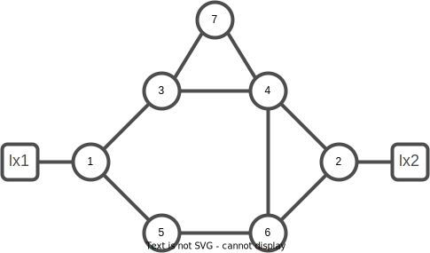
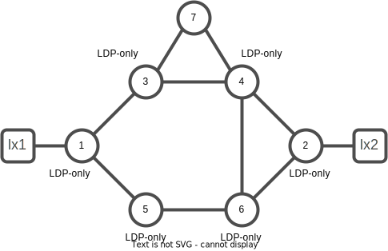
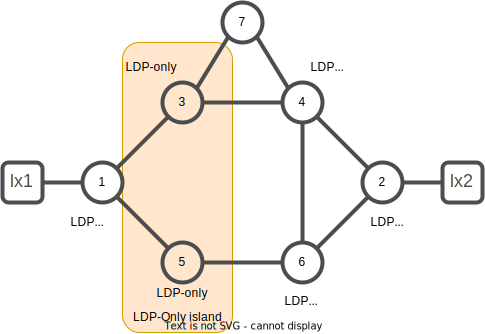
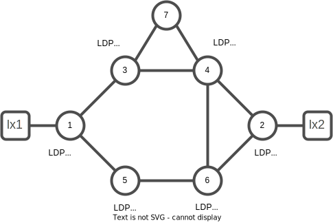
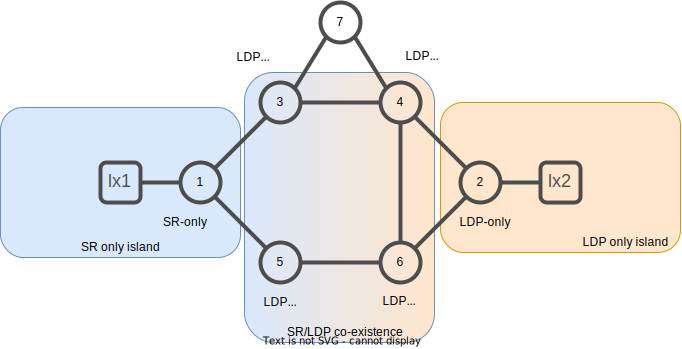
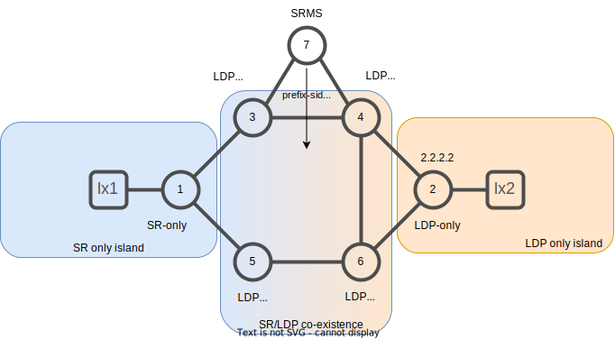

# 11. LDP and SR Coexistence

This lab explores the Segment Routing (SR) and LDP Co-Existance and SR Mapping Server function.

We will create a container based XR lab with the following initial topology



The tasks related to LDP and SR co-existence lab includes:

- configure MPLS LDP on xrd-1 to xrd-6 (tasks 0. to 5.)
- configure SR on xrd-1 and understand behaviour of dual control plane co-existence (tasks 6. to 7.)
- configure SR on xrd-2, xrd-4, xrd-6 and understand connectivity across LDP island (tasks 8. to 11.)
- configure SR label imposition preference and understand dataplane configuration (tasks 12. to 17.)

The tasks related to Mapping Server lab includes:

- configure LDP-only (xrd-2) and SR only (xrd-1) islands (tasks 18. to 21.)
- configure mapping server (xrd-7) to allow SR to LDP island connectivity (tasks 23. to 25.)

## Segment Routing and LDP Co-Existence

Multiple MPLS label distribution protocols can concurrently run on a node. They can co-exists as ships-in-the-night and their control plane mechanisms are independent. Therefore MPLS architecture permits concurrent use of LDP and Segment Routing as well as RSVP-TE and others.

### Task 0. Create a container based XR lab

```bash
#clean up the previous lab if it exists
cd $HOME/lab/sr-lab
docker-compose down
rm docker-compose.yml
rm ~/.ssh/known_hosts
```

Generate a docker-compose file from the docker-compose.xr.yaml sample

```bash
#generate the docker-compose.yml file
xr-compose -i 541301263746.dkr.ecr.us-east-1.amazonaws.com/cloud-native-router -f docker-compose.xr.yml
```

Instantiate the lab

```bash
#instanciate the lab from docker-compose.yml file
docker-compose up -d
countdown 120
```

Wait 2 min for the router to come up then connect to a router instance

```bash
xrd 1
```

Note : When first connecting to an XRd instance warning messages may appear regarding insufficient permissions or `/pkg/bin/ssh_launch.sh:` script with too many arguments. You can disregard those errors.

Check the ISIS router configuration:

```bash
show run router isis
```

You should have a similar output:

```console
RP/0/RP0/CPU0:xrd-1#show run router isis
Wed Dec 28 14:30:27.369 UTC
router isis core
 is-type level-2-only
 net 49.0002.0000.0000.0001.00
 address-family ipv4 unicast
  metric-style wide
 !
 interface Loopback0
  passive
  address-family ipv4 unicast
  !
 !
 interface GigabitEthernet0/0/0/0
  point-to-point
  address-family ipv4 unicast
  !
 !
 interface GigabitEthernet0/0/0/1
  point-to-point
  address-family ipv4 unicast
  !
 !
 interface GigabitEthernet0/0/0/2
  point-to-point
  address-family ipv4 unicast
  !
 !
!
```

Notice that Segment Routing is not configured on ISIS.

Check the segment routing SRGB configuration:

```bash
show run segment-routing
```

```console
RP/0/RP0/CPU0:xrd-1#show run segment-routing 
Wed Dec 28 14:34:34.715 UTC
% No such configuration item(s)
```

Notice there is no SRGB defined.

Check the ISIS topology database:

```bash
show isis database detail
```

You should have a similar output:

```console
RP/0/RP0/CPU0:xrd-1#show isis database detail
Wed Dec 28 14:31:40.625 UTC

IS-IS core (Level-2) Link State Database
LSPID                 LSP Seq Num  LSP Checksum  LSP Holdtime/Rcvd  ATT/P/OL
xrd-1.00-00         * 0x00000006   0x9a28        991  /*            0/0/0
  Area Address:   49.0002
  LSP MTU:        1492
  NLPID:          0xcc
  IP Address:     1.1.1.1
  Hostname:       xrd-1
  Metric: 10         IS-Extended xrd-3.00
  Metric: 10         IS-Extended xrd-5.00
  Metric: 0          IP-Extended 1.1.1.1/32
  Metric: 10         IP-Extended 99.1.10.0/24
  Metric: 10         IP-Extended 100.1.3.0/24
  Metric: 10         IP-Extended 100.1.5.0/24
xrd-2.00-00           0x00000006   0xc6e0        991  /1200         0/0/0
  Area Address:   49.0002
  LSP MTU:        1492
  NLPID:          0xcc
  IP Address:     2.2.2.2
  Hostname:       xrd-2
  Metric: 10         IS-Extended xrd-4.00
  Metric: 10         IS-Extended xrd-6.00
  Metric: 0          IP-Extended 2.2.2.2/32
  Metric: 10         IP-Extended 99.2.20.0/24
  Metric: 10         IP-Extended 100.2.4.0/24
  Metric: 10         IP-Extended 100.2.6.0/24
xrd-3.00-00           0x00000006   0xc8bb        992  /1200         0/0/0
  Area Address:   49.0002
  LSP MTU:        1492
  NLPID:          0xcc
  IP Address:     3.3.3.3
  Hostname:       xrd-3
  Metric: 10         IS-Extended xrd-1.00
  Metric: 10         IS-Extended xrd-4.00
  Metric: 30         IS-Extended xrd-7.00
  Metric: 0          IP-Extended 3.3.3.3/32
  Metric: 10         IP-Extended 100.1.3.0/24
  Metric: 10         IP-Extended 100.3.4.0/24
  Metric: 30         IP-Extended 100.3.7.0/24
xrd-4.00-00           0x00000006   0x157a        991  /1200         0/0/0
  Area Address:   49.0002
  LSP MTU:        1492
  NLPID:          0xcc
  IP Address:     4.4.4.4
  Hostname:       xrd-4
  Metric: 10         IS-Extended xrd-2.00
  Metric: 10         IS-Extended xrd-3.00
  Metric: 10         IS-Extended xrd-6.00
  Metric: 30         IS-Extended xrd-7.00
  Metric: 0          IP-Extended 4.4.4.4/32
  Metric: 10         IP-Extended 100.2.4.0/24
  Metric: 10         IP-Extended 100.3.4.0/24
  Metric: 10         IP-Extended 100.4.6.0/24
  Metric: 30         IP-Extended 100.4.7.0/24
xrd-5.00-00           0x00000005   0x4832        989  /1200         0/0/0
  Area Address:   49.0002
  LSP MTU:        1492
  NLPID:          0xcc
  IP Address:     5.5.5.5
  Hostname:       xrd-5
  Metric: 10         IS-Extended xrd-1.00
  Metric: 10         IS-Extended xrd-6.00
  Metric: 0          IP-Extended 5.5.5.5/32
  Metric: 10         IP-Extended 100.1.5.0/24
  Metric: 10         IP-Extended 100.5.6.0/24
xrd-6.00-00           0x00000006   0xc3c3        991  /1200         0/0/0
  Area Address:   49.0002
  LSP MTU:        1492
  NLPID:          0xcc
  IP Address:     6.6.6.6
  Hostname:       xrd-6
  Metric: 10         IS-Extended xrd-2.00
  Metric: 10         IS-Extended xrd-4.00
  Metric: 10         IS-Extended xrd-5.00
  Metric: 0          IP-Extended 6.6.6.6/32
  Metric: 10         IP-Extended 100.2.6.0/24
  Metric: 10         IP-Extended 100.4.6.0/24
  Metric: 10         IP-Extended 100.5.6.0/24
xrd-7.00-00           0x00000006   0xbe52        991  /1200         0/0/0
  Area Address:   49.0002
  LSP MTU:        1492
  NLPID:          0xcc
  IP Address:     7.7.7.7
  Hostname:       xrd-7
  Metric: 30         IS-Extended xrd-3.00
  Metric: 30         IS-Extended xrd-4.00
  Metric: 0          IP-Extended 7.7.7.7/32
  Metric: 30         IP-Extended 100.3.7.0/24
  Metric: 30         IP-Extended 100.4.7.0/24

 Total Level-2 LSP count: 7     Local Level-2 LSP count: 1
 ```

Notice the ISIS topology is consistent with the lab topology diagram.

Check the MPLS forwarding plane:

```bash
show mpls forwarding
exit
```

You should have a similar output:

```console
RP/0/RP0/CPU0:xrd-1#show mpls forwarding
Wed Dec 28 14:34:59.226 UTC
```

Notice there is no entry for the MPLS forwarding plane

### Task 1. Configure MPLS on xrd-1..xrd-6 routers

We are configuring the router xrd-1 to xrd-6 to get the following topology:



Configure the routers xrd-1..xrd-6 for MPLS LDP:

```bash
xrd 1
```

```bash
conf t
!         
mpls oam  
!         
mpls ldp  
 log      
  hello-adjacency
  neighbor
 !        
 router-id 1.1.1.1
 neighbor 
  dual-stack transport-connection prefer ipv4
 !        
 address-family ipv4
 !        
 address-family ipv6
 !        
 interface GigabitEthernet0/0/0/0
  address-family ipv4
  !       
  address-family ipv6
  !       
 !        
 interface GigabitEthernet0/0/0/1
  address-family ipv4
  !       
  address-family ipv6
  !       
 !        
!
commit
end
exit         
!
```

```bash
xrd 2
```

```bash
conf t
!         
mpls oam  
!         
mpls ldp  
 log      
  hello-adjacency
  neighbor
 !        
 router-id 2.2.2.2
 neighbor 
  dual-stack transport-connection prefer ipv4
 !        
 address-family ipv4
 !        
 address-family ipv6
 !        
 interface GigabitEthernet0/0/0/0
  address-family ipv4
  !       
  address-family ipv6
  !       
 !        
 interface GigabitEthernet0/0/0/1
  address-family ipv4
  !       
  address-family ipv6
  !       
 !        
!
commit
end
exit         
!
```

```bash
xrd 3
```

```bash
conf t
!         
mpls oam  
!         
mpls ldp  
 log      
  hello-adjacency
  neighbor
 !        
 router-id 3.3.3.3
 neighbor 
  dual-stack transport-connection prefer ipv4
 !        
 address-family ipv4
 !        
 address-family ipv6
 !        
 interface GigabitEthernet0/0/0/0
  address-family ipv4
  !       
  address-family ipv6
  !       
 !        
 interface GigabitEthernet0/0/0/1
  address-family ipv4
  !       
  address-family ipv6
  !       
 !
 interface GigabitEthernet0/0/0/2
  address-family ipv4
  !       
  address-family ipv6
  !       
 !
!
commit
end
exit         
!
```

```bash
xrd 4
```

```bash
conf t
!         
mpls oam  
!         
mpls ldp  
 log      
  hello-adjacency
  neighbor
 !        
 router-id 4.4.4.4
 neighbor 
  dual-stack transport-connection prefer ipv4
 !        
 address-family ipv4
 !        
 address-family ipv6
 !        
 interface GigabitEthernet0/0/0/0
  address-family ipv4
  !       
  address-family ipv6
  !       
 !        
 interface GigabitEthernet0/0/0/1
  address-family ipv4
  !       
  address-family ipv6
  !       
 !
 interface GigabitEthernet0/0/0/2
  address-family ipv4
  !       
  address-family ipv6
  !       
 !
!
commit
end
exit      
!     
```

```bash
xrd 5
```

```bash
conf t
!         
mpls oam  
!         
mpls ldp  
 log      
  hello-adjacency
  neighbor
 !        
 router-id 5.5.5.5
 neighbor 
  dual-stack transport-connection prefer ipv4
 !        
 address-family ipv4
 !        
 address-family ipv6
 !        
 interface GigabitEthernet0/0/0/0
  address-family ipv4
  !       
  address-family ipv6
  !       
 !        
 interface GigabitEthernet0/0/0/1
  address-family ipv4
  !       
  address-family ipv6
  !       
 !
 interface GigabitEthernet0/0/0/2
  address-family ipv4
  !       
  address-family ipv6
  !       
 !
!
commit
end
exit      
!
```

```bash
xrd 6
```

```bash
conf t
!         
mpls oam  
!         
mpls ldp  
 log      
  hello-adjacency
  neighbor
 !        
 router-id 6.6.6.6
 neighbor 
  dual-stack transport-connection prefer ipv4
 !        
 address-family ipv4
 !        
 address-family ipv6
 !        
 interface GigabitEthernet0/0/0/0
  address-family ipv4
  !       
  address-family ipv6
  !       
 !        
 interface GigabitEthernet0/0/0/1
  address-family ipv4
  !       
  address-family ipv6
  !       
 !
 interface GigabitEthernet0/0/0/2
  address-family ipv4
  !       
  address-family ipv6
  !       
 !
!
commit
end
exit      
!
```

### Task 2. Verify MPLS interfaces status

Access the xrd-1 router and verify the interfaces connected to xrd-3 and xrd-5 are enabled for MPLS LDP.

```bash
xrd 1
```

```bash
show mpls interfaces 
```

```console
RP/0/RP0/CPU0:xrd-1#show mpls interfaces 
Mon Dec  5 10:48:58.775 UTC
Interface                  LDP      Tunnel   Static   Enabled 
-------------------------- -------- -------- -------- --------
GigabitEthernet0/0/0/0     Yes      No       No       Yes
GigabitEthernet0/0/0/1     Yes      No       No       Yes
```

Display the detailed information for the MPLS interfaces.  Make note of the enabled protocols on the interfaces for comparison in a later task.

```bash
show mpls interfaces detail
```

```console
RP/0/RP0/CPU0:xrd-1#show mpls interfaces detail 
Mon Dec  5 10:54:02.139 UTC
Interface GigabitEthernet0/0/0/0:
        LDP(A)
        MPLS enabled
Interface GigabitEthernet0/0/0/1:
        LDP(A)
        MPLS enabled
```

Notice the MPLS protocol is enable for the interfaces as well as LDP control plane is managing the labels.
### Task 3. Verify LDP neighbor relationships

Verify that xrd-1 has formed MPLS LDP neighbor relationships to xrd-3 and xrd-5.

```bash
show mpls ldp neighbor
```

```console
RP/0/RP0/CPU0:xrd-1#show mpls ldp neighbor 
Mon Dec  5 10:57:03.488 UTC

Peer LDP Identifier: 3.3.3.3:0
  TCP connection: 3.3.3.3:50439 - 1.1.1.1:646
  Graceful Restart: No
  Session Holdtime: 180 sec
  State: Oper; Msgs sent/rcvd: 43/43; Downstream-Unsolicited
  Up time: 00:18:44
  LDP Discovery Sources:
    IPv4: (1)
      GigabitEthernet0/0/0/0
    IPv6: (0)
  Addresses bound to this peer:
    IPv4: (5)
      3.3.3.3        100.1.3.3      100.3.4.3      100.3.7.3      
      172.28.0.3     
    IPv6: (0)

Peer LDP Identifier: 5.5.5.5:0
  TCP connection: 5.5.5.5:57126 - 1.1.1.1:646
  Graceful Restart: No
  Session Holdtime: 180 sec
  State: Oper; Msgs sent/rcvd: 38/39; Downstream-Unsolicited
  Up time: 00:15:09
  LDP Discovery Sources:
    IPv4: (1)
      GigabitEthernet0/0/0/1
    IPv6: (0)
  Addresses bound to this peer:
    IPv4: (4)
      5.5.5.5        100.1.5.5      100.5.6.5      172.28.0.5     
    IPv6: (0)
```

### Task 4. Check MPLS forwarding table

Display the MPLS forwarding table and verify that there are forwarding entries for the IPv4 and IPv6 loopback addresses for all the nodes in the network.

```bash
show mpls forwarding 
```

```console
RP/0/RP0/CPU0:xrd-1#show mpls forwarding 
Mon Dec  5 10:58:41.252 UTC
Local  Outgoing    Prefix             Outgoing     Next Hop        Bytes       
Label  Label       or ID              Interface                    Switched    
------ ----------- ------------------ ------------ --------------- ------------
24000  24000       7.7.7.7/32         Gi0/0/0/0    100.1.3.3       2247        
24001  24000       6.6.6.6/32         Gi0/0/0/1    100.1.5.5       0           
24002  Pop         5.5.5.5/32         Gi0/0/0/1    100.1.5.5       1996        
24003  24001       4.4.4.4/32         Gi0/0/0/0    100.1.3.3       0           
24004  Pop         3.3.3.3/32         Gi0/0/0/0    100.1.3.3       2482        
24005  24008       2.2.2.2/32         Gi0/0/0/0    100.1.3.3       288         
       24006       2.2.2.2/32         Gi0/0/0/1    100.1.5.5       0           
24006  Pop         100.5.6.0/24       Gi0/0/0/1    100.1.5.5       0           
24007  24003       100.4.7.0/24       Gi0/0/0/0    100.1.3.3       0           
24008  24004       100.4.6.0/24       Gi0/0/0/0    100.1.3.3       0           
       24002       100.4.6.0/24       Gi0/0/0/1    100.1.5.5       0           
24009  Pop         100.3.7.0/24       Gi0/0/0/0    100.1.3.3       0           
24010  Pop         100.3.4.0/24       Gi0/0/0/0    100.1.3.3       0           
24011  24003       100.2.6.0/24       Gi0/0/0/1    100.1.5.5       0           
24012  24005       100.2.4.0/24       Gi0/0/0/0    100.1.3.3       0           
24013  24010       99.2.20.0/24       Gi0/0/0/0    100.1.3.3       0           
       24008       99.2.20.0/24       Gi0/0/0/1    100.1.5.5       0 
```

### Task 5. Verify IP connectivity through MPLS 

Verify IPv4 connectivity and LDP transport of services to xrd-2 using the traceroute command.

```bash
traceroute mpls ipv4 2.2.2.2/32
```

```console
RP/0/RP0/CPU0:xrd-1#traceroute mpls ipv4 2.2.2.2/32
Mon Dec  5 12:20:06.462 UTC

Tracing MPLS Label Switched Path to 2.2.2.2/32, timeout is 2 seconds

Codes: '!' - success, 'Q' - request not sent, '.' - timeout,
  'L' - labeled output interface, 'B' - unlabeled output interface, 
  'D' - DS Map mismatch, 'F' - no FEC mapping, 'f' - FEC mismatch,
  'M' - malformed request, 'm' - unsupported tlvs, 'N' - no rx label, 
  'P' - no rx intf label prot, 'p' - premature termination of LSP, 
  'R' - transit router, 'I' - unknown upstream index,
  'X' - unknown return code, 'x' - return code 0

Type escape sequence to abort.

  0 100.1.5.1 MRU 1500 [Labels: 24006 Exp: 0]
L 1 100.1.5.5 MRU 1500 [Labels: 24002 Exp: 0] 2 ms
L 2 100.5.6.6 MRU 1500 [Labels: implicit-null Exp: 0] 2 ms
! 3 100.2.6.2 3 ms
```

### Task 6. Configure IS-IS Segment Routing

Access the xrd-1 router and enabled IS-IS segment routing for the IPv4 and IPv6 unicast address families.


Configure the Loopback 0 interface with the following absolute value prefix-SIDs:

- IPv4 unicast address family:  16011
- IPv6 unicast address family:  17011

```bash
conf t
!
router isis core
 address-family ipv4 unicast
  segment-routing mpls
 !
 address-family ipv6 unicast
  segment-routing mpls
 !
 interface Loopback0
  address-family ipv4 unicast
   prefix-sid absolute 16001
  !
  address-family ipv6 unicast
   prefix-sid absolute 17001
  !
 !
!
commit
end
exit
!
```

### Task 7. Check MPLS interfaces detail

An MPLS control plane funtion ("Label Manager") exists on each node that ensures that the local labels used by different label distribution protocols don't collide; it ensures that local labels are uniquely allocated and assigned.

For SR Global Segments, such as the Prefix segments, a range of local labels is reserved with the configuration of the SRGB.

For the MPLS label distribution protocols (e.g. LDP, RSVP-TE...) that use random dynamic labels, or for the SR Local segments, such as IGP Adjacency segments, the Label Manager ensures that each local label is locally unique.

Display the detailed information for the MPLS interfaces.

```bash
xrd 1
```

```bash
show mpls interfaces detail
exit
!
```

```console
RP/0/RP0/CPU0:xrd-1#show mpls interfaces detail 
Mon Dec  5 12:39:27.227 UTC
Interface GigabitEthernet0/0/0/0:
        MPLS ISIS enabled
        LDP(A)
        ISIS(A):core
        MPLS enabled
Interface GigabitEthernet0/0/0/1:
        MPLS ISIS enabled
        LDP(A)
        ISIS(A):core
        MPLS enabled
Interface GigabitEthernet0/0/0/2:
        MPLS ISIS enabled
        ISIS(A):core
        MPLS enabled
```

What  protocols are enabled on the interfaces that were not enabled in the previous task?

### Task 8. Configure IS-IS Segment Routing on xrd-2, xrd-4, xrd-6

We will configure xrd-2, xrd-4 and xrd-6 to have the following topology:



```bash
xrd 2
```

```bash
conf t
!
router isis core
 address-family ipv4 unicast
  segment-routing mpls
 !
 address-family ipv6 unicast
  segment-routing mpls
 !
 interface Loopback0
  address-family ipv4 unicast
   prefix-sid absolute 16002
  !
  address-family ipv6 unicast
   prefix-sid absolute 17002
  !
 !
!
commit
end
exit
!
```

```bash
xrd 4
```

```bash
conf t
!
router isis core
 address-family ipv4 unicast
  segment-routing mpls
 !
 address-family ipv6 unicast
  segment-routing mpls
 !
 interface Loopback0
  address-family ipv4 unicast
   prefix-sid absolute 16004
  !
  address-family ipv6 unicast
   prefix-sid absolute 17004
  !
 !
!
commit
end
exit
!
```

```bash
xrd 6
```

```bash
conf t
!
router isis core
 address-family ipv4 unicast
  segment-routing mpls
 !
 address-family ipv6 unicast
  segment-routing mpls
 !
 interface Loopback0
  address-family ipv4 unicast
   prefix-sid absolute 16006
  !
  address-family ipv6 unicast
   prefix-sid absolute 17006
  !
 !
!
commit
end
exit
!
```

### Task 9. Check MPLS forwarding table

```bash
xrd 1
```

```bash
show mpls forwarding
```

```console
RP/0/RP0/CPU0:xrd-1#show mpls forwarding
Mon Dec  5 14:40:13.800 UTC
Local  Outgoing    Prefix             Outgoing     Next Hop        Bytes       
Label  Label       or ID              Interface                    Switched    
------ ----------- ------------------ ------------ --------------- ------------
16002  24008       SR Pfx (idx 2)     Gi0/0/0/0    100.1.3.3       0           
       24006       SR Pfx (idx 2)     Gi0/0/0/1    100.1.5.5       0           
16004  24001       SR Pfx (idx 4)     Gi0/0/0/0    100.1.3.3       0           
16006  24000       SR Pfx (idx 6)     Gi0/0/0/1    100.1.5.5       0           
24000  24000       7.7.7.7/32         Gi0/0/0/0    100.1.3.3       25894       
24001  24000       6.6.6.6/32         Gi0/0/0/1    100.1.5.5       0           
24002  Pop         5.5.5.5/32         Gi0/0/0/1    100.1.5.5       318         
24003  24001       4.4.4.4/32         Gi0/0/0/0    100.1.3.3       0           
24004  Pop         3.3.3.3/32         Gi0/0/0/0    100.1.3.3       636         
24005  24008       2.2.2.2/32         Gi0/0/0/0    100.1.3.3       0           
       24006       2.2.2.2/32         Gi0/0/0/1    100.1.5.5       0           
24006  Pop         100.5.6.0/24       Gi0/0/0/1    100.1.5.5       0           
24007  24003       100.4.7.0/24       Gi0/0/0/0    100.1.3.3       0           
24008  24004       100.4.6.0/24       Gi0/0/0/0    100.1.3.3       0           
       24002       100.4.6.0/24       Gi0/0/0/1    100.1.5.5       0           
24009  Pop         100.3.7.0/24       Gi0/0/0/0    100.1.3.3       0           
24010  Pop         100.3.4.0/24       Gi0/0/0/0    100.1.3.3       0           
24011  24003       100.2.6.0/24       Gi0/0/0/1    100.1.5.5       0           
24012  24005       100.2.4.0/24       Gi0/0/0/0    100.1.3.3       0           
24013  24010       99.2.20.0/24       Gi0/0/0/0    100.1.3.3       0           
       24008       99.2.20.0/24       Gi0/0/0/1    100.1.5.5       0           
24014  Pop         SR Adj (idx 1)     Gi0/0/0/0    100.1.3.3       0           
24015  Pop         SR Adj (idx 3)     Gi0/0/0/0    100.1.3.3       0           
24016  Pop         SR Adj (idx 1)     Gi0/0/0/1    100.1.5.5       0           
24017  Pop         SR Adj (idx 3)     Gi0/0/0/1    100.1.5.5       0        
```

What changes have occurred within the MPLS forwarding table ?

### Task 10. Check CEF entry for xrd-2

Display the CEF entry for the xrd-2 IPv4 loopback address.  The services are still carried using LDP transport labels since xrd-3 and xrd-5 neighbors are enabled for SR.

```bash
show cef 2.2.2.2
```

```console
RP/0/RP0/CPU0:xrd-1#show cef 2.2.2.2
Mon Dec  5 13:18:42.159 UTC
2.2.2.2/32, version 76, labeled SR, internal 0x1000001 0x8130 (ptr 0x8719edb0) [1], 0x600 (0x877ca650), 0xa28 (0x897fe2b0)
 Updated Dec  5 13:16:13.633 
 local adjacency to GigabitEthernet0/0/0/0

 Prefix Len 32, traffic index 0, precedence n/a, priority 3
 Extensions: context-label:16002
  gateway array (0x87632b40) reference count 3, flags 0x68, source lsd (5), 1 backups
                [2 type 5 flags 0x8401 (0x8912f7c8) ext 0x0 (0x0)]
  LW-LDI[type=5, refc=3, ptr=0x877ca650, sh-ldi=0x8912f7c8]
  gateway array update type-time 1 Dec  5 12:56:59.984
 LDI Update time Dec  5 12:56:59.984
 LW-LDI-TS Dec  5 12:56:59.984
   via 100.1.3.3/32, GigabitEthernet0/0/0/0, 21 dependencies, weight 0, class 0 [flags 0x0]
    path-idx 0 NHID 0x1 [0x892f26f0 0x0]
    next hop 100.1.3.3/32
    local adjacency
     local label 24005      labels imposed {24008}
   via 100.1.5.5/32, GigabitEthernet0/0/0/1, 21 dependencies, weight 0, class 0 [flags 0x0]
    path-idx 1 NHID 0x2 [0x892f2830 0x0]
    next hop 100.1.5.5/32
    local adjacency
     local label 24005      labels imposed {24006}

    Load distribution: 0 1 0 1 (refcount 2)

    Hash  OK  Interface                 Address
    0     Y   GigabitEthernet0/0/0/0    100.1.3.3      
    1     Y   GigabitEthernet0/0/0/1    100.1.5.5      
    2     Y   GigabitEthernet0/0/0/0    100.1.3.3      
    3     Y   GigabitEthernet0/0/0/1    100.1.5.5
```

### Task 11. Check IP route entry for xrd-2

```bash
show route 2.2.2.2 detail
exit
!
```

```console
  RP/0/RP0/CPU0:xrd-1#show ip route 2.2.2.2 detail 
Mon Dec  5 14:37:43.319 UTC

Routing entry for 2.2.2.2/32
  Known via "isis core", distance 115, metric 30, labeled SR, type level-2
  Installed Dec  5 14:37:23.177 for 00:00:20
  Routing Descriptor Blocks
    100.1.3.3, from 2.2.2.2, via GigabitEthernet0/0/0/0
      Route metric is 30
      Label: None
      Tunnel ID: None
      Binding Label: None
      Extended communities count: 0
      Path id:2       Path ref count:0
      NHID:0x1(Ref:11)
    100.1.5.5, from 2.2.2.2, via GigabitEthernet0/0/0/1
      Route metric is 30
      Label: None
      Tunnel ID: None
      Binding Label: None
      Extended communities count: 0
      Path id:1       Path ref count:0
      NHID:0x2(Ref:8)
  Route version is 0x15 (21)
  Local Label: 0x3e82 (16002)
  IP Precedence: Not Set
  QoS Group ID: Not Set
  Flow-tag: Not Set
  Fwd-class: Not Set
  Route Priority: RIB_PRIORITY_NON_RECURSIVE_MEDIUM (7) SVD Type RIB_SVD_TYPE_LOCAL
  Download Priority 1, Download Version 161
  No advertising protos. 
```

Notice that for each path entry there is no outgoing label configured as xrd-3 and xrd-5 are not SR enabled.

### Task 12. Configure IS-IS Segment Routing on xrd-3 and xrd-5

Let's configure the xrd-3 and xrd-5 routers with SR:



```bash
xrd 3
```

```bash
conf t
!
router isis core
 address-family ipv4 unicast
  segment-routing mpls
 !
 address-family ipv6 unicast
  segment-routing mpls
 !
 interface Loopback0
  address-family ipv4 unicast
   prefix-sid absolute 16003
  !
  address-family ipv6 unicast
   prefix-sid absolute 17003
  !
 !
!
commit
end
exit
!
```

```bash
xrd 5
```

```bash
conf t
!
router isis core
 address-family ipv4 unicast
  segment-routing mpls
 !
 address-family ipv6 unicast
  segment-routing mpls
 !
 interface Loopback0
  address-family ipv4 unicast
   prefix-sid absolute 16005
  !
  address-family ipv6 unicast
   prefix-sid absolute 17005
  !
 !
!
commit
end
exit
!
```

### Task 13. Check IP route entry for xrd-2

```bash
xrd 1
```

```bash
show route 2.2.2.2 detail
```

```console
RP/0/RP0/CPU0:xrd-1#show route 2.2.2.2 detail
Mon Dec  5 13:27:24.113 UTC

Routing entry for 2.2.2.2/32
  Known via "isis core", distance 115, metric 30, labeled SR, type level-2
  Installed Dec  5 13:16:13.627 for 00:11:10
  Routing Descriptor Blocks
    100.1.3.3, from 2.2.2.2, via GigabitEthernet0/0/0/0
      Route metric is 30
      Label: 0x3e82 (16002)
      Tunnel ID: None
      Binding Label: None
      Extended communities count: 0
      Path id:2       Path ref count:0
      NHID:0x1(Ref:11)
    100.1.5.5, from 2.2.2.2, via GigabitEthernet0/0/0/1
      Route metric is 30
      Label: 0x3e82 (16002)
      Tunnel ID: None
      Binding Label: None
      Extended communities count: 0
      Path id:1       Path ref count:0
      NHID:0x2(Ref:8)
  Route version is 0xf (15)
  Local Label: 0x3e82 (16002)
  IP Precedence: Not Set
  QoS Group ID: Not Set
  Flow-tag: Not Set
  Fwd-class: Not Set
  Route Priority: RIB_PRIORITY_NON_RECURSIVE_MEDIUM (7) SVD Type RIB_SVD_TYPE_LOCAL
  Download Priority 1, Download Version 107
  No advertising protos. 
```

Notice there are outgoing labels now for each path as xrd-3 and xrd-5 are SR enabled.

### Task 14. Check CEF entry for xrd-2

Display the CEF entry for the xrd-2 IPv4 loopback address.  The services are still carried using LDP transport labels since the default label imposition is to prefer the LDP label imposition.

```bash
show cef 2.2.2.2 detail
exit
!
```

```console
RP/0/RP0/CPU0:xrd-1#show cef 2.2.2.2 detail
Mon Dec  5 14:48:31.356 UTC
2.2.2.2/32, version 115, labeled SR, internal 0x1000001 0x8130 (ptr 0x8719edb0) [1], 0x600 (0x877ca650), 0xa28 (0x897fe2b0)
 Updated Dec  5 14:47:51.725 
 local adjacency to GigabitEthernet0/0/0/0

 Prefix Len 32, traffic index 0, precedence n/a, priority 3
 Extensions: context-label:16002
  gateway array (0x87632b40) reference count 3, flags 0x68, source lsd (5), 1 backups
                [2 type 5 flags 0x8401 (0x8912f7c8) ext 0x0 (0x0)]
  LW-LDI[type=5, refc=3, ptr=0x877ca650, sh-ldi=0x8912f7c8]
  gateway array update type-time 1 Dec  5 12:56:59.984
 LDI Update time Dec  5 12:56:59.984
 LW-LDI-TS Dec  5 12:56:59.984
   via 100.1.3.3/32, GigabitEthernet0/0/0/0, 21 dependencies, weight 0, class 0 [flags 0x0]
    path-idx 0 NHID 0x1 [0x892f26f0 0x0]
    next hop 100.1.3.3/32
    local adjacency
     local label 24005      labels imposed {24008}
   via 100.1.5.5/32, GigabitEthernet0/0/0/1, 21 dependencies, weight 0, class 0 [flags 0x0]
    path-idx 1 NHID 0x2 [0x892f2830 0x0]
    next hop 100.1.5.5/32
    local adjacency
     local label 24005      labels imposed {24006}

    Load distribution: 0 1 0 1 (refcount 2)

    Hash  OK  Interface                 Address
    0     Y   GigabitEthernet0/0/0/0    100.1.3.3      
    1     Y   GigabitEthernet0/0/0/1    100.1.5.5      
    2     Y   GigabitEthernet0/0/0/0    100.1.3.3      
    3     Y   GigabitEthernet0/0/0/1    100.1.5.5 
```

### Task 15. Configure label imposition preference

Change the label imposition preference on xrd-1 to prefer imposing SR labels.

```bash
xrd 1
```

```bash
conf t
router isis core
 address-family ipv4 unicast
  segment-routing mpls sr-prefer
 !
 address-family ipv6 unicast
  segment-routing mpls sr-prefer
 !
!
commit
end
exit
!
```

### Task 16. Check CEF entry for xrd-2

```bash
xrd 1
```

```bash
show cef 2.2.2.2 detail 
```

```console
RP/0/RP0/CPU0:xrd-1#show cef 2.2.2.2 detail 
Mon Dec  5 14:54:31.202 UTC
2.2.2.2/32, version 234, labeled SR, internal 0x1000001 0x8310 (ptr 0x8719edb0) [1], 0x600 (0x877cab18), 0xa28 (0x897fe0a8)
 Updated Dec  5 14:54:18.634 
 local adjacency to GigabitEthernet0/0/0/0

 Prefix Len 32, traffic index 0, precedence n/a, priority 1
  gateway array (0x876339c0) reference count 3, flags 0x68, source rib (7), 1 backups
                [2 type 5 flags 0x8401 (0x89130008) ext 0x0 (0x0)]
  LW-LDI[type=5, refc=3, ptr=0x877cab18, sh-ldi=0x89130008]
  gateway array update type-time 1 Dec  5 14:54:18.634
 LDI Update time Dec  5 14:54:18.634
 LW-LDI-TS Dec  5 14:54:18.634
   via 100.1.3.3/32, GigabitEthernet0/0/0/0, 19 dependencies, weight 0, class 0 [flags 0x0]
    path-idx 0 NHID 0x1 [0x892f26f0 0x0]
    next hop 100.1.3.3/32
    local adjacency
     local label 16002      labels imposed {16002}
   via 100.1.5.5/32, GigabitEthernet0/0/0/1, 19 dependencies, weight 0, class 0 [flags 0x0]
    path-idx 1 NHID 0x2 [0x892f2830 0x0]
    next hop 100.1.5.5/32
    local adjacency
     local label 16002      labels imposed {16002}

    Load distribution: 0 1 0 1 (refcount 2)

    Hash  OK  Interface                 Address
    0     Y   GigabitEthernet0/0/0/0    100.1.3.3      
    1     Y   GigabitEthernet0/0/0/1    100.1.5.5      
    2     Y   GigabitEthernet0/0/0/0    100.1.3.3      
    3     Y   GigabitEthernet0/0/0/1    100.1.5.5      
```

### Task 17. Verify IP connectivity 

```bash
traceroute 2.2.2.2
exit
!
```

```console
RP/0/RP0/CPU0:xrd-1#traceroute 2.2.2.2
Mon Dec  5 14:57:28.199 UTC

Type escape sequence to abort.
Tracing the route to 2.2.2.2

 1  100.1.3.3 [MPLS: Label 16002 Exp 0] 2 msec  1 msec  1 msec 
 2  100.3.4.4 [MPLS: Label 16002 Exp 0] 1 msec  1 msec  1 msec 
 3  100.2.4.2 1 msec  *  2 msec 
```

## Segment Routing Mapping Server

The Segment Routing Mapping Server (SRMS) functionality in SR is used to advertise SIDs for destinations, in the LDP part of the network, that do not support SR. SRMS maintains and advertises segment identifier (SID) mapping entries for such destinations. IGP propagates the SRMS mapping entries and interacts with SRMS to determine the SID value when programming the forwarding plane. IGP installs prefixes and corresponding labels, into routing information base (RIB), that are used to program the forwarding information base (FIB).

Let's configure xrd-2 and xrd-1 to have the following topology:



### Task 18. Disable SR on xrd-2

```bash
xrd 2
```

```bash
conf t
!
router isis core
 address-family ipv4 unicast
  no segment-routing mpls
 !
 address-family ipv6 unicast
  no segment-routing mpls
 !
 interface Loopback0
  address-family ipv4 unicast
   no prefix-sid absolute 16002
  !
  address-family ipv6 unicast
   no prefix-sid absolute 17002
  !
 !
!
commit
end
exit
!
```

### Task 19. Disable LDP on xrd-1

```bash
xrd 1
```

```bash
conf t
no mpls ldp
commit
exit
!  
```

### Task 20 . Check MPLS forwarding on xrd-1

```bash
xrd 1
```

```bash
show mpls forwarding
```

```console
RP/0/RP0/CPU0:xrd-1#show mpls forwarding 
Mon Dec  5 15:29:38.055 UTC
Local  Outgoing    Prefix             Outgoing     Next Hop        Bytes       
Label  Label       or ID              Interface                    Switched    
------ ----------- ------------------ ------------ --------------- ------------
16003  Pop         SR Pfx (idx 3)     Gi0/0/0/0    100.1.3.3       4497        
16004  16004       SR Pfx (idx 4)     Gi0/0/0/0    100.1.3.3       0           
16005  Pop         SR Pfx (idx 5)     Gi0/0/0/1    100.1.5.5       4453        
16006  16006       SR Pfx (idx 6)     Gi0/0/0/1    100.1.5.5       0           
24014  Pop         SR Adj (idx 1)     Gi0/0/0/0    100.1.3.3       0           
24015  Pop         SR Adj (idx 3)     Gi0/0/0/0    100.1.3.3       0           
24016  Pop         SR Adj (idx 1)     Gi0/0/0/1    100.1.5.5       0           
24017  Pop         SR Adj (idx 3)     Gi0/0/0/1    100.1.5.5       0   
```

### Task 21 . Check IP connectivity


```bash
traceroute 2.2.2.2
exit
!
```

```console
RP/0/RP0/CPU0:xrd-1#traceroute 2.2.2.2   
Mon Dec  5 15:29:48.042 UTC

Type escape sequence to abort.
Tracing the route to 2.2.2.2

 1  100.1.3.3 1 msec  0 msec  0 msec 
 2  100.3.4.4 [MPLS: Label 24003 Exp 0] 1 msec  1 msec  1 msec 
 3  100.2.4.2 1 msec  *  2 msec 
```

### Task 22. Configure Mapping Server on xrd-7

Let's configure mapping server on xrd-7 to allow connectivity between SR-only and LDP-only islands:



```bash
xrd 7
```

```bash
conf
router isis core
 address-family ipv4 unicast
  metric-style wide
  segment-routing mpls
  segment-routing prefix-sid-map advertise-local
 !
 address-family ipv6 unicast
  segment-routing mpls
  segment-routing prefix-sid-map advertise-local
 !
!
segment-routing
 mapping-server
  prefix-sid-map
   address-family ipv4
    2.2.2.2/32 2 range 1
   !
  !
 !
!
commit
end
exit
!
```

### Task 23. Check Mapping Server configuration

```bash
xrd 7
```

```bash
show segment-routing mapping-server prefix-sid-map ipv4
```

```console
RP/0/RP0/CPU0:xrd-7#show segment-routing mapping-server prefix-sid-map ipv4        
Mon Dec  5 15:40:42.255 UTC
Prefix               SID Index    Range        Flags
2.2.2.2/32           2            1            

Number of mapping entries: 1
```

```bash
show isis segment-routing prefix-sid-map active-policy detail
exit
!
```

```console
RP/0/RP0/CPU0:xrd-7#show isis segment-routing prefix-sid-map active-policy detail
Mon Dec  5 15:50:30.014 UTC

IS-IS core active policy
Prefix
2.2.2.2/32
    Source:         Local
    Router ID:      0000.0000.0007
    Level:          Not set
    SID Index:      2
    Range:          1
    Last Prefix:    2.2.2.2/32
    Last SID Index: 2
    Flags:          

Number of mapping entries: 1
```

### Task 24. Verify IP connectivity

```bash
xrd 1
```

```bash
traceroute 2.2.2.2
```

```console
RP/0/RP0/CPU0:xrd-1#traceroute 2.2.2.2
Mon Dec  5 15:59:23.283 UTC

Type escape sequence to abort.
Tracing the route to 2.2.2.2

 1  100.1.3.3 [MPLS: Label 16002 Exp 0] 2 msec  1 msec  1 msec 
 2  100.3.4.4 [MPLS: Label 16002 Exp 0] 1 msec  1 msec  1 msec 
 3  100.2.4.2 1 msec  *  2 msec 
 ```

### Task 25. Check CEF entry for xrd-2

```bash
show cef 2.2.2.2 detail
exit
!
```

```console
RP/0/RP0/CPU0:xrd-1#show cef 2.2.2.2 detail 
Mon Dec  5 16:58:54.611 UTC
2.2.2.2/32, version 260, labeled SR, internal 0x1000001 0x8310 (ptr 0x8719edb0) [1], 0x600 (0x877ca1d0), 0xa28 (0x8974a0a8)
 Updated Dec  5 15:50:23.260 
 local adjacency to GigabitEthernet0/0/0/0

 Prefix Len 32, traffic index 0, precedence n/a, priority 1
  gateway array (0x876324e8) reference count 3, flags 0x68, source rib (7), 0 backups
                [2 type 5 flags 0x8401 (0x8912f468) ext 0x0 (0x0)]
  LW-LDI[type=5, refc=3, ptr=0x877ca1d0, sh-ldi=0x8912f468]
  gateway array update type-time 1 Dec  5 15:50:23.260
 LDI Update time Dec  5 15:50:23.265
 LW-LDI-TS Dec  5 15:50:23.265
   via 100.1.3.3/32, GigabitEthernet0/0/0/0, 9 dependencies, weight 0, class 0 [flags 0x0]
    path-idx 0 NHID 0x1 [0x892f26f0 0x0]
    next hop 100.1.3.3/32
    local adjacency
     local label 16002      labels imposed {16002}
   via 100.1.5.5/32, GigabitEthernet0/0/0/1, 9 dependencies, weight 0, class 0 [flags 0x0]
    path-idx 1 NHID 0x2 [0x892f2830 0x0]
    next hop 100.1.5.5/32
    local adjacency
     local label 16002      labels imposed {16002}

    Load distribution: 0 1 0 1 (refcount 2)

    Hash  OK  Interface                 Address
    0     Y   GigabitEthernet0/0/0/0    100.1.3.3      
    1     Y   GigabitEthernet0/0/0/1    100.1.5.5      
    2     Y   GigabitEthernet0/0/0/0    100.1.3.3      
    3     Y   GigabitEthernet0/0/0/1    100.1.5.5      
```

---
