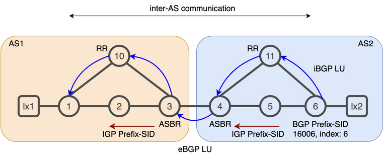

# 12. BGP Prefix-SID and BGP Labeled Unicast

Segment Routing is not constrained to using IGP control plane and can leverage Border Gateway Protocol (BGP) to distribute SR information.
BGP Labeled Unicast (BGP-LU), as specified in IETF RFC 3107, is used to distribute labels for prefixes in BGP. BGP-LU specifies how one or more labels for a prefix can be carried in the BGP update message using the Multiprotocol Extensions of BGP (MBGP). The labels are advertised as part of the Network Layer Reachability Information (NLRI).
BGP-LU signaling is applicable for both external and internal BGP (EBGP, IBGP) sessions.
We will use the lab to illustrate BGP-LU in a multi-AS network.

The diagram below represents the lab:



SR BGP Prefix-SID is signaled by xrd-6 (in our case with `index=6`) through BGP-LU. BGP is reponsible to update xrd-1 with xrd-6 reachability information including the signaled prefix-index.

## Task 0. Create a container based XR lab

```bash
cd $HOME/lab/sr-bgp-lab
```

Generate a docker-compose file from the docker-compose.xr.yaml sample

```bash
xr-compose -i 541301263746.dkr.ecr.us-east-1.amazonaws.com/cloud-native-router -f docker-compose.xr.yml
```

Instantiate the lab

```bash
docker-compose up -d
```

Wait 5 min for the router to come up then connect to a router instance

```bash
xrd 1
```

Note : When first connecting to an XRd instance warning messages may appear regarding insufficient permissions or `/pkg/bin/ssh_launch.sh:` script with too many arguments. You can disregard those errors.

```bash
show run router isis
```

```bash
show run segment-routing
```

```bash
show isis database detail
```

```bash
show mpls forwarding
exit
```

```bash
xrd 6
```

```bash
show run router isis
```

```bash
show run segment-routing
```

```bash
show isis database detail
```

```bash
show mpls forwarding
exit
```

## Task 1. Configure BGP Prefix-SID on xrd-6

```bash
xrd 6
```

```bash
conf t
!
route-policy SID($SID)
 set label-index $SID
end-policy
!
router bgp 2
 bgp router-id 6.6.6.6
 address-family ipv4 unicast
  network 6.6.6.6/32 route-policy SID(6)
  allocate-label all
 !
 address-family vpnv4 unicast
 !
 neighbor 11.11.11.11
  remote-as 2
  update-source Loopback0
  address-family ipv4 labeled-unicast
  !
  address-family vpnv4 unicast
  !
 !
 vrf ONE
  rd auto
  address-family ipv4 unicast
   network 99.6.99.0/24
   network 99.6.200.0/24
  !
 !
!
commit
end
exit         
!
```

## Task 2. Configure Route Reflector on xrd-11

```bash
xrd 11
```

```bash
conf t
!
router bgp 2
 bgp router-id 11.11.11.11
 bgp cluster-id 11.11.11.11
 address-family ipv4 unicast
  allocate-label all
 !
 address-family vpnv4 unicast
 !
 neighbor 4.4.4.4
  remote-as 2
  update-source Loopback0
  address-family ipv4 labeled-unicast
   route-reflector-client
  !
  address-family vpnv4 unicast
   route-reflector-client
  !
 !
 neighbor 6.6.6.6
  remote-as 2
  update-source Loopback0
  address-family ipv4 labeled-unicast
   route-reflector-client
  !
  address-family vpnv4 unicast
   route-reflector-client
  !
 !
!
commit
end
exit         
!
```

## Task 3. Configure BGP-LU on xrd-4

```bash
xrd 4
```

```bash
conf t
!
route-policy PASS
pass
exit
!
router bgp 2
 bgp router-id 4.4.4.4
 address-family ipv4 unicast
  allocate-label all
 !
 neighbor 11.11.11.11
  remote-as 2
  update-source Loopback0
  address-family ipv4 labeled-unicast
   next-hop-self
  !
 !
 neighbor 99.3.4.3
  remote-as 1
  address-family ipv4 labeled-unicast
   route-policy PASS in
   route-policy PASS out
  !
 !
! 
segment-routing
global-block 16000 23999
!
router static
address-family ipv4 unicast
99.3.4.3/32 GigabitEthernet0/0/0/0
!
commit
end
exit         
!
```

## Task 4. Check BGP neighbors on xrd-11

```bash
xrd 11
```

```bash
show bgp neighbor brief
```

You should have a similar output:

```console
RP/0/RP0/CPU0:xrd-11#show bgp neighbor brief 
Mon Dec 26 09:24:50.031 UTC

Neighbor        Spk    AS Description                          Up/Down  NBRState
4.4.4.4           0     2                                      00:41:01 Established 
6.6.6.6           0     2                                      00:44:37 Established 
## Task 4. Configure BGP-LU on xrd-3
```

## Task 5. Check BGP Labeled Unicast on xrd-11

```bash
show bgp ipv4 labeled-unicast
exit
```

You should have a similar output:

```console
RP/0/RP0/CPU0:xrd-11#show bgp ipv4 labeled-unicast 
Mon Dec 26 09:27:12.536 UTC
BGP router identifier 11.11.11.11, local AS number 2
BGP generic scan interval 60 secs
Non-stop routing is enabled
BGP table state: Active
Table ID: 0xe0000000   RD version: 4
BGP main routing table version 4
BGP NSR Initial initsync version 3 (Reached)
BGP NSR/ISSU Sync-Group versions 0/0
BGP scan interval 60 secs

Status codes: s suppressed, d damped, h history, * valid, > best
              i - internal, r RIB-failure, S stale, N Nexthop-discard
Origin codes: i - IGP, e - EGP, ? - incomplete
   Network            Next Hop            Metric LocPrf Weight Path
*>i1.1.1.1/32         4.4.4.4                       100      0 1 i
*>i6.6.6.6/32         6.6.6.6                  0    100      0 i

Processed 2 prefixes, 2 paths
```

## Task 6. Configure BGP-LU on xrd-3

```bash
xrd 3
```

```bash
conf t
!
route-policy PASS
pass
exit
!
router bgp 1
bgp router-id 3.3.3.3
address-family ipv4 unicast
allocate-label all
!
neighbor 10.10.10.10
remote-as 1
update-source Loopback0
address-family ipv4 labeled-unicast
next-hop-self
!
neighbor 99.3.4.4
remote-as 2
address-family ipv4 labeled-unicast
route-policy PASS in
route-policy PASS out
!
segment-routing
global-block 16000 23999
!
router static
address-family ipv4 unicast
99.3.4.4/32 GigabitEthernet0/0/0/2
!
commit
end
exit         
!
```

## Task 7. Configure Route Reflector on xrd-10

```bash
xrd 10
```

```bash
conf t
!
router bgp 1
 bgp router-id 10.10.10.10
 bgp cluster-id 10.10.10.10
 address-family ipv4 unicast
  allocate-label all
 !
 address-family vpnv4 unicast
 !
 neighbor 1.1.1.1
  remote-as 1
  update-source Loopback0
  address-family ipv4 labeled-unicast
   route-reflector-client
  !
  address-family vpnv4 unicast
  !
 !
 neighbor 3.3.3.3
  remote-as 1
  update-source Loopback0
  address-family ipv4 labeled-unicast
   route-reflector-client
  !
  address-family vpnv4 unicast
  !
 !
!
commit
end
exit         
!
```

## Task 8. Configure BGP Prefix-SID on xrd-1

```bash
xrd 1
```

```bash
conf t
!
route-policy SID($SID)
set label-index $SID
end-policy
!
router bgp 1
bgp router-id 1.1.1.1
address-family ipv4 unicast
network 1.1.1.1/32 route-policy SID(1)
allocate-label all
!
address-family vpnv4 unicast
!
neighbor 10.10.10.10
remote-as 1
update-source Loopback0
address-family ipv4 labeled-unicast
!
address-family vpnv4 unicast
!
vrf ONE
rd auto
address-family ipv4 unicast
network 99.1.100.0/24
!
commit
end
exit         
!
```

## Task 9. Check the BGP Labeled Unicast on xrd-1

```bash
xrd 1
```

```bash
show bgp ipv4 labeled-unicast 
```

You should have a similar output:

```console
RP/0/RP0/CPU0:xrd-1#show bgp ipv4 labeled-unicast 
Mon Dec 26 09:18:02.293 UTC
BGP router identifier 1.1.1.1, local AS number 1
BGP generic scan interval 60 secs
Non-stop routing is enabled
BGP table state: Active
Table ID: 0xe0000000   RD version: 4
BGP main routing table version 4
BGP NSR Initial initsync version 4 (Reached)
BGP NSR/ISSU Sync-Group versions 0/0
BGP scan interval 60 secs

Status codes: s suppressed, d damped, h history, * valid, > best
              i - internal, r RIB-failure, S stale, N Nexthop-discard
Origin codes: i - IGP, e - EGP, ? - incomplete
   Network            Next Hop            Metric LocPrf Weight Path
*> 1.1.1.1/32         0.0.0.0                  0         32768 i
*>i6.6.6.6/32         3.3.3.3                       100      0 2 i

Processed 2 prefixes, 2 paths
```

Notice the best path in the BGP table for xrd-6 `6.6.6.6` loopback with xrd-3 ASBR `3.3.3.3` Next Hop.

## Task 10. Check the xrd-1 MPLS forwarding plane

Execute the following command to check the MPLS forwarding plane configuration at xrd-1

```bash
show mpls forwarding
```

You should have a similar output:

```console
RP/0/RP0/CPU0:xrd-1#show mpls forwarding 
Mon Dec 26 08:54:05.209 UTC
Local  Outgoing    Prefix             Outgoing     Next Hop        Bytes       
Label  Label       or ID              Interface                    Switched    
------ ----------- ------------------ ------------ --------------- ------------
16002  Pop         SR Pfx (idx 2)     Gi0/0/0/2    99.1.2.2        0           
16003  16003       SR Pfx (idx 3)     Gi0/0/0/1    99.1.10.10      0           
       16003       SR Pfx (idx 3)     Gi0/0/0/2    99.1.2.2        540         
16006  16006       SR Pfx (idx 6)                  3.3.3.3         520         
16010  Pop         SR Pfx (idx 10)    Gi0/0/0/1    99.1.10.10      1631        
24000  Pop         SR Adj (idx 1)     Gi0/0/0/2    99.1.2.2        0           
24001  Pop         SR Adj (idx 3)     Gi0/0/0/2    99.1.2.2        0           
24002  Pop         SR Adj (idx 1)     Gi0/0/0/1    99.1.10.10      0           
24003  Pop         SR Adj (idx 3)     Gi0/0/0/1    99.1.10.10      0 
```

Notice the label `16006` is configured in the dataplane with a AS1 ASBR xrd-3 as Next Hop `3.3.3.3`. That entry will recurse on `3.3.3.3` to build the full label stack `<16003;16006>` to reach `6.6.6.6`

## Task 11. Check the xrd-1 label stack to xrd-6

You can get the result of Next Hop recursivity with a show cef command:

```bash
show cef 6.6.6.6/32
```

You should have a similar output:

```console
RP/0/RP0/CPU0:xrd-1#show cef 6.6.6.6/32
Mon Dec 26 09:00:00.418 UTC
6.6.6.6/32, version 26, labeled SR, internal 0x5000001 0x8040 (ptr 0x8719e7a0) [1], 0x600 (0x87e1a1d0), 0xa08 (0x890f0468)
 Updated Dec 26 08:47:26.728
 Prefix Len 32, traffic index 0, precedence n/a, priority 4
  gateway array (0x87c82c28) reference count 3, flags 0x78, source rib (7), 0 backups
                [2 type 5 flags 0x8441 (0x8912f6a8) ext 0x0 (0x0)]
  LW-LDI[type=5, refc=3, ptr=0x87e1a1d0, sh-ldi=0x8912f6a8]
  gateway array update type-time 1 Dec 26 08:47:26.727
 LDI Update time Dec 26 08:47:26.727
 LW-LDI-TS Dec 26 08:47:26.727
   via 3.3.3.3/32, 3 dependencies, recursive [flags 0x6000]
    path-idx 0 NHID 0x0 [0x871e29f0 0x0]
    recursion-via-/32
    next hop 3.3.3.3/32 via 16003/0/21
     local label 16006 
     next hop 99.1.10.10/32 Gi0/0/0/1    labels imposed {16003 16006}
     next hop 99.1.2.2/32 Gi0/0/0/2    labels imposed {16003 16006}

    Load distribution: 0 (refcount 2)

    Hash  OK  Interface                 Address
    0     Y   recursive                 16003/0  
```

Notice the IGP ECMP aware behaviour with the two paths available to reach the xrd-3 ASBR node. Finally you can notice the imposed label stack `labels imposed {16003 16006}`.

## Task 12. Check the reachability between xrd-1 and xrd-6

Execute a ping command with `1.1.1.1` xrd-1 loopback as source:

```bash
ping 6.6.6.6/32 source 1.1.1.1
```

## Task 13. Check the paths and labels stack between xrd-1 and xrd-6

Execute a traceroute mpls from xrd-1 to xrd-6

```bash
traceroute mpls ipv4 6.6.6.6/32 source 1.1.1.1
```

You should have a similar output:

```console
RP/0/RP0/CPU0:xrd-1#traceroute mpls ipv4 6.6.6.6/32 source 1.1.1.1
Mon Dec 26 08:48:05.227 UTC

Tracing MPLS Label Switched Path to 6.6.6.6/32, timeout is 2 seconds

Codes: '!' - success, 'Q' - request not sent, '.' - timeout,
  'L' - labeled output interface, 'B' - unlabeled output interface, 
  'D' - DS Map mismatch, 'F' - no FEC mapping, 'f' - FEC mismatch,
  'M' - malformed request, 'm' - unsupported tlvs, 'N' - no rx label, 
  'P' - no rx intf label prot, 'p' - premature termination of LSP, 
  'R' - transit router, 'I' - unknown upstream index,
  'X' - unknown return code, 'x' - return code 0

Type escape sequence to abort.

  0 99.1.2.1 MRU 1500 [Labels: 16003/16006 Exp: 0/0]
L 1 99.1.2.2 MRU 1500 [Labels: implicit-null/16006 Exp: 0/0] 19 ms
L 2 99.2.3.3 MRU 1500 [Labels: implicit-null/16006 Exp: 0/0] 6 ms
L 3 99.3.4.4 MRU 1500 [Labels: 16006 Exp: 0] 7 ms
L 4 99.4.11.11 MRU 1500 [Labels: implicit-null Exp: 0] 7 ms
! 5 99.6.11.6 5 ms
```

You can notice that xrd-1 push <16003/16006> stack built with xrd-3 ASBR IGP Prefix-SID and xrd-6 BGP Prefix-SID. xrd-2 and xrd-3 push <implicit-null/16006> as PHP behaviour applies. xrd-4 pushes <16006> and finaly xrd-11 (in that case, idem for xrd-5) pop label (implicit-null).
